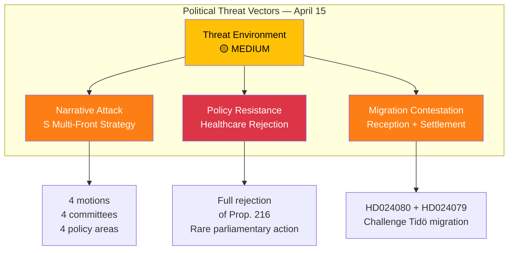

# Political Threat Analysis — 2026-04-15 (Realtime Monitor 0954)

**Generated**: 2026-04-15 09:55 UTC
**Documents Analyzed**: 4 S motions + parliamentary context
**Confidence**: HIGH
**Analyst**: news-realtime-monitor

---

## Summary

Threat analysis identifies **3 active threat vectors** in today's parliamentary activity: coordinated opposition narrative attack, healthcare reform resistance, and migration policy contestation. None rise to CRITICAL level but collectively create MEDIUM threat environment.

## Threat Taxonomy



## Detailed Threat Assessment

| Threat | Actor | Vector | Likelihood | Impact | dok_id | Confidence |
|--------|-------|--------|------------|--------|--------|------------|
| S narrative dominance on April 15 | S party leadership | Coordinated 4-motion filing | MEDIUM | MEDIUM | HD024078-81 | HIGH |
| Healthcare reform blocked in committee | S + potential V/MP | SoU rejection vote | LOW | HIGH | HD024081 | MEDIUM |
| Migration policy challenged on human rights | S + civil society | Reception + settlement motions | MEDIUM | MEDIUM | HD024079-80 | HIGH |
| Government overextension | Government coalition | Too many reforms simultaneously | LOW | MEDIUM | Multiple props | MEDIUM |
| SD leverage increases | SD | Demands stricter terms on migration | MEDIUM | MEDIUM | Tidö context | MEDIUM |

## Attack Tree Analysis

```
Root: Undermine Government Legislative Agenda
├── Branch 1: Multi-Front Opposition (S)
│   ├── Leaf: Migration motions (HD024079, HD024080) → SfU, AU
│   ├── Leaf: Justice motion (HD024078) → CU
│   └── Leaf: Healthcare REJECTION (HD024081) → SoU ← STRONGEST
├── Branch 2: Committee Delays
│   ├── Leaf: Request hearings on Prop. 216, 222, 229
│   └── Leaf: Force government amendments
└── Branch 3: Media Narrative
    ├── Leaf: "Government failing on 4 fronts"
    └── Leaf: Healthcare + migration are voter priorities
```

## Key Findings

1. **No CRITICAL threats** — coalition majority not at risk **[HIGH confidence]**
2. **MEDIUM threat from narrative impact** — 4-motion coordination designed for media attention **[HIGH confidence]**
3. **Healthcare rejection is highest-impact single threat** — could attract cross-party support **[MEDIUM confidence]**
4. **Cyber threat briefing** (government) and **welfare fraud conference** counterbalance S narrative **[MEDIUM confidence]**

## Implications

Government should prioritize communication on policy delivery achievements (spring budget, security) to counter S multi-front narrative. The healthcare rejection motion (HD024081) requires specific committee management attention.
