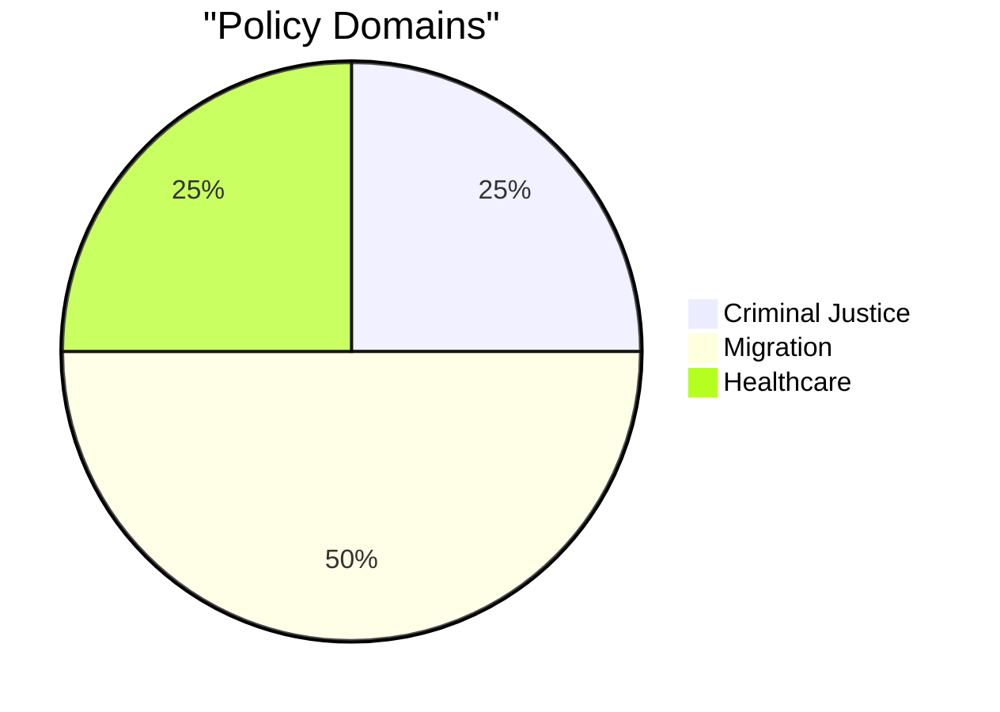

# Classification Results — 2026-04-15 (Realtime 1029)

**Generated**: 2026-04-15 10:29 UTC (AI-Enhanced)
**Methodology**: political-classification-guide.md + ai-driven-analysis-guide.md
**Confidence**: HIGH (85%)

---

## Document Classification Table

| dok_id | Type | Policy Area | Committee | Party | Tactic | Severity |
|--------|------|-------------|-----------|-------|--------|----------|
| HD024078 | mot (committee) | Criminal Justice | JuU | S | Accept-and-extend | MEDIUM |
| HD024079 | mot (committee) | Migration/Settlement | CU | S | Partial reject (§8) | MEDIUM |
| HD024080 | mot (committee) | Migration/Reception | SfU | S | Full reject (privatization) | MEDIUM |
| HD024081 | mot (committee) | Healthcare Reform | SoU | S | Full reject (remiss-backed) | MEDIUM |

## Classification Methodology

### Document Type Distribution
- Committee motions (mot): 4/4 (100%)
- All filed as följdmotioner (response motions) to government propositions

### Policy Domain Classification

### Political Tactic Classification

| Tactic | dok_id | Description |
|--------|--------|-------------|
| Accept-and-extend | HD024078 | Praise government direction, demand additional measures |
| Partial rejection | HD024079 | Target specific sections (§ 8) while accepting overall framework |
| Full rejection (policy) | HD024080 | Oppose fundamental approach (privatization vs. state provision) |
| Full rejection (evidence) | HD024081 | Reject on basis of expert opposition (remiss majority) |

### Committee Coverage

| Committee | Count | dok_id(s) |
|-----------|-------|-----------|
| JuU (Justice) | 1 | HD024078 |
| CU (Civil Affairs) | 1 | HD024079 |
| SfU (Social Insurance) | 1 | HD024080 |
| SoU (Social Affairs) | 1 | HD024081 |

### Actor Classification

| Actor | Role | Activity Count |
|-------|------|---------------|
| S (Socialdemokraterna) | Opposition — Primary | 4 motions |
| SD (Sverigedemokraterna) | Coalition support — Probing | 8 written questions |
| Government (M/KD/L) | Governing — Defending | 12 press releases |

## Key Classification Insight

All 4 documents share: S-authored committee motions targeting government propositions. The 4-committee spread is unusual — S typically concentrates efforts. This suggests deliberate strategic breadth to demonstrate cross-policy alternative governance.
