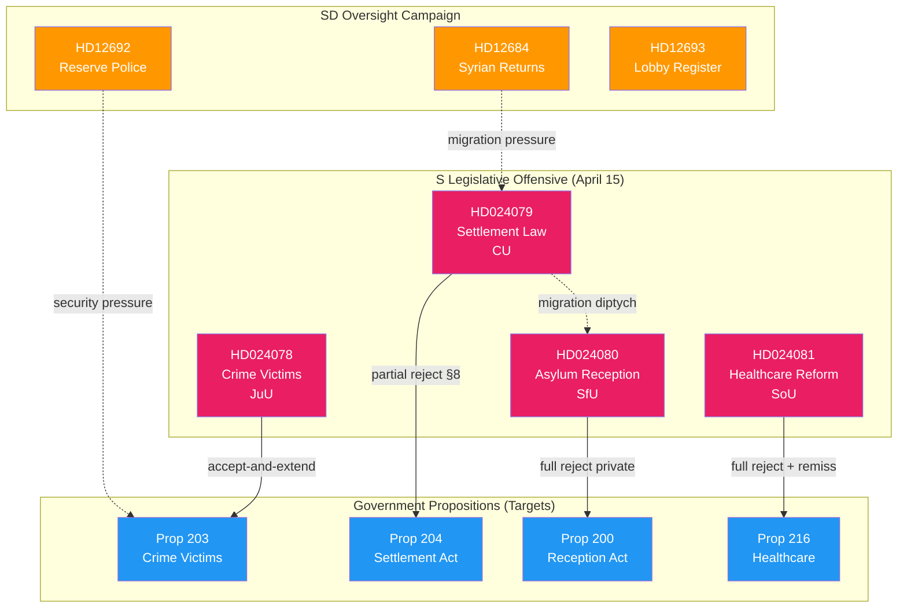

# Cross-Reference Map — 2026-04-15 (Realtime 1029)

**Generated**: 2026-04-15 10:29 UTC (AI-Enhanced)
**Documents Analyzed**: 4 S motions + 8 SD written questions + 12 gov press releases
**Confidence**: HIGH (85%)

---

## Inter-Document Relationship Diagram

## Linkage Table

| Source dok_id | Target dok_id | Relationship | Strength |
|---------------|---------------|-------------|----------|
| HD024078 | Prop 2025/26:203 | Accept-and-extend (constructive) | Strong |
| HD024079 | Prop 2025/26:204 | Partial rejection (§ 8 targeted) | Strong |
| HD024080 | Prop 2025/26:200 | Full rejection (anti-privatization) | Strong |
| HD024081 | Prop 2025/26:216 | Full rejection (remiss-backed) | Strong |
| HD024079 | HD024080 | Migration diptych (settlement + reception) | Strong |
| HD024078 | HD024081 | Escalation ladder endpoints (constructive ↔ rejection) | Moderate |
| HD12684 | HD024079 | SD migration pressure parallels S migration critique | Weak |
| HD12692 | HD024078 | Security preparedness context for crime prevention | Weak |

## Thematic Clusters

### Cluster 1: Migration Policy (3 documents)
- HD024079 (settlement), HD024080 (reception), HD12684 (Syrian returns)
- Pattern: S and SD both challenge government migration policy from different directions

### Cluster 2: Criminal Justice & Security (2 documents)
- HD024078 (crime victim compensation), HD12692 (reserve police)
- Pattern: Both address security/safety from different angles (victim support vs. preparedness)

### Cluster 3: Social Welfare (1 document)
- HD024081 (healthcare reform)
- Pattern: S leverages expert consensus against government proposal

### Cluster 4: Transparency & Governance (1 document)
- HD12693 (lobby register)
- Pattern: SD probes scope of new transparency legislation

## Key Insight

The S 4-motion batch is NOT random — it follows a deliberate escalation ladder:
1. **Constructive** (HD024078): accept government direction, demand more
2. **Targeted amendment** (HD024079): reject specific section (§ 8)
3. **Policy alternative** (HD024080): oppose privatization, propose state alternative
4. **Full rejection** (HD024081): reject entire proposition with remiss backing

This demonstrates strategic legislative communication, not just opposition voting.
