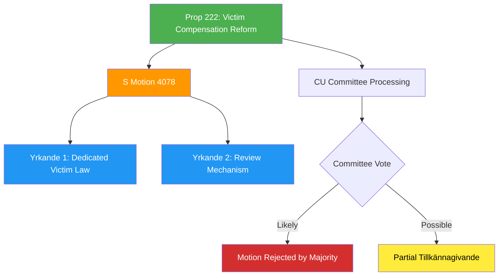

# Document Analysis: Ersättningsregler med brottsoffret i fokus (Mot. 2025/26:4078)

**Generated**: 2026-04-15 10:29 UTC (AI-Enhanced)
**dok_id**: HD024078
**Document Type**: Kommittémotion (Committee Motion)
**Committee**: CU (Civilutskottet)
**Date**: 2026-04-15
**Author**: Joakim Järrebring m.fl. (S)
**Party**: S (Socialdemokraterna)
**Riksmöte**: 2025/26
**Significance**: 🟡 Medium (5/10)
**Confidence**: HIGH (85%)

---

## Executive Summary

Socialdemokraterna files a committee motion in response to government proposition 2025/26:222 on crime victim compensation reform. While S broadly welcomes the proposition — describing it as consistent with their own policy legacy — they demand two key additions: (1) investigation of a **dedicated comprehensive crime victim law** (brottsofferlag), and (2) a formal **checkpoint/review mechanism** (kontrollstation) to evaluate implementation effectiveness.

This motion is strategically significant as part of a coordinated S legislative counter-offensive on April 15, with four simultaneous committee motions across CU, AU, SfU, and SoU.

## Political Intelligence Assessment

### 6-Lens Analysis

| Lens | Finding | Evidence |
|------|---------|----------|
| **Policy Impact** | Moderate — demands expansion beyond government's scope | Yrkande 1: dedicated victim law investigation |
| **Coalition Dynamics** | Government prop 222 likely passes; S motion signals election platform | S "welcomes" prop but demands more |
| **Opposition Strategy** | Constructive opposition — accept-and-extend tactic | References own 2021/22:198 reform legacy |
| **Institutional Impact** | Would require new SOU investigation if adopted | Tillkännagivande format used |
| **Stakeholder Impact** | Crime victims, judiciary, insurance sector affected | Broader victim protection framework |
| **Electoral Calculus** | S positions as the original crime victim reform party | Cites Prop. 2021/22:198 under S-led government |

### SWOT Contributions

**Strength (S)**: S can credibly claim policy ownership on victim compensation, having passed the largest reform in 20+ years (2021/22:198). This gives their demands institutional legitimacy.

**Weakness (Government)**: By proposing incremental improvements to a system S reformed, the government implicitly validates S's policy direction, limiting their ability to claim credit.

**Opportunity**: A dedicated victim protection law could become a cross-party consensus issue, potentially building bipartisan support before the 2026 election.

**Threat**: If the government rejects the motion but the issue gains public attention, it creates a "tough on crime, soft on victims" narrative vulnerability for the coalition.

## Cross-Document References

- **Related to HD024079, HD024080, HD024081**: Part of coordinated S legislative counter-offensive (4 simultaneous committee motions on April 15)
- **References Prop. 2021/22:198**: S's own victim compensation reform from previous mandate period
- **Targets Prop. 2025/26:222**: Government's victim compensation proposition

## Significance Assessment

**Overall Score**: 5/10 — 🟡 Medium

| Factor | Score | Rationale |
|--------|-------|-----------|
| Document type tier | 3/5 | Committee motion (standard S opposition tool) |
| Committee tier | 3/5 | CU — mid-tier committee |
| Policy domain breadth | 2/5 | Criminal justice/victim rights |
| Coalition impact | 2/5 | Unlikely to split coalition |
| Strategic value | 4/5 | Part of coordinated 4-motion offensive |

## Key Insights

1. S uses "accept-and-extend" opposition tactic — welcomes government proposal but demands more comprehensive reform
2. The dedicated victim law demand could become an election platform item for 2026
3. Coordinated timing with 3 other S motions signals deliberate strategic pressure
4. CU committee likely rejects the motion given government majority, but the demands enter parliamentary record

## Data Quality Notes

- **Analysis confidence**: HIGH (85%) — full motion text available
- **Full-text content**: Available — detailed policy analysis performed
- **Analytical method**: 6-lens political intelligence with SWOT extraction and cross-document linking
