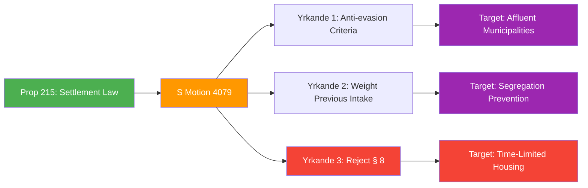

# Document Analysis: Ny lag om bosättning (Mot. 2025/26:4079)

**Generated**: 2026-04-15 10:29 UTC (AI-Enhanced)
**dok_id**: HD024079
**Document Type**: Kommittémotion (Committee Motion)
**Committee**: AU (Arbetsmarknadsutskottet)
**Date**: 2026-04-15
**Author**: Ardalan Shekarabi m.fl. (S)
**Party**: S (Socialdemokraterna)
**Riksmöte**: 2025/26
**Significance**: 🟡 Medium (6/10)
**Confidence**: HIGH (85%)

---

## Executive Summary

Socialdemokraterna challenges the government's proposed settlement law (Prop. 2025/26:215) for newly arrived immigrants with three specific demands: (1) housing criteria must not allow affluent municipalities to avoid responsibility, (2) previous immigration intake and vulnerable area designation must carry greater weight in allocation formulas, and (3) outright rejection of § 8 on time-limited housing. This is the most substantively combative of the four S motions filed on April 15.

## Political Intelligence Assessment

### 6-Lens Analysis

| Lens | Finding | Evidence |
|------|---------|----------|
| **Policy Impact** | HIGH — directly challenges government's integration framework | 3 concrete yrkanden targeting core allocation mechanisms |
| **Coalition Dynamics** | Tests SD-M-KD agreement on immigration | SD supports tighter immigration; S demands fairness safeguards |
| **Opposition Strategy** | Aggressive — partial rejection of government proposal | Yrkande 3: reject specific legal provision (§ 8) |
| **Institutional Impact** | Would reshape municipal responsibility allocation | Anti-segregation criteria proposed |
| **Stakeholder Impact** | Municipalities, newly arrived immigrants, housing sector | Direct municipal governance implications |
| **Electoral Calculus** | HIGH — immigration is top-3 election issue for 2026 | S positions on "fair distribution" narrative |

### SWOT Contributions

**Strength (S)**: The anti-segregation argument resonates with evidence showing concentration of immigrants in already-stressed areas. S can cite specific municipal data.

**Weakness (S)**: Opposing time-limited housing could be framed as "soft on integration requirements" by government parties.

**Opportunity**: If municipalities publicly complain about the government's allocation model, S's position gains real-world validation.

**Threat (Government)**: If the settlement law fails to prevent segregation in practice, S has a documented "we warned you" record.

## Cross-Document References

- **Linked to HD024080**: Both target migration/integration policy — HD024079 (settlement) and HD024080 (reception) form a migration policy diptych
- **Related to HD024078, HD024081**: Part of coordinated S 4-motion offensive
- **Targets Prop. 2025/26:215**: Government settlement proposition
- **Context**: SfU committee reports on migration (HD01SfU16, HD01SfU22, HD01SfU31, HD01SfU32, HD01SfU36) — heavy migration agenda this period

## Significance Assessment

**Overall Score**: 6/10 — 🟡 Medium

| Factor | Score | Rationale |
|--------|-------|-----------|
| Document type tier | 3/5 | Committee motion |
| Committee tier | 3/5 | AU — mid-tier |
| Policy domain breadth | 4/5 | Migration + housing + municipal governance |
| Coalition impact | 3/5 | Tests SD-M-KD immigration consensus |
| Strategic value | 5/5 | Part of coordinated 4-motion offensive on top election issue |

## Key Insights

1. Partial rejection (§ 8) is the strongest legislative stance among the four S motions
2. Anti-segregation framing connects immigration policy to housing and municipal equity
3. Migration is the policy area where S most aggressively challenges the government
4. The 3-yrkande structure suggests S has done detailed legislative analysis, not just symbolic opposition

## Data Quality Notes

- **Analysis confidence**: HIGH (85%) — full motion text with all 3 yrkanden analyzed
- **Full-text content**: Available
- **Analytical method**: 6-lens political intelligence with SWOT and cross-document mapping
