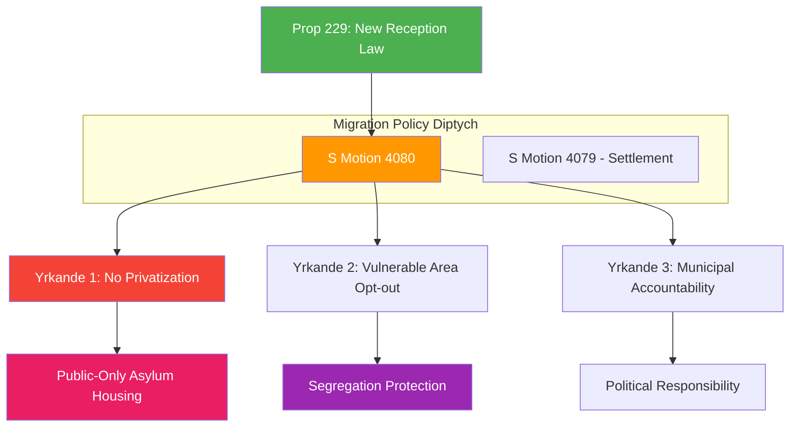

# Document Analysis: En ny mottagandelag (Mot. 2025/26:4080)

**Generated**: 2026-04-15 10:29 UTC (AI-Enhanced)
**dok_id**: HD024080
**Document Type**: Kommittémotion (Committee Motion)
**Committee**: SfU (Socialförsäkringsutskottet)
**Date**: 2026-04-15
**Author**: Ida Karkiainen m.fl. (S)
**Party**: S (Socialdemokraterna)
**Riksmöte**: 2025/26
**Significance**: 🟡 Medium (6/10)
**Confidence**: HIGH (85%)

---

## Executive Summary

Socialdemokraterna targets the government's new reception law (Prop. 2025/26:229) with demands to block privatization of asylum center accommodation. S argues that asylum housing at reception centers must remain under public control to ensure quality and accountability. The motion also demands that vulnerable urban areas (utsatta områden) should be able to opt out of emergency housing assignments, and that municipal political accountability must be clearly defined.

## Political Intelligence Assessment

### 6-Lens Analysis

| Lens | Finding | Evidence |
|------|---------|----------|
| **Policy Impact** | HIGH — anti-privatization demand challenges government's market approach | Yrkande 1: public-only asylum housing |
| **Coalition Dynamics** | Challenges L and M's market-oriented integration approach | Privatization is core ideological divide |
| **Opposition Strategy** | Principled stance on public services — classic S territory | Welfare state vs. market debate |
| **Institutional Impact** | Would constrain Migrationsverket's procurement options | Public-only housing mandate |
| **Stakeholder Impact** | Asylum seekers, municipal governments, private housing operators | Direct service delivery implications |
| **Electoral Calculus** | Resonates with S base on public services | Anti-privatization narrative |

### SWOT Contributions

**Strength (S)**: Anti-privatization of asylum services has broad public support. Quality concerns about private asylum housing providers are well-documented.

**Weakness (S)**: Could be accused of defending a dysfunctional public asylum system if privatization is framed as "efficiency improvement."

**Opportunity**: Municipal concerns about emergency housing assignments in vulnerable areas align with S's demand for opt-outs — potential cross-party support.

**Threat (Government)**: Private sector lobby (housing operators) may oppose S's position, but public opinion likely favors accountability over market efficiency in asylum services.

## Cross-Document References

- **Paired with HD024079**: Together these form S's migration policy diptych — HD024079 (settlement/bosättning) + HD024080 (reception/mottagande)
- **Part of 4-motion offensive**: HD024078, HD024079, HD024080, HD024081
- **Targets Prop. 2025/26:229**: Government reception law
- **Related committee reports**: HD01SfU22 (inhibition), HD01SfU31 (supervision/detention), HD01SfU32 (return operations)

## Significance Assessment

**Overall Score**: 6/10 — 🟡 Medium

| Factor | Score | Rationale |
|--------|-------|-----------|
| Document type tier | 3/5 | Committee motion |
| Committee tier | 4/5 | SfU — high-profile committee given migration salience |
| Policy domain breadth | 3/5 | Migration + municipal governance |
| Coalition impact | 3/5 | Privatization debate is ideological core |
| Strategic value | 5/5 | Part of coordinated offensive; anti-privatization resonates |

## Key Insights

1. Anti-privatization demand is the most ideologically charged of all four S motions
2. Vulnerable area opt-out mirrors similar demand in HD024079 — consistent S messaging on segregation
3. Municipal accountability demand reflects S's broader governance philosophy
4. This motion + HD024079 create a comprehensive S migration policy alternative

## Data Quality Notes

- **Analysis confidence**: HIGH (85%)
- **Full-text content**: Available
- **Analytical method**: 6-lens political intelligence with SWOT and cross-document mapping
