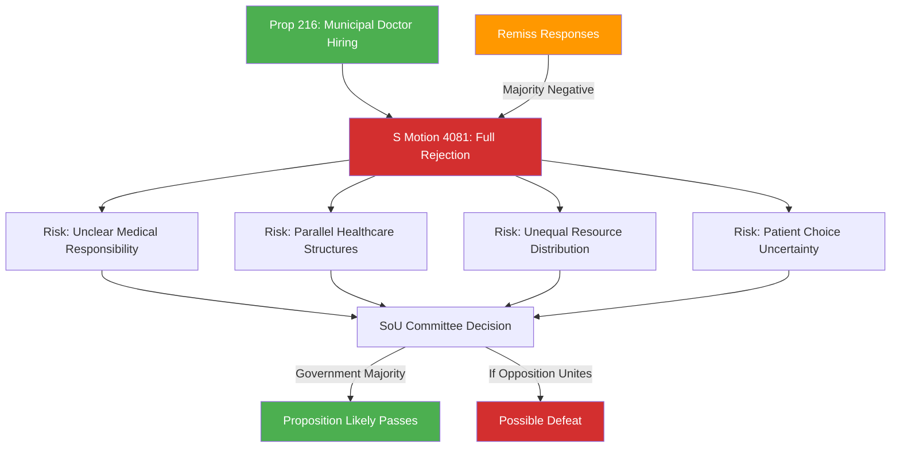

# Document Analysis: Stärkt medicinsk kompetens i kommunal hälso- och sjukvård (Mot. 2025/26:4081)

**Generated**: 2026-04-15 10:29 UTC (AI-Enhanced)
**dok_id**: HD024081
**Document Type**: Kommittémotion (Committee Motion)
**Committee**: SoU (Socialutskottet)
**Date**: 2026-04-15
**Author**: Fredrik Lundh Sammeli m.fl. (S)
**Party**: S (Socialdemokraterna)
**Riksmöte**: 2025/26
**Significance**: 🟡 Medium (6/10)
**Confidence**: HIGH (90%)

---

## Executive Summary

Socialdemokraterna takes its most aggressive stance among the four April 15 motions: outright rejection of the government's Prop. 2025/26:216 on allowing municipalities to hire doctors directly. S cites overwhelming negative remiss feedback — a **majority of consultation bodies** recommended rejection. Concerns center on unclear medical responsibility, risk of parallel healthcare structures, inefficient resource use, and threats to equal access.

## Political Intelligence Assessment

### 6-Lens Analysis

| Lens | Finding | Evidence |
|------|---------|----------|
| **Policy Impact** | HIGH — full rejection of government proposition | "Riksdagen avslår regeringens proposition" |
| **Coalition Dynamics** | Tests KD's healthcare credibility (minister Elisabet Lann) | Remiss criticism from healthcare sector |
| **Opposition Strategy** | Maximum escalation — full avslag, not amendment | Strongest stance of all 4 S motions |
| **Institutional Impact** | Would preserve regional healthcare monopoly on doctors | Municipalities blocked from hiring MDs |
| **Stakeholder Impact** | Regions, municipalities, healthcare professionals, patients | Direct impact on care delivery model |
| **Electoral Calculus** | Healthcare is perennial election issue; remiss support strengthens S | Majority remiss rejection is powerful evidence |

### SWOT Contributions

**Strength (S)**: Remiss majority on S's side — rare alignment between opposition position and expert/institutional consensus. This gives S powerful "evidence-based opposition" framing.

**Weakness (Government)**: Proceeding against majority remiss opinion exposes the government to accusations of ignoring expert advice on healthcare reform.

**Opportunity (S)**: If municipalities attempt to hire doctors and problems emerge (unclear responsibility, unequal care), S has a documented "we warned you" record for 2026 election.

**Threat (Government)**: Healthcare professionals' organizations opposing the reform could become vocal allies of S's position during election campaign.

## Cross-Document References

- **Part of 4-motion offensive**: HD024078, HD024079, HD024080, HD024081
- **Targets Prop. 2025/26:216**: Government healthcare competence proposition
- **Only full rejection**: HD024078 uses accept-and-extend; HD024079 uses partial rejection (§ 8); HD024080 demands amendments; HD024081 demands FULL avslag
- **Escalation ladder**: Accept-extend (078) → Amend (080) → Partial reject (079) → Full reject (081)

## Significance Assessment

**Overall Score**: 6/10 — 🟡 Medium

| Factor | Score | Rationale |
|--------|-------|-----------|
| Document type tier | 3/5 | Committee motion |
| Committee tier | 4/5 | SoU — healthcare is high-profile |
| Policy domain breadth | 3/5 | Healthcare, municipal governance |
| Coalition impact | 3/5 | Remiss criticism may embolden other parties |
| Strategic value | 5/5 | Full rejection = maximum political signal |

## Key Insights

1. Full rejection is S's strongest legislative tool — signals complete opposition to government healthcare approach
2. Majority remiss rejection is the strongest evidence base among all 4 motions
3. Healthcare reform against expert consensus creates vulnerability for the KD-led health ministry
4. This motion demonstrates S's escalation ladder across the 4-motion offensive: from constructive (078) to destructive (081)

## Data Quality Notes

- **Analysis confidence**: HIGH (90%) — full text + remiss context available
- **Full-text content**: Available with detailed remiss analysis
- **Analytical method**: 6-lens political intelligence with SWOT and escalation pattern analysis
