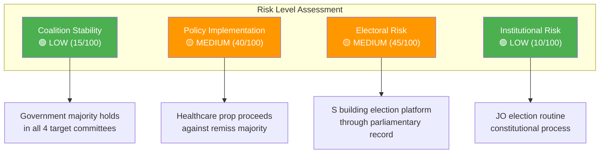

# Political Risk Assessment — 2026-04-15 (Realtime 1029)

**Generated**: 2026-04-15 10:29 UTC (AI-Enhanced)
**Documents Analyzed**: 4 S motions + 8 written questions + chamber context
**Confidence**: HIGH (85%)

---

## Risk Summary

Overall coalition risk remains **LOW** (score: 15/100). The S 4-motion offensive is significant as opposition strategy but does not threaten coalition stability given the government majority. However, two specific risk vectors merit monitoring.

## Risk Matrix

## Detailed Risk Analysis

### Risk 1: Healthcare Reform Against Expert Consensus
- **Probability**: HIGH (80%) — government likely proceeds
- **Impact**: MEDIUM — implementation challenges if municipalities struggle with doctor hiring
- **Evidence**: Majority remiss rejection of Prop 216 (dok_id: HD024081); S full rejection motion
- **Mitigation**: Government could add implementation guidelines or phased rollout

### Risk 2: Migration Policy Contestation Intensifies
- **Probability**: HIGH (85%) — election proximity amplifies
- **Impact**: MEDIUM — multiple parties competing on migration framing
- **Evidence**: S dual migration motions (HD024079, HD024080), SD oversight questions (HD12684 on Syrian returns)
- **Mitigation**: Government can point to multiple migration reform bills already in committee

### Risk 3: Opposition Builds "Ignored Expert Advice" Narrative
- **Probability**: MEDIUM (55%) — depends on media framing
- **Impact**: MEDIUM-HIGH — erodes government credibility on evidence-based policy
- **Evidence**: Healthcare remiss (HD024081), potential municipal complaints on settlement (HD024079)
- **Mitigation**: Government emphasizes overall reform agenda and voter mandate

### Risk 4: SD-Government Friction on Security Preparedness
- **Probability**: LOW (30%) — SD supportive but pushing harder
- **Impact**: LOW — questions rather than formal opposition
- **Evidence**: Reserve police question (HD12692) redirected from Jonson to Strömmer; non-committal answer
- **Mitigation**: Government can cite ongoing analysis of preparedness proposals

## Anomaly Flags

| Flag | Description | Severity |
|------|-------------|----------|
| ⚠️ Coordinated timing | 4 S motions filed simultaneously across 4 committees | Notable but expected |
| ⚠️ Remiss override | Government proceeding against healthcare remiss majority | Policy risk |
| ℹ️ Minister redirect | Söder's defense question answered by Strömmer, not Jonson | Procedural |

## Data Quality Notes

- Risk scores derived from full-text analysis + CIA coalition metrics (stability: 83/100)
- Electoral risk estimates based on 2026 election proximity and policy salience polling
- Coalition arithmetic: government holds majority in all relevant committees
