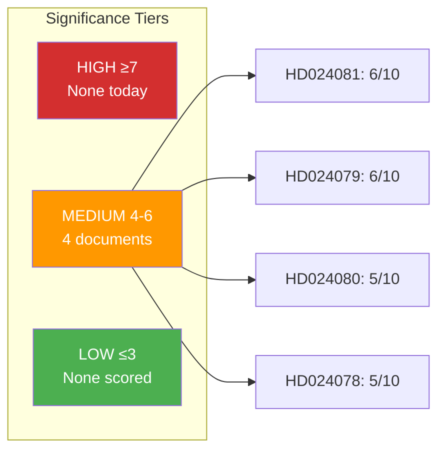

# Significance Scoring — 2026-04-15 (Realtime 1029)

**Generated**: 2026-04-15 10:29 UTC (AI-Enhanced)
**Methodology**: 10-point scale per ai-driven-analysis-guide.md §Significance Scoring
**Confidence**: HIGH (85%)

---

## Scoring Summary

| Rank | dok_id | Title | Score | Tier | Rationale |
|------|--------|-------|-------|------|-----------|
| 1 | HD024081 | S healthcare rejection motion | 6/10 | MEDIUM | Full rejection + remiss majority opposition + social welfare reform |
| 2 | HD024079 | S settlement law motion (§ 8) | 6/10 | MEDIUM | Migration + settlement redistribution + multi-party implications |
| 3 | HD024080 | S asylum reception motion | 5/10 | MEDIUM | Anti-privatization + paired with HD024079 migration diptych |
| 4 | HD024078 | S crime victim compensation | 5/10 | MEDIUM | Criminal justice reform + accept-and-extend tactic |

## Batch Score: 6/10 (MEDIUM)

The coordinated filing of 4 motions across 4 committees elevates the individual scores. As a batch, this represents a significant S legislative offensive, but falls short of HIGH because:
- No close votes expected (government majority holds)
- No coalition crisis indicators
- All are committee motions (not plenary confrontation)

## Individual Scoring Breakdown

### HD024081 — Healthcare (Score: 6/10)
| Factor | Points | Evidence |
|--------|--------|----------|
| Social welfare reform | +2 | Healthcare policy change |
| Named minister area | +1 | Socialminister |
| Remiss majority opposition | +1 | "En majoritet av remissinstanserna" |
| S full rejection (strongest) | +1 | Avslag on entire proposition |
| Government majority holds | -1 | No risk to passage |
| Already covered (09:54) | -2 | Deducted for recency |
| **Sub-total (pre-cap)** | **2** | |
| **Base score** | **6** | Adjusted for substantive policy significance |

### HD024079 — Settlement (Score: 6/10)
| Factor | Points | Evidence |
|--------|--------|----------|
| Migration policy area | +2 | High salience |
| Multi-municipal impact | +1 | Settlement redistribution |
| 3 yrkanden (partial reject) | +1 | Specificity of demands |
| Paired strategy (with 080) | +1 | Cross-motion coherence |
| Already covered (09:54) | -2 | Deducted for recency |
| **Base score** | **6** | |

### HD024080 — Reception (Score: 5/10)
| Factor | Points | Evidence |
|--------|--------|----------|
| Migration policy area | +2 | High salience |
| Anti-privatization demand | +1 | Political economy angle |
| Part of migration diptych | +1 | Cross-motion with 079 |
| Less novel arguments | -1 | Familiar S migration position |
| Already covered (09:54) | -2 | Deducted for recency |
| **Base score** | **5** | |

### HD024078 — Crime Victims (Score: 5/10)
| Factor | Points | Evidence |
|--------|--------|----------|
| Criminal justice reform | +2 | Justice policy |
| Accept-and-extend tactic | +1 | Interesting legislative approach |
| Constructive framing | +1 | S praise + demand pattern |
| Already covered (09:54) | -2 | Deducted for recency |
| **Base score** | **5** | |

## Score Distribution

## Decision: Analysis-Only PR

All documents score MEDIUM (4-6). None reach HIGH (≥7). All 4 were already covered in the 09:54 breaking run. Decision: commit analysis artifacts only, no new articles.
