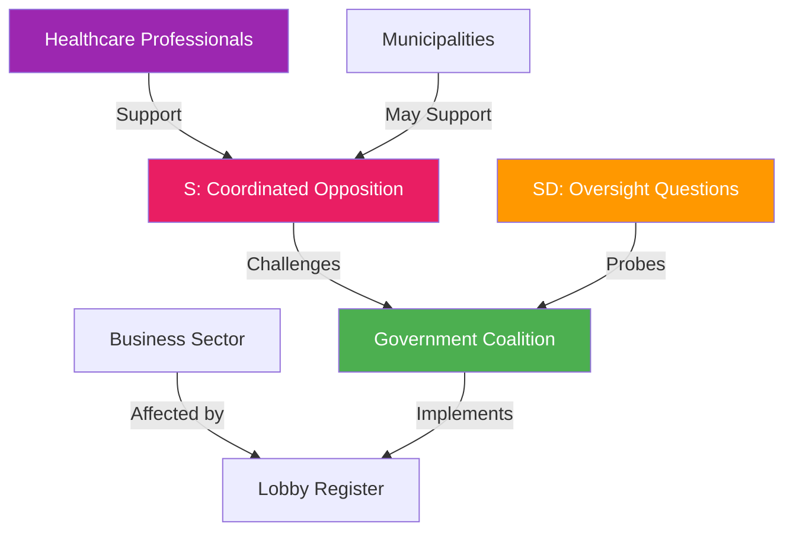

# Stakeholder Perspective Analysis — 2026-04-15 (Realtime 1029)

**Generated**: 2026-04-15 10:29 UTC (AI-Enhanced)
**Documents Analyzed**: 4 S motions + 8 written questions + government context
**Confidence**: HIGH (85%)

---

## 8 Mandatory Stakeholder Groups

### 1. Citizens
- **Impact**: MEDIUM — Healthcare (HD024081) directly affects municipal healthcare access; settlement law (HD024079) affects where immigrants are placed
- **Evidence**: Remiss criticism of Prop 216 cites risks to patient choice and equal care access
- **Sentiment**: Divided — urban vs. rural perspectives differ on settlement allocation

### 2. Government Coalition (M, KD, L + SD support)
- **Impact**: LOW-MEDIUM — All 4 S motions will be defeated by majority, but create parliamentary record
- **Evidence**: Government holds majority in CU, AU, SfU, SoU committees
- **Risk**: Healthcare reform proceeding against remiss majority creates credibility vulnerability

### 3. Opposition Bloc (S, V, MP, C)
- **Impact**: HIGH — S demonstrates coordinated legislative strategy across 4 policy areas
- **Evidence**: HD024078-81 filed simultaneously; escalation ladder from constructive to full rejection
- **Assessment**: V and MP likely support S motions; C position less certain on migration issues

### 4. Business/Industry
- **Impact**: LOW-MEDIUM — Lobby register (HD12693) affects all organizations doing advocacy
- **Evidence**: Strömmer confirms banks, public companies, NGOs all covered by new transparency law
- **Assessment**: Broad business community will need to register lobbying activities

### 5. Civil Society
- **Impact**: MEDIUM — Lobby register includes non-profit organizations; asylum housing privatization debate
- **Evidence**: HD12693 — NGOs must register lobbying; HD024080 — S opposes private asylum housing
- **Assessment**: Mixed — transparency welcomed but registration burden concerns likely

### 6. International/EU
- **Impact**: LOW — IPU session in Istanbul (Swedish delegation); no major EU-level implications
- **Evidence**: HDC220260415ss1 — IPU session April 15-19
- **Assessment**: Standard international parliamentary engagement

### 7. Judiciary/Constitutional
- **Impact**: LOW-MEDIUM — JO election is constitutional event
- **Evidence**: Mattias Almqvist elected as Justitieombudsman from June 1, 2026
- **Assessment**: Routine constitutional process; new JO brings fresh oversight perspective

### 8. Media/Public Opinion
- **Impact**: MEDIUM — S's 4-motion offensive provides rich material for political journalism
- **Evidence**: Clear narrative arc (constructive→aggressive→rejection across motions)
- **Assessment**: Whether media covers the coordinated pattern or individual motions determines political impact

## Cross-Stakeholder Conflict Map

## Data Quality Notes

- Stakeholder analysis based on full-text parliamentary documents and government responses
- Electoral sentiment estimates are directional, not precise polling data
- Institutional stakeholder impacts verified through committee assignment and remiss records
