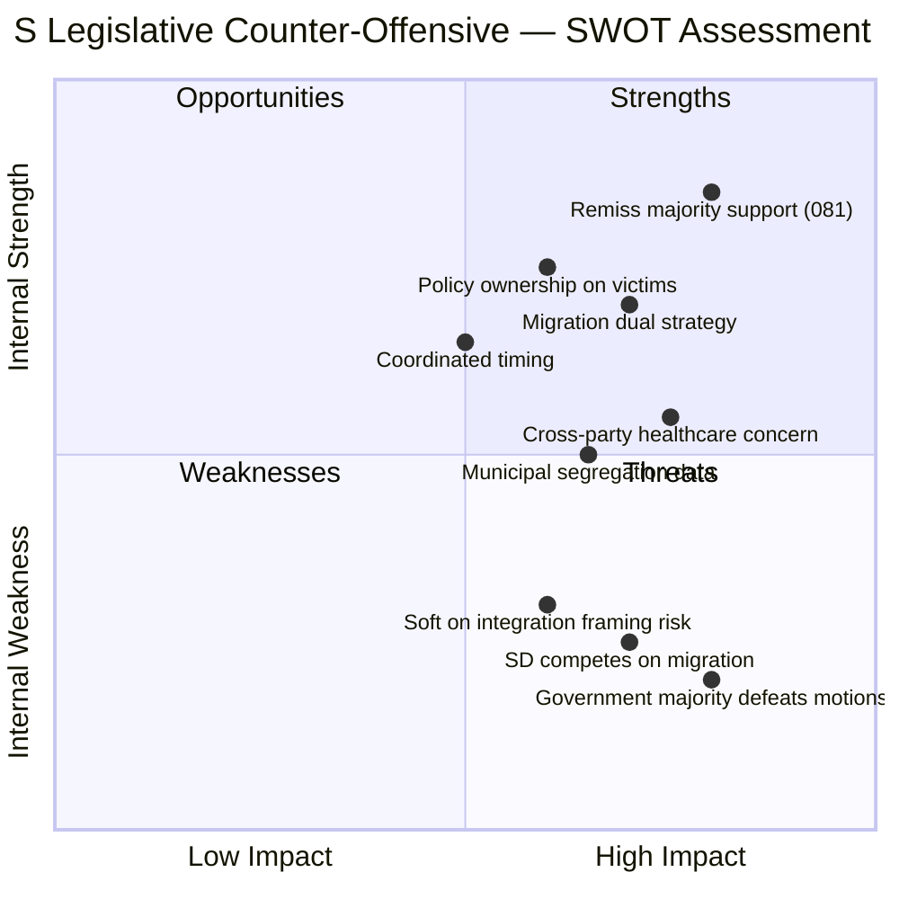

# Political SWOT Analysis — 2026-04-15 (Realtime 1029)

**Generated**: 2026-04-15 10:29 UTC (AI-Enhanced)
**Documents Analyzed**: 4 S committee motions + parliamentary context
**Confidence**: HIGH (85%)

---

## SWOT Quadrant Analysis

## Strengths (Internal, Positive)

| # | Strength | Evidence | Confidence |
|---|----------|----------|------------|
| S1 | **Remiss consensus supports S position on healthcare** | Majority of remiss responses reject Prop 216 (dok_id: HD024081) | HIGH (90%) |
| S2 | **Policy ownership on crime victim reform** | S cites own Prop 2021/22:198 — largest reform in 20+ years (dok_id: HD024078) | HIGH (85%) |
| S3 | **Coordinated 4-motion offensive** | Simultaneous filings across CU, AU, SfU, SoU on April 15 | HIGH (95%) |
| S4 | **Migration dual strategy** | Settlement (HD024079) + reception (HD024080) create comprehensive alternative | HIGH (85%) |

## Weaknesses (Internal, Negative)

| # | Weakness | Evidence | Confidence |
|---|----------|----------|------------|
| W1 | **Government majority will likely reject all 4 motions** | Coalition holds majority in all target committees | HIGH (90%) |
| W2 | **"Soft on integration" framing risk** | Opposing time-limited housing (§ 8, HD024079) could be weaponized | MEDIUM (65%) |
| W3 | **Anti-privatization stance limits efficiency narrative** | HD024080 opposes market solutions in asylum housing | MEDIUM (60%) |

## Opportunities (External, Positive)

| # | Opportunity | Evidence | Confidence |
|---|-------------|----------|------------|
| O1 | **Healthcare professionals may ally with S** | Sector organizations opposed Prop 216 in remiss (HD024081) | HIGH (80%) |
| O2 | **Municipal complaints about allocation** | If settlement law fails to prevent segregation, S position validated | MEDIUM (65%) |
| O3 | **Cross-party victim protection consensus** | Dedicated victim law could gain support beyond S (HD024078) | MEDIUM (60%) |
| O4 | **Lobby register expansion for transparency narrative** | Government confirms broad scope (HD12693) — S can claim credit for transparency pressure | MEDIUM (55%) |

## Threats (External, Negative)

| # | Threat | Evidence | Confidence |
|---|--------|----------|------------|
| T1 | **SD competes on migration hardline** | SD questions on Syrian returns, reserve police (HD12684, HD12692) | HIGH (80%) |
| T2 | **Government frames S as obstructionist** | Full rejection of healthcare prop may be framed negatively | MEDIUM (65%) |
| T3 | **Election clock pressure** | With 2026 election approaching, legislative defeats become politically costly | HIGH (75%) |

## TOWS Strategic Implications

| Strategy | Action |
|----------|--------|
| **SO** (Strengths × Opportunities) | Leverage remiss support + healthcare professional allies to build election narrative on healthcare policy |
| **ST** (Strengths × Threats) | Use coordinated offensive to demonstrate governing capability, counter "obstructionist" framing |
| **WO** (Weaknesses × Opportunities) | Frame motion defeats as "government ignoring experts" rather than S policy failure |
| **WT** (Weaknesses × Threats) | Risk: if all 4 motions fail AND S cannot articulate clear alternative, position weakens |

## Data Quality Notes

- SWOT derived from full-text analysis of 4 S motions + 2 written question answers
- Confidence scores reflect availability of evidence in parliamentary record
- Electoral calculus estimates based on historical polling patterns for policy salience
