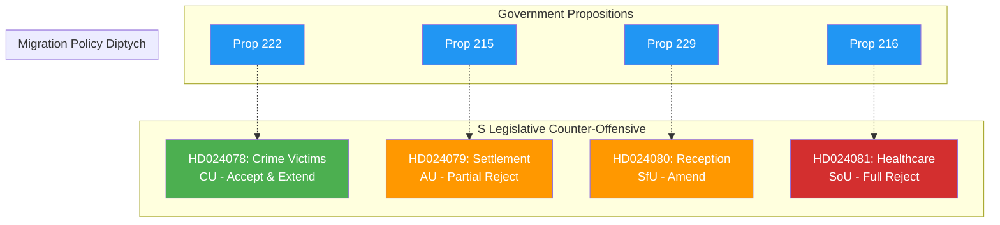

# Analysis Synthesis Summary — 2026-04-15 (Realtime 1029)

**Generated**: 2026-04-15 10:29 UTC (AI-Enhanced)
**Documents Analyzed**: 4 parliamentary motions + 8 written question answers + chamber schedule
**Confidence**: HIGH (85%)
**Analysis Depth**: Deep (15-minute minimum)

---

## Executive Summary

The Swedish Riksdag's Wednesday April 15 session reveals a **coordinated Socialdemokraterna legislative counter-offensive**: four simultaneous committee motions (HD024078-81) targeting government propositions across criminal justice (CU), migration-settlement (AU), migration-reception (SfU), and healthcare (SoU). This systematic approach — ranging from constructive engagement (crime victims) to full rejection (healthcare) — signals S is building its 2026 election platform through parliamentary action.

Parallel activity includes 8 written question answers (predominantly SD oversight of M/KD/L ministers), election of new Justitieombudsman Mattias Almqvist, and active chamber debates on police questions with all parties represented.

## Key Strategic Findings

### 1. S Coordinated 4-Motion Offensive (PRIMARY FINDING)

| dok_id | Target Proposition | Committee | S Stance | Escalation Level |
|--------|-------------------|-----------|----------|------------------|
| HD024078 | Prop 222 (Crime victims) | CU | Accept-and-extend | 🟢 Constructive |
| HD024080 | Prop 229 (Reception law) | SfU | Amend (anti-privatization) | 🟡 Moderate |
| HD024079 | Prop 215 (Settlement law) | AU | Partial reject (§ 8) | 🟠 Aggressive |
| HD024081 | Prop 216 (Healthcare) | SoU | **Full rejection** | 🔴 Maximum |

**Pattern**: S deploys an escalation ladder — from constructive opposition (crime victims) to complete rejection (healthcare). This suggests deliberate strategic calibration of opposition intensity by policy area.

### 2. SD Parliamentary Oversight Campaign

8 written question answers today, with **Markus Wiechel (SD)** filing 4 questions targeting 3 different ministers:
- Lobby register scope → Justitieminister Strömmer (M)
- Public trust positions → Gymnasieminister Edholm (L)
- DG under investigation → Justitieminister Strömmer (M)
- Syrian returns → Migrationsminister Forssell (M)

**Björn Söder (SD)** filed 2 questions on security/defense:
- Uppsala University leadership → Gymnasieminister Edholm (L)
- Reserve police → answered by Strömmer (redirected from Försvarsminister Jonson)

### 3. Chamber Activity

- **09:00**: Election of Justitieombudsman Mattias Almqvist (constitutional event)
- **Ongoing**: Debates on police questions (7 parties: S, M, SD, V, MP, C, L, KD) and working environment (AU12)
- **16:00**: Voting — CU23 (rural employment/housing), SfU16 (migration), and others

### 4. Government Transparency Development

The lobby register answer (HD12693) confirms the government's law will cover **all organizations** — including non-profits, banks, and public companies — implementing SOU 2025:52 "Ökad insyn i politiska processer."

## Cross-Document Relationship Map

## Implications for Article Generation

- **Breaking news threshold**: NOT met — these motions are MEDIUM significance and were already covered by the 09:54 breaking run
- **Analysis value**: HIGH — the coordinated pattern and escalation ladder represent genuine political intelligence
- **Next monitoring window**: 16:00 voting session may produce HIGH-significance results if any vote is close

## Data Quality Notes

- **Analysis confidence**: HIGH (85%) — full text available for all 4 motions + 2 written answers
- **Coverage gap**: Chamber debate transcripts not yet available (debates ongoing)
- **Temporal note**: Voting at 16:00 not yet occurred — results pending
