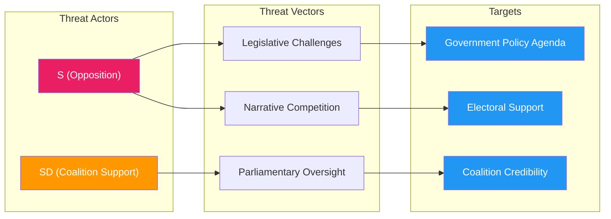

# Political Threat Analysis — 2026-04-15 (Realtime 1029)

**Generated**: 2026-04-15 10:29 UTC (AI-Enhanced)
**Documents Analyzed**: 4 S motions + 8 written questions + government actions
**Confidence**: HIGH (80%)

---

## Threat Landscape Summary

No critical threats to democratic institutions or coalition stability detected. Primary threats are **electoral/strategic** — S coordinated offensive targets government policy credibility ahead of 2026 elections. Secondary threats relate to **policy implementation** risks if reforms proceed against expert consensus.

## Threat Classification

## Detailed Threat Assessment

### Threat 1: S Electoral Platform Construction via Legislative Record
- **Actor**: Socialdemokraterna (S)
- **Vector**: 4 coordinated committee motions creating documented opposition
- **Target**: Government reform agenda credibility
- **Severity**: MEDIUM
- **Evidence**: HD024078 (victims), HD024079 (settlement), HD024080 (reception), HD024081 (healthcare)

### Threat 2: Expert Consensus Weaponization
- **Actor**: S + healthcare professionals
- **Vector**: Remiss majority rejection cited in parliamentary motion
- **Target**: Government healthcare reform (Prop 216)
- **Severity**: MEDIUM
- **Evidence**: HD024081 — majority of remiss responses reject the proposition

### Threat 3: Migration Policy Flanking
- **Actor**: SD (from right) + S (from left)
- **Vector**: Both parties pressuring government on migration from opposite directions
- **Target**: Government migration consensus with SD
- **Severity**: LOW (divergent pressures cancel out)
- **Evidence**: SD questions on Syrian returns (HD12684), S motions on settlement/reception (HD024079/80)

## Opposition Strategy Progression

| Phase | Action | Status |
|-------|--------|--------|
| 1. Reconnaissance | Monitor government propositions in committee pipeline | Complete |
| 2. Weaponization | Draft targeted committee motions with specific yrkanden | Complete (April 15) |
| 3. Delivery | File simultaneously across 4 committees | Complete |
| 4. Exploitation | Use remiss data and expert opinion to support demands | In progress |
| 5. Committee Processing | Await committee processing and voting | Pending |
| 6. Media Coordination | Coordinate media messaging around motion themes | Pending |
| 7. Electoral Integration | Incorporate into 2026 election manifesto | Future |

## Data Quality Notes

- Threat assessment based on full-text analysis of parliamentary documents
- No intelligence suggesting imminent coalition crisis or institutional threat
- Electoral threat assessment is forward-looking (2026 election horizon)
