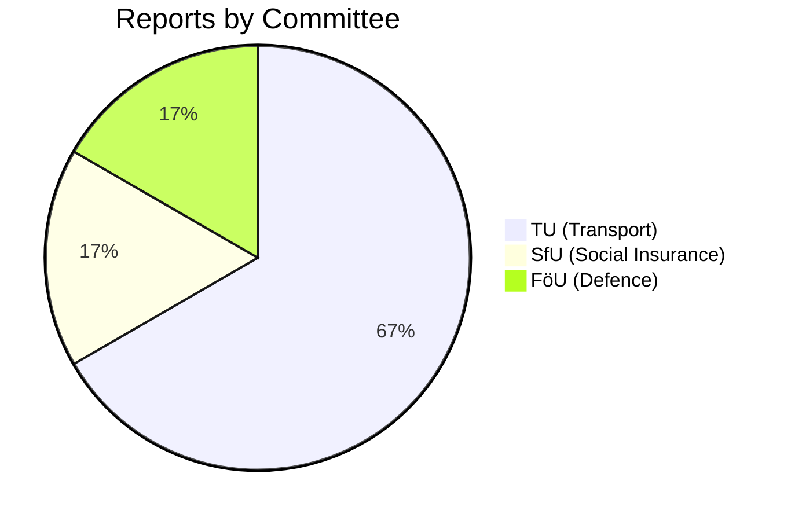

# Political Classification Results — 2026-04-16

**Generated**: 2026-04-16 04:47 UTC
**Documents Analyzed**: 6
**Confidence**: HIGH
**Riksmöte**: 2025/26

## Document Classification

| dok_id | Title | Committee | Domain | Type | Significance | Status |
|--------|-------|-----------|--------|------|-------------|--------|
| HD01SfU22 | Inhibition av verkställigheten — ny ordning för utlänningar | SfU | Immigration/Asylum | Legislative reform | 🔴 8/10 Critical | Planned |
| HD01TU21 | En statlig e-legitimation | TU | Digital governance | Infrastructure law | 🟡 7/10 High | Planned |
| HD01TU17 | Nya regler mot bedrägerier genom elektronisk kommunikation | TU | Consumer protection | Regulatory reform | 🟡 6/10 Moderate-High | Planned |
| HD01TU22 | Åtgärder mot manipulation av färdskrivare | TU | Transport safety | EU regulation | 🟢 3/10 Low | Planned |
| HD01TU19 | Ny lag om kommunal hamnverksamhet | TU | Municipal governance | New legislation | 🟢 3/10 Low | Planned |
| HD01FöU22 | Titel (unavailable) | FöU | Defence/Security | Unknown | 🟢 2/10 Low | Planned |

## Committee Distribution

## Domain Analysis

- **Immigration/Asylum**: 1 report (SfU22) — highest significance, most politically contentious
- **Digital Governance**: 1 report (TU21) — high significance, broad public impact
- **Consumer Protection**: 1 report (TU17) — moderate-high significance, anti-fraud focus
- **Transport**: 2 reports (TU22, TU19) — low significance, technical/regulatory
- **Defence/Security**: 1 report (FöU22) — low significance, title unavailable

## Legislative Origin

| dok_id | Source Proposition | Issuing Department |
|--------|-------------------|-------------------|
| HD01SfU22 | Prop 2025/26:145 | Justitiedepartementet |
| HD01TU17 | Prop 2025/26:233 | Finansdepartementet |
| HD01TU19 | Prop 2025/26:234 | (Transport related) |
| HD01TU21 | EU eIDAS 2.0 regulation | Infrastrukturdepartementet |
| HD01TU22 | EU tachograph regulation | (Transport related) |
| HD01FöU22 | Unknown | Försvarsdepartementet |
