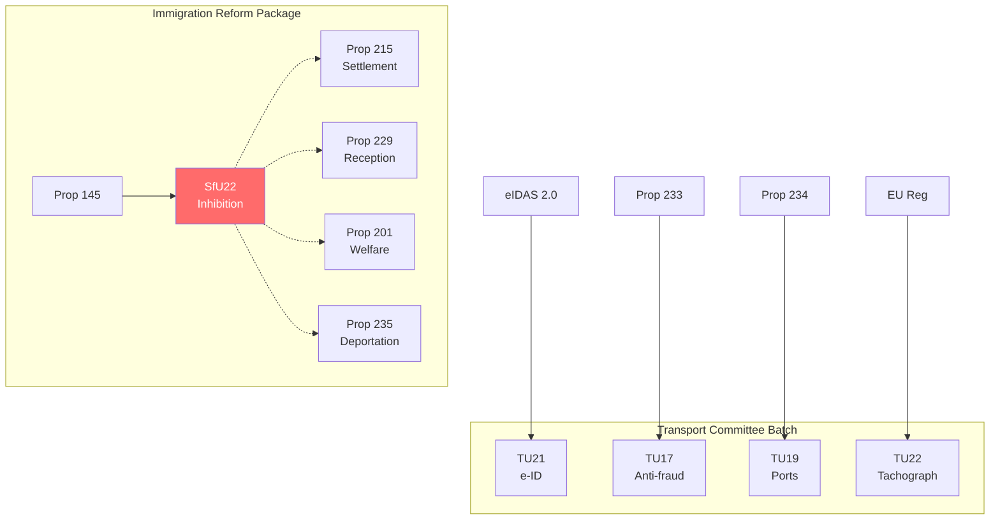

# Cross-Document Reference Map — 2026-04-16

**Generated**: 2026-04-16 04:48 UTC
**Documents Analyzed**: 6

## Cross-References

### Legislative Chain: Immigration Reform Package
- **HD01SfU22** (Inhibition) ← Prop 2025/26:145
- Related: Prop 2025/26:215 (Tidsbegränsat boende — new settlement law references SfU22)
- Related: Prop 2025/26:229 (Ny mottagandelag — new reception law references SfU22 inhibition)
- Related: Prop 2025/26:201 (Reformerat försörjningsstöd — reformed welfare references SfU22)
- Related: Prop 2025/26:235 (Skärpta regler om utvisning — stricter deportation rules)

### Legislative Chain: Transport Committee Batch
- **HD01TU21** (e-ID) ← EU eIDAS 2.0 regulation + Polismyndigheten directive (Ju2025/00740)
- **HD01TU17** (Anti-fraud) ← Prop 2025/26:233 (Finansdepartementet)
- **HD01TU19** (Ports) ← Prop 2025/26:234
- **HD01TU22** (Tachograph) ← EU regulation

### Cross-Committee Links
| Source | Target | Relationship |
|--------|--------|-------------|
| HD01SfU22 | Prop 145 | Implements proposition |
| HD01SfU22 | Prop 215 | Referenced in settlement law |
| HD01SfU22 | Prop 229 | Referenced in reception law |
| HD01TU17 | Prop 233 | Implements proposition |
| HD01TU19 | Prop 234 | Implements proposition |
| HD01TU21 | eIDAS 2.0 | EU regulation transposition |
| HD01TU22 | EU Reg | EU regulation transposition |

## Cross-Reference Network

