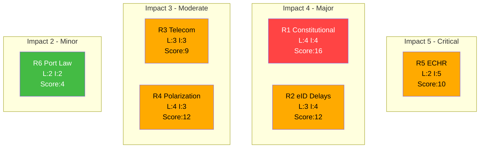

# Political Risk Assessment — 2026-04-16

**Generated**: 2026-04-16 04:46 UTC
**Documents Analyzed**: 6
**Confidence**: HIGH
**Riksmöte**: 2025/26

## Risk Matrix (Likelihood × Impact)

| # | Risk | Likelihood (1-5) | Impact (1-5) | L×I Score | Level |
|---|------|------------------|-------------|-----------|-------|
| R1 | Constitutional challenge to SfU22 inhibition regime | 4 | 4 | **16** | 🔴 HIGH |
| R2 | State e-ID implementation delays past EU deadline | 3 | 4 | **12** | 🟡 MEDIUM |
| R3 | Telecom operator non-compliance with TU17 anti-fraud rules | 3 | 3 | **9** | 🟡 MEDIUM |
| R4 | Electoral polarization from immigration reform package | 4 | 3 | **12** | 🟡 MEDIUM |
| R5 | ECHR case against Sweden over inhibition replacing permits | 2 | 5 | **10** | 🟡 MEDIUM |
| R6 | Municipal resistance to port operations law (TU19) | 2 | 2 | **4** | 🟢 LOW |

## Risk Heat Map

## Detailed Risk Analysis

### R1: Constitutional Challenge to Inhibition Regime (L×I: 16 — HIGH)
**Source**: HD01SfU22 — Prop 2025/26:145
The replacement of temporary residence permits with "inhibition" (enforcement postponement) creates a novel legal construct. Opposition parties (S, V, MP) have constitutional concerns about removing a positive rights framework (permits) and replacing it with a negative one (non-enforcement). Lagrådet review likely. Similar reforms in Denmark faced European Court challenges.

### R2: State e-ID Implementation Delays (L×I: 12 — MEDIUM)
**Source**: HD01TU21
EU Digital Identity Wallet regulation sets implementation deadlines. Tasking Polismyndigheten (police authority) as issuer involves complex technical and organizational build-out. Risk of delay is moderate given similar Nordic experiences (Norway's BankID transition took 18+ months). Political consequences for government credibility.

## Forward Indicators

| # | Indicator | Trigger | Timeline | Confidence |
|---|-----------|---------|----------|------------|
| F1 | Opposition motion for Lagrådet review of SfU22 | Filed after committee report publication | Q2 2026 | 🟩HIGH |
| F2 | Polismyndigheten e-ID pilot announcement | Government directive or appropriation | Q3 2026 | 🟧MEDIUM |
| F3 | Telecom operator compliance reports | PTS enforcement actions | Q4 2026 | 🟧MEDIUM |
| F4 | ECHR communication on Swedish inhibition case | Individual complaint post-implementation | 2027+ | 🟥LOW |

## Coalition Risk Score: 18/100 (LOW)
Government maintains comfortable majority for all 6 reports. SD support secured through Tidöavtalet commitments. No cross-bloc defection expected.
