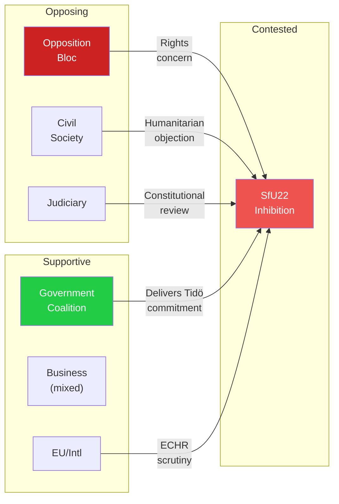

# Stakeholder Perspective Analysis — 2026-04-16

**Generated**: 2026-04-16 04:47 UTC
**Documents Analyzed**: 6
**Confidence**: HIGH
**Riksmöte**: 2025/26

## All 8 Mandatory Stakeholder Groups

### 1. Citizens
| Document | Impact | Assessment | Confidence |
|----------|--------|------------|------------|
| HD01TU21 (e-ID) | **Positive** | Universal digital identity access — reduces BankID dependency for elderly, immigrants, unbanked | 🟩HIGH |
| HD01TU17 (Anti-fraud) | **Positive** | Protection from phone scams, spoofed calls, and SMS fraud affecting millions annually | 🟩HIGH |
| HD01SfU22 (Inhibition) | **Mixed** | Deportees lose residence permit framework; general public may see this as tougher enforcement | 🟧MEDIUM |
| HD01TU22 (Tachograph) | **Neutral** | Road safety improvement but low direct citizen impact | 🟥LOW |

### 2. Government Coalition (M-KD-L + SD support)
| Document | Impact | Assessment | Confidence |
|----------|--------|------------|------------|
| HD01SfU22 | **Strongly Positive** | Core Tidöavtalet delivery — demonstrates coalition can legislate immigration reform | 🟩HIGH |
| HD01TU21 | **Positive** | Modernization narrative — digital governance improvement | 🟩HIGH |
| HD01TU17 | **Positive** | Consumer protection initiative from Finansdepartementet (Prop 233) | 🟧MEDIUM |

### 3. Opposition Bloc (S-V-MP-C)
| Document | Impact | Assessment | Confidence |
|----------|--------|------------|------------|
| HD01SfU22 | **Attack vector** | "Government strips rights from vulnerable people" — S/V/MP will oppose on humanitarian grounds | 🟩HIGH |
| HD01TU21 | **Support expected** | Broad consensus on state e-ID — limited opposition leverage | 🟩HIGH |
| HD01TU17 | **Support expected** | Anti-fraud is cross-partisan — opposition co-owns this agenda | 🟧MEDIUM |

### 4. Business/Industry
| Document | Impact | Assessment | Confidence |
|----------|--------|------------|------------|
| HD01TU17 | **Mixed** | Telecom operators face new compliance costs; financial sector benefits from fraud reduction | 🟩HIGH |
| HD01TU19 | **Mixed** | Maritime/logistics sector gains regulatory clarity on port operations; some operators face restrictions | 🟧MEDIUM |
| HD01TU21 | **Positive** | Digital identity infrastructure enables secure digital commerce | 🟧MEDIUM |

### 5. Civil Society
| Document | Impact | Assessment | Confidence |
|----------|--------|------------|------------|
| HD01SfU22 | **Negative** | Human rights organizations (Amnesty, UNHCR Sweden, Asylrättscentrum) will criticize removal of permit framework | 🟩HIGH |
| HD01TU21 | **Positive** | Digital inclusion for marginalized groups | 🟧MEDIUM |

### 6. International/EU
| Document | Impact | Assessment | Confidence |
|----------|--------|------------|------------|
| HD01TU21 | **Positive** | EU Digital Identity Wallet compliance (eIDAS 2.0) | 🟩HIGH |
| HD01TU22 | **Positive** | EU tachograph regulation alignment | 🟧MEDIUM |
| HD01SfU22 | **Neutral-Negative** | May draw UNHCR or Council of Europe scrutiny on deportee rights | 🟧MEDIUM |

### 7. Judiciary/Constitutional
| Document | Impact | Assessment | Confidence |
|----------|--------|------------|------------|
| HD01SfU22 | **High concern** | Novel "inhibition" construct untested in Swedish administrative law — expect Lagrådet scrutiny and potential constitutional review | 🟩HIGH |
| HD01TU21 | **Moderate** | Data protection implications of police-issued digital ID | 🟧MEDIUM |

### 8. Media/Public Opinion
| Document | Impact | Assessment | Confidence |
|----------|--------|------------|------------|
| HD01SfU22 | **High coverage** | Immigration reform generates extensive media debate — expect editorial positions | 🟩HIGH |
| HD01TU21 | **Moderate coverage** | Tech/digital governance angle — positive framing likely | 🟧MEDIUM |
| HD01TU17 | **Moderate coverage** | Consumer protection "good news" story | 🟧MEDIUM |

## Stakeholder Conflict Map

