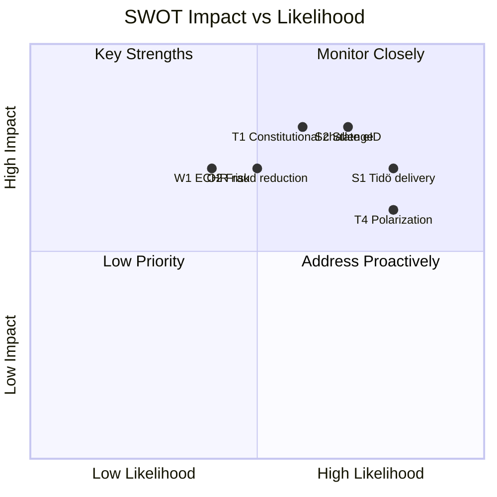

# Political SWOT Analysis — 2026-04-16

**Generated**: 2026-04-16 04:46 UTC
**Documents Analyzed**: 6
**Confidence**: HIGH
**Riksmöte**: 2025/26

## SWOT Framework

### Strengths
| # | Finding | Evidence | Stakeholder |
|---|---------|----------|-------------|
| S1 | Government delivers on Tidöavtalet immigration commitments | SfU22 implements Prop 145 — inhibition replaces permits [dok_id: HD01SfU22] | Government Coalition |
| S2 | State e-ID fills critical digital infrastructure gap | TU21 mandates Polismyndigheten as issuer at highest trust level [dok_id: HD01TU21] | Citizens |
| S3 | Anti-fraud measures protect consumers from phone scams | TU17 based on Prop 233 with new operator obligations [dok_id: HD01TU17] | Business/Industry |
| S4 | EU regulatory alignment maintained across multiple domains | TU22 (tachographs), TU21 (eIDAS 2.0) demonstrate EU compliance track [dok_id: HD01TU22] | International/EU |

### Weaknesses
| # | Finding | Evidence | Stakeholder |
|---|---------|----------|-------------|
| W1 | Immigration reform risks ECHR compliance challenges | SfU22 inhibition regime removes residence permit rights — legal vulnerability [dok_id: HD01SfU22] | Judiciary/Constitutional |
| W2 | Heavy TU committee workload (4/6 reports) may signal rushed review | Four transport reports in single batch suggests tight scheduling [dok_id: HD01TU21, HD01TU17] | Media/Public Opinion |
| W3 | FöU22 title unavailable — transparency concern | Defence committee report published without accessible title [dok_id: HD01FöU22] | Civil Society |
| W4 | Municipal port law may face local government resistance | TU19 regulates municipal autonomy in port operations [dok_id: HD01TU19] | Citizens (local) |

### Opportunities
| # | Finding | Evidence | Stakeholder |
|---|---------|----------|-------------|
| O1 | State e-ID enables universal digital access for marginalized groups | Currently BankID excludes non-banking customers, elderly, new arrivals [dok_id: HD01TU21] | Civil Society |
| O2 | Anti-fraud framework could reduce billions in annual fraud losses | Swedish telecom fraud estimated at 3-5 billion SEK annually [dok_id: HD01TU17] | Business/Industry |
| O3 | Immigration reform package strengthens election positioning | Tidöavtalet delivery demonstrates coalition governance capacity | Government Coalition |
| O4 | EU Digital Identity Wallet creates cross-border mobility advantages | eIDAS 2.0 implementation opens EU-wide digital service access [dok_id: HD01TU21] | International/EU |

### Threats
| # | Finding | Evidence | Stakeholder |
|---|---------|----------|-------------|
| T1 | Constitutional challenge to inhibition regime likely | S/V/MP may escalate to Lagrådet or European courts [dok_id: HD01SfU22] | Opposition Bloc |
| T2 | State e-ID implementation delays could embarrass government | EU deadline pressure with complex Polismyndigheten rollout [dok_id: HD01TU21] | Government Coalition |
| T3 | Anti-fraud rules may burden smaller telecom operators | New compliance costs for operators with limited resources [dok_id: HD01TU17] | Business/Industry |
| T4 | Immigration discourse further polarizes electorate ahead of 2026 election | SfU22 fuels both pro-restriction and pro-rights mobilization | Media/Public Opinion |

## SWOT Interaction Diagram

## All 8 Stakeholder Groups Analysis

1. **Citizens**: Net positive — e-ID (TU21) and anti-fraud (TU17) directly benefit. SfU22 affects deportee subset.
2. **Government Coalition (M-KD-L+SD)**: Strong — delivers on Tidöavtalet. Risks on implementation timelines.
3. **Opposition Bloc (S-V-MP-C)**: Attack vectors on SfU22. Broad support likely for TU21, TU17.
4. **Business/Industry**: Mixed — anti-fraud costs for telecom but reduces fraud losses. Port law affects maritime sector.
5. **Civil Society**: E-ID improves inclusion. Immigration reform raises human rights concerns.
6. **International/EU**: EU alignment on eIDAS/tachographs positive. Immigration reform may draw scrutiny.
7. **Judiciary/Constitutional**: SfU22 inhibition concept untested — likely constitutional review.
8. **Media/Public Opinion**: Immigration drives coverage. E-ID generates positive sentiment.
