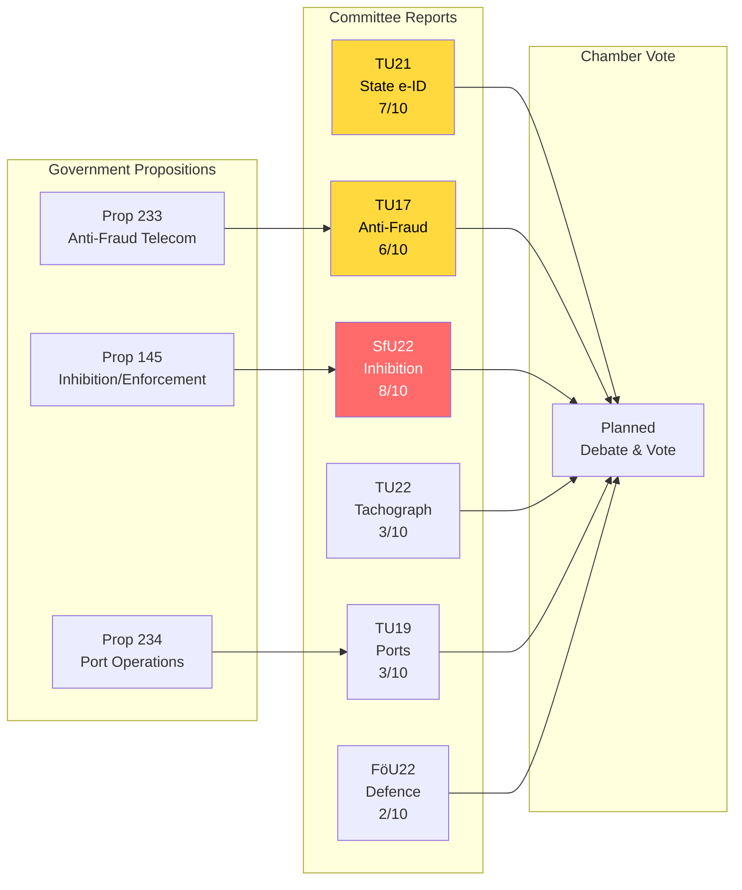

# Analysis Synthesis Summary — 2026-04-16

**Generated**: 2026-04-16 04:45 UTC
**Data Sources**: get_betankanden, get_dokument_innehall, search_dokument (propositions)
**Documents Analyzed**: 6
**Confidence**: HIGH
**Riksmöte**: 2025/26
**Analysis Depth**: deep

## Summary

Six committee reports from Trafikutskottet (TU), Socialförsäkringsutskottet (SfU), and Försvarsutskottet (FöU) dated 2026-04-14 cover a politically significant legislative agenda spanning digital identity, anti-fraud telecom regulation, immigration enforcement reform, transport safety (tachographs), municipal port governance, and defence. The batch is dominated by TU (4 of 6 reports), reflecting the Transport Committee's active spring session. The most consequential report — SfU22 on replacing temporary residence permits with enforcement inhibition — directly implements Prop 2025/26:145 and connects to the government's broader immigration overhaul (Tidöavtalet commitments).

## Recommended Article Titles

- **EN**: "Riksdag Committees Advance State e-ID and Immigration Enforcement Reform"
- **SV**: "Riksdagens utskott driver statlig e-legitimation och reformerad verkställighetsordning"

## Recommended Meta Descriptions

- **EN**: "Transport and Social Insurance committees approve state e-ID (TU21), anti-fraud telecom rules (TU17), and a new enforcement inhibition regime replacing residence permits for deportees (SfU22)."
- **SV**: "Trafik- och socialförsäkringsutskotten godkänner statlig e-legitimation (TU21), telekombedrägeribekämpning (TU17) och ny inhibitionsordning som ersätter uppehållstillstånd (SfU22)."

## Key Findings

1. **HD01TU21** (Significance 7/10): State e-ID at highest trust level — implements EU Digital Identity Wallet (eIDAS 2.0). Polismyndigheten designated as issuer [HIGH confidence]. Major digital governance milestone affecting all citizens.
2. **HD01TU17** (Significance 6/10): Anti-fraud telecom rules — Prop 2025/26:233 from Finansdepartementet. Targets phone scams and electronic communication fraud with new operator obligations [HIGH confidence].
3. **HD01SfU22** (Significance 8/10): Enforcement inhibition replacing temporary residence permits for deportees facing temporary enforcement obstacles — Prop 2025/26:145. Part of Tidöavtalet immigration package. Politically contentious with Opposition likely to critique [HIGH confidence].
4. **HD01TU22** (Significance 3/10): EU tachograph manipulation measures. Technical transport regulation with low political salience [MEDIUM confidence].
5. **HD01TU19** (Significance 3/10): Municipal port operations law — Prop 2025/26:234. Regulates local government port services [MEDIUM confidence].
6. **HD01FöU22** (Significance 2/10): Defence committee report — title not yet published. Likely routine defence matter [LOW confidence].

## Legislative Pipeline

## Election 2026 Implications

| Dimension | Assessment | Confidence |
|-----------|-----------|------------|
| Electoral Impact | SfU22 immigration reform highly salient — fuels SD/M base but alienates swing voters concerned about rights | 🟩HIGH |
| Coalition Scenarios | Reports reinforce Tidöavtalet legislative delivery — strengthens M-KD-L-SD cooperation | 🟩HIGH |
| Voter Salience | State e-ID (TU21) has broad popular appeal; immigration (SfU22) is top-3 election issue | 🟧MEDIUM |
| Campaign Vulnerability | Opposition can frame SfU22 as "stripping rights from vulnerable people" — S/V/MP attack vector | 🟧MEDIUM |
| Policy Legacy | TU21 creates lasting digital infrastructure; SfU22 fundamentally restructures immigration enforcement | 🟩HIGH |

## Data Quality Notes

- Documents sourced from **2026-04-14** via lookback fallback (article date: 2026-04-16)
- Full text available for TU21, TU17, TU22, TU19; SfU22 has HTML content; FöU22 title unavailable
- Cross-referenced with Prop 2025/26:145, 233, 234 for legislative context
