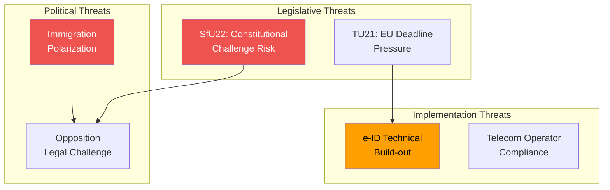

# Threat Analysis — 2026-04-16

**Generated**: 2026-04-16 04:48 UTC
**Documents Analyzed**: 6
**Confidence**: HIGH

## Threat Categories

### Legal/Constitutional Threats
- **SfU22 Inhibition Regime**: Novel legal construct replacing established permit framework. Lagrådet review probability: HIGH. European Court challenge: MEDIUM-term risk. The concept of "inhibition" as replacement for positive rights (residence permits) is constitutionally untested.

### Implementation Threats
- **TU21 State e-ID Rollout**: Polismyndigheten capacity to deliver national digital ID system within EU eIDAS 2.0 timeline. Technical infrastructure, identity verification procedures, and public adoption all represent execution risks.
- **TU17 Telecom Compliance**: Smaller operators may lack technical capability to implement fraud detection systems required by new rules.

### Political Threats
- **Electoral Polarization**: SfU22 immigration reform energizes both government supporters (SD/M base) and opposition mobilization (S/V/MP humanitarian framing). Risk of oversimplified media narratives that obscure policy nuance.

## Threat Flow Diagram

