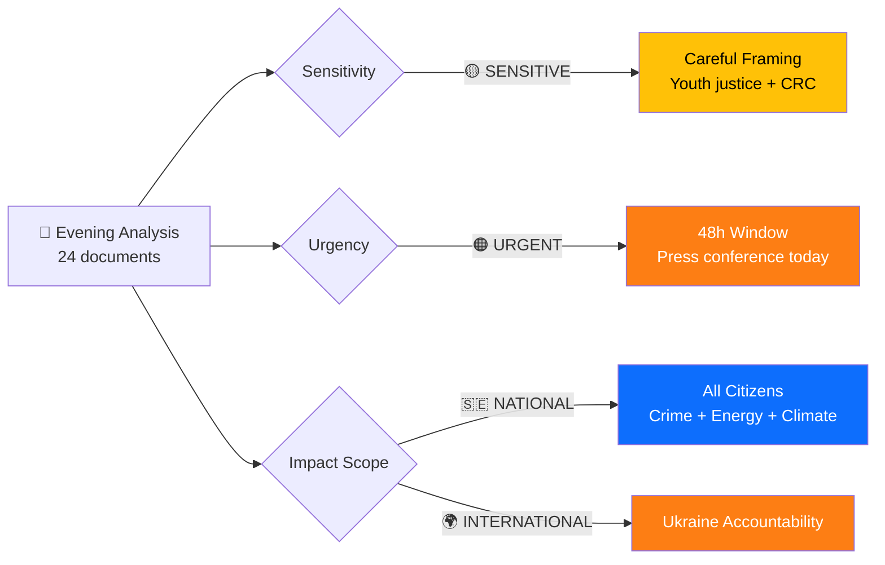
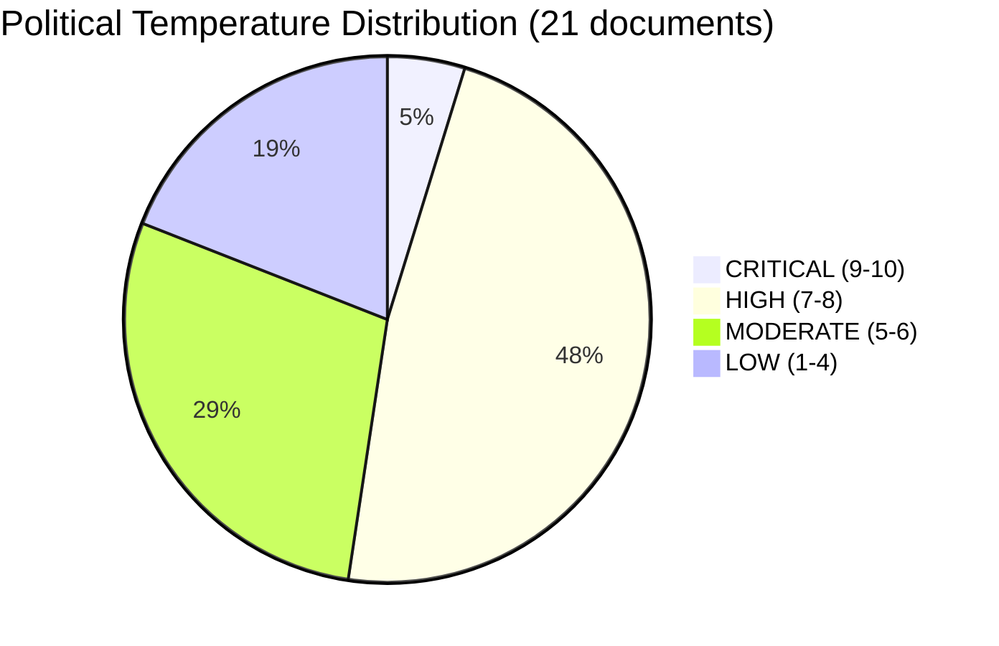

# Political Event Classification — Evening Analysis 2026-04-16

## 📋 Document Metadata

| Field | Value |
|-------|-------|
| **Classification ID** | `CLS-2026-04-16-EVE` |
| **Document Type** | Political Event Classification |
| **Event Date** | 2026-04-16 |
| **Classification Date** | 2026-04-16 19:30 UTC |
| **Primary Source dok_id** | HD03246 (Skärpta regler för unga lagöverträdare) |
| **Secondary Source(s)** | HD03231, HD03232, HD03244, HD03242, HD01SkU23, HD01MJU19, HD01MJU20, HD024090-HD024093, HD024095-HD024097 |
| **Classified By** | news-evening-analysis |
| **Reviewed By** | automated |

---

## 🏷️ Classification Dimensions

### Classification Decision Tree

---

## 📊 Per-Document Classification Table

| dok_id | Title | Sensitivity | Urgency | Impact Scope | Policy Domain | PTI (1-10) | Strategic Significance |
|--------|-------|:-----------:|:-------:|:------------:|:-------------:|:----------:|:---------------------:|
| HD03246 | Skärpta regler för unga lagöverträdare | 🟡 SENSITIVE | 🔴 CRITICAL | 🇸🇪 NATIONAL | Criminal Justice | **9** | Core Tidöavtalet delivery; press conference signals flagship status |
| HD03231 | Ukraine aggression tribunal | 🟢 PUBLIC | 🔵 ELEVATED | 🌍 INTERNATIONAL | Foreign Affairs | **8** | Sweden joins international accountability framework; NATO-era positioning |
| HD03232 | Ukraine damages commission | 🟢 PUBLIC | 🔵 ELEVATED | 🌍 INTERNATIONAL | Foreign Affairs | **8** | Companion to HD03231; comprehensive Ukraine accountability |
| HD01SkU23 | EV charging + fuel deductions | 🟢 PUBLIC | 🔵 ELEVATED | 🇸🇪 NATIONAL | Energy/Tax | **8** | Permanent tax exemption; dual green+cost-of-living agenda |
| HD024090 | V rejects deportation rules | 🟡 SENSITIVE | 🟠 URGENT | 🇸🇪 NATIONAL | Migration/Justice | **8** | V leads opposition coordination on Prop 235 |
| HD03244 | Public admin interoperability | 🟢 PUBLIC | ⚪ ROUTINE | 🇪🇺 EU | Digital Governance | **7** | EU Interoperable Europe Act implementation |
| HD03242 | Active forestry regulation | 🟡 SENSITIVE | ⚪ ROUTINE | 🇸🇪 NATIONAL | Environment/Industry | **7** | Environmental vs. industry tension |
| HD024091 | V rejects war material rules | 🟡 SENSITIVE | 🔵 ELEVATED | 🌍 INTERNATIONAL | Defense/Export | **7** | Svenneling (V) defense critique |
| HD024092 | V opposes fuel tax cut | 🟡 SENSITIVE | 🔵 ELEVATED | 🇸🇪 NATIONAL | Fiscal/Energy | **7** | Dadgostar (V) fiscal alternative signal |
| HD01MJU19 | Waste recycling reform | 🟢 PUBLIC | ⚪ ROUTINE | 🇪🇺 EU | Environment | **7** | EU directive implementation |
| HD01MJU20 | Climate framework audit | 🟡 SENSITIVE | 🔵 ELEVATED | 🇸🇪 NATIONAL | Climate/Environment | **7** | Riksrevisionen accountability finding |
| HD024093 | C on cybersecurity center | 🟢 PUBLIC | ⚪ ROUTINE | 🇸🇪 NATIONAL | Security/Digital | **6** | Paarup-Petersen (C) constructive opposition |
| HD024094 | C on health care provisions | 🟢 PUBLIC | ⚪ ROUTINE | 🇸🇪 NATIONAL | Health Care | **5** | Bergenblock (C) challenges medical competence requirements |
| HD024095 | C on deportation rules | 🟡 SENSITIVE | 🔵 ELEVATED | 🇸🇪 NATIONAL | Migration/Justice | **6** | C flanks on Prop 235 alongside V |
| HD024096 | MP bans war material to dictatorships | 🟡 SENSITIVE | 🔵 ELEVATED | 🌍 INTERNATIONAL | Defense/Human Rights | **6** | Risberg (MP) principled position |
| HD024097 | MP on deportation rules | 🟡 SENSITIVE | 🔵 ELEVATED | 🇸🇪 NATIONAL | Migration/Justice | **6** | Hirvonen (MP) convergence with V and C |
| HD10435 | Bernadotte murder interpellation | 🟡 SENSITIVE | ⚪ ROUTINE | 🌍 INTERNATIONAL | Diplomacy/History | **5** | El-Haj historical accountability question |
| HD10436 | Space industry interpellation | 🟢 PUBLIC | ⚪ ROUTINE | 🇸🇪 NATIONAL | Science/Industry | **4** | Wiking (S) industry policy question |
| HD01SfU20 | Parental leave notification | 🟢 PUBLIC | ⚪ ROUTINE | 🇸🇪 NATIONAL | Social Welfare | **4** | Administrative simplification |
| HD01TU16 | Driving practice course removal | 🟢 PUBLIC | ⚪ ROUTINE | 🇸🇪 NATIONAL | Transport | **4** | Deregulation |
| HD01SkU32 | Savings agreement termination | 🟢 PUBLIC | ⚪ ROUTINE | 🇸🇪 NATIONAL | Finance | **2** | Minor administrative change |

---

## 🌡️ Political Temperature Index

### Overall Temperature: **7.2/10** (ELEVATED)

| Temperature Zone | Count | Documents |
|-----------------|:-----:|-----------|
| 🔴 CRITICAL (9-10) | 1 | HD03246 (Youth crime reform) |
| 🟠 HIGH (7-8) | 10 | HD03231, HD03232, HD01SkU23, HD024090, HD03244, HD03242, HD024091, HD024092, HD01MJU19, HD01MJU20 |
| 🟡 MODERATE (5-6) | 6 | HD024093, HD024094, HD024095, HD024096, HD024097, HD10435 |
| 🟢 LOW (1-4) | 4 | HD10436, HD01SfU20, HD01TU16, HD01SkU32 |

**Temperature Trend:** RISING — Five propositions with press conference signals government legislative peak. Opposition mobilization with 8 motions adds friction heat. Temperature expected to remain elevated through JuU committee hearings on Prop 246.

---

## 🎯 Coalition Impact Vector

| Dimension | Direction | Magnitude | Evidence |
|-----------|:---------:|:---------:|----------|
| **Government cohesion** | → Strengthening | HIGH | 5 propositions demonstrate legislative capacity; unified crime messaging |
| **SD-Government alignment** | → Stable | MEDIUM | Tidöavtalet delivery (Prop 246, deportation) satisfies SD demands |
| **L internal tension** | ← Weakening | LOW | Forestry deregulation (Prop 242) may strain L's green-liberal wing |
| **Opposition coordination** | → Strengthening | HIGH | 8 coordinated motions across V, C, MP on same propositions |
| **S-V alignment** | → Uncertain | MEDIUM | S filed yesterday, V/C/MP today — timing gap may indicate coordination limits |

---

## 📊 Publication Decision

| Criterion | Assessment |
|-----------|-----------|
| **Newsworthy?** | YES — flagship government reform with press conference; coordinated opposition response; Ukraine accountability framework |
| **Sensitive?** | MODERATE — Youth justice reform requires careful framing re: CRC; deportation motions require balanced reporting |
| **Timely?** | CRITICAL — Press conference today; committee reports issued today; motions filed today |
| **Actionable?** | HIGH — Citizens affected by youth justice, energy tax, and parental leave reforms; investors by forestry deregulation |

**Publication Recommendation:** PUBLISH with priority framing on youth crime reform (Prop 246) as lead story, supported by Ukraine accountability, energy policy, and opposition mobilization sub-stories.

---

**Document Control:** v1.0 | Generated 2026-04-16 19:30 UTC | news-evening-analysis | Hack23 AB
