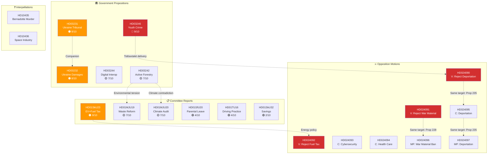

# Cross-Reference Map — Evening Analysis 2026-04-16

## 📋 Cross-Reference Context

| Field | Value |
|-------|-------|
| **Cross-Reference ID** | `XRF-2026-04-16-EVE` |
| **Analysis Date** | 2026-04-16 19:30 UTC |
| **Documents Mapped** | 24 primary + 32 cross-referenced from sibling analysis |
| **Document Types** | Propositions (5), Committee Reports (6), Motions (8), Interpellations (2), Press Releases (9) — 30 retrieved, 21 deeply analyzed |
| **Produced By** | news-evening-analysis workflow |

---

## 🔗 Document Relationship Graph

---

## 📊 Cross-Reference Matrix

### Proposition → Opposition Motion Links

| Proposition | Motions Against | Parties | Rejection Type | Cross-Party Coordination |
|------------|:---------------:|---------|---------------|:------------------------:|
| Prop 2025/26:235 (Deportation) | 3 | V (HD024090), C (HD024095), MP (HD024097) | Full rejection (V, MP), partial rejection (C) | ✅ HIGH — 3 parties converge |
| Prop 2025/26:228 (War Material) | 2 | V (HD024091), MP (HD024096) | Full rejection (V), ban expansion (MP) | ✅ MEDIUM — left-green alignment |
| Prop 2025/26:236 (Fuel Tax Cut) | 1 | V (HD024092) | Full rejection of fuel tax reduction | ❌ V only |
| Prop 2025/26:214 (Cybersecurity) | 1 | C (HD024093) | Amendment request, not rejection | ❌ C constructive |
| Prop 2025/26:216 (Health Care) | 1 | C (HD024094) | Partial rejection of health care provisions | ❌ C only |

### Committee Report → Proposition Links

| Committee Report | Related Proposition | Relationship |
|-----------------|-------------------|-------------|
| HD01SkU23 (EV+Fuel Tax) | Prop 236 (Fuel Tax Cut) | SkU23 advances green transport; Prop 236 cuts fuel taxes — complementary but tension |
| HD01MJU19 (Waste Reform) | Prop 242 (Forestry) | Both involve environmental regulation — MJU19 tightens waste rules, Prop 242 loosens forestry rules |
| HD01MJU20 (Climate Audit) | Prop 242 (Forestry) | Riksrevisionen audit questions climate evaluation; forestry deregulation adds to credibility gap |

### Press Release → Legislative Activity Links

| Press Release | Related Document | Messaging Connection |
|--------------|-----------------|---------------------|
| Pressträff om skärpta regler för unga brottslingar | HD03246 | Direct: Press conference for Prop 246 tabling |
| Tidsobestämd påföljd i kraft | HD03246 | Thematic: Youth crime reform + indefinite sentences = crime blitz |
| Bidragsspärr för kriminella | HD03246 | Thematic: Crime prevention + punishment package |
| Cyberhot-åtgärder | HD024093, HD03244 | Thematic: Cybersecurity + digital governance |
| Telefonbedrägerier-åtgärder | — | Thematic: Crime prevention communications |
| Socialtjänsten verktyg | HD03246 | Thematic: Social services + youth crime |
| Utmätningsregler kriminella ekonomin | — | Thematic: Crime prevention fiscal tools |

---

## 🕸️ Thematic Clusters

### Cluster 1: Crime & Justice (5 documents)
HD03246 → pressträff → tidsobestämd påföljd → bidragsspärr → utmätningsregler
**Coherence:** VERY HIGH — deliberate government messaging package

### Cluster 2: Ukraine Accountability (2 documents)
HD03231 ↔ HD03232
**Coherence:** VERY HIGH — companion propositions, same minister (Malmer Stenergard)

### Cluster 3: Opposition Mobilization on Prop 235 (3 documents)
HD024090 (V) ↔ HD024095 (C) ↔ HD024097 (MP)
**Coherence:** HIGH — coordinated multi-party rejection of same proposition

### Cluster 4: Environmental Policy Tension (3 documents)
HD03242 ↔ HD01MJU19 ↔ HD01MJU20
**Coherence:** MEDIUM — conflicting signals on environmental regulation

### Cluster 5: Defense/Export (2 documents)
HD024091 (V) ↔ HD024096 (MP)
**Coherence:** HIGH — left-green convergence on war material restrictions

### Cluster 6: Energy/Tax (2 documents)
HD01SkU23 ↔ HD024092 (V)
**Coherence:** MEDIUM — complementary energy policies challenged by V fiscal critique

---

## 🔗 Sibling Analysis Cross-References

This evening analysis synthesizes findings from:

| Sibling Type | Date | Key Finding Incorporated |
|-------------|------|-------------------------|
| committeeReports | 2026-04-16 | SkU23 EV charging permanence, MJU19 waste reform, MJU20 climate audit |
| propositions | 2026-04-16 | Props 246, 231, 232, 244, 242 significance scoring |
| motions | 2026-04-16 | V triple rejection pattern, C-MP convergence on Prop 235 |
| interpellations | 2026-04-16 | HD10435 Bernadotte, HD10436 space industry |
| realtime (morning) | 2026-04-16 | Government press release monitoring data |

---

**Document Control:** v1.0 | Generated 2026-04-16 19:30 UTC | news-evening-analysis | Hack23 AB
