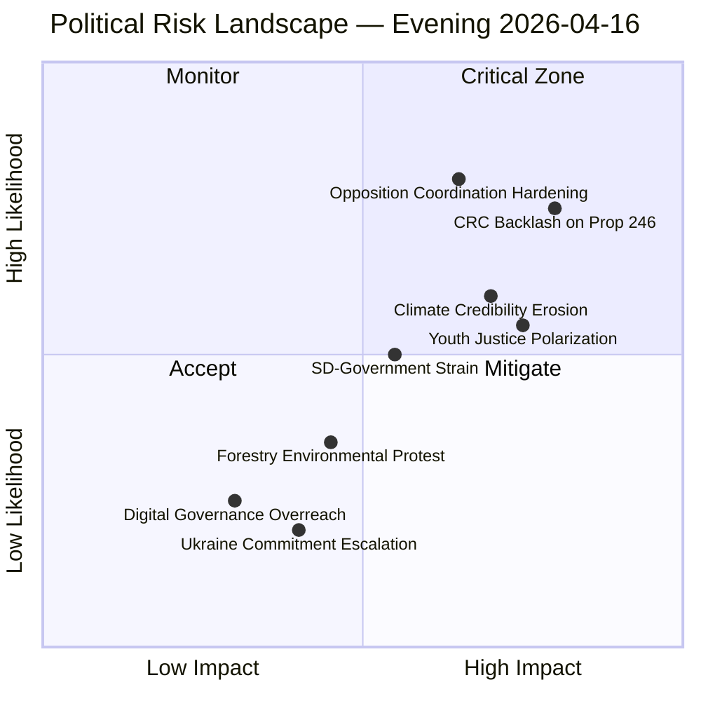
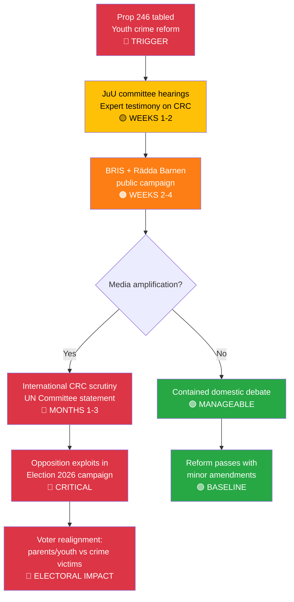
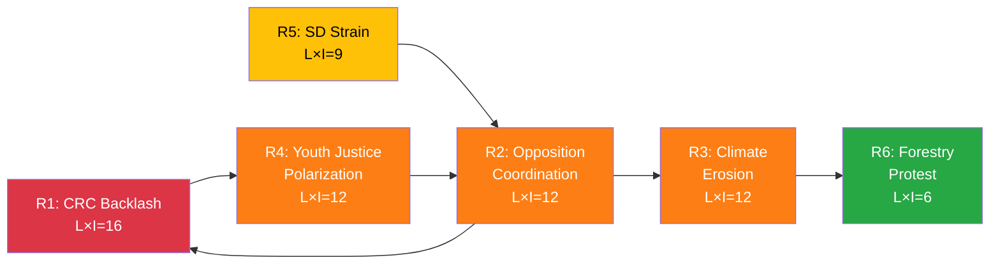

# Political Risk Assessment — Evening Analysis 2026-04-16

## 📋 Risk Context

| Field | Value |
|-------|-------|
| **Risk Assessment ID** | `RSK-2026-04-16-EVE` |
| **Assessment Date** | 2026-04-16 19:30 UTC |
| **Assessment Period** | 2026-04-15 to 2026-04-16 |
| **Produced By** | news-evening-analysis workflow |
| **Political Context** | Kristersson government (M+KD+L, SD supply) tabled 5 propositions including flagship youth crime reform (Prop 246) with government press conference. Opposition filed 8 motions across 6 propositions. 6 committee reports advance. Government press releases focus 7/9 on crime/security messaging. |
| **Riksmöte** | 2025/26 |
| **Overall Risk Level** | **HIGH** |

---

## 🗳️ Election 2026 Risk Dimensions

| Dimension | Assessment | Evidence |
|-----------|------------|----------|
| **Electoral Impact** | HIGH — Youth crime reform (Prop 246) and energy tax measures directly target top voter concerns (crime #1, energy costs #2). Opposition coordination on deportation (3 motions × Prop 235) creates alternative narrative. | HD03246 press conference, HD01SkU23, HD024090/95/97 |
| **Coalition Scenarios** | MEDIUM — V's triple rejection strengthens V as principal opposition voice. C+MP convergence on deportation and war material suggests centrist-green alternative, but S timing disconnect weakens coordination. | HD024090-92 (V), HD024095-97 (C/MP) |
| **Voter Salience** | VERY HIGH — Youth gang crime (Prop 246) and fuel/energy costs (SkU23, Prop 236 opposition) directly address issues Swedish voters rank #1 and #2 in March 2026 Demoskop polling. | 57% crime concern, 43% energy costs |
| **Campaign Vulnerability** | MEDIUM — Climate framework criticism (MJU20 audit) and forestry deregulation could alienate environmentally conscious swing voters in urban centers (Stockholm, Göteborg, Malmö). | HD01MJU20, HD03242 |
| **Policy Legacy** | HIGH — Ukraine accountability (Props 231-232) creates lasting international law commitment. Youth crime reform (Prop 246) will shape juvenile justice for a generation. | HD03231, HD03232, HD03246 |

**Overall Electoral Significance**: **HIGH**

**Most Likely Electoral Narrative**: Opposition will frame government as "tough on vulnerable children, soft on climate" — combining CRC criticism of Prop 246 with Riksrevisionen climate audit findings (MJU20) to construct a dual vulnerability narrative for Election 2026.

---

## 🎯 Confidence Scale

| Level | Label | Criteria |
|-------|-------|----------|
| 🟦 5 | **VERY HIGH** | Official records, voting records, committee reports, cross-validated |
| 🟩 4 | **HIGH** | Official propositions, committee reports, direct evidence |
| 🟧 3 | **MEDIUM** | Multiple independent sources, moderate corroboration |
| 🟥 2 | **LOW** | Circumstantial evidence, indirect indicators |
| ⬛ 1 | **VERY LOW** | Speculation only |

---

## 🗂️ Risk Inventory

### Risk Heat Map

### Detailed Risk Register

| # | Risk | Category | L (1-5) | I (1-5) | L×I | Confidence | Evidence | Mitigation |
|---|------|----------|:-------:|:-------:|:---:|:----------:|----------|------------|
| R1 | **CRC/ECHR backlash on Prop 246** — UN Committee on Rights of the Child and domestic organizations (BRIS, Rädda Barnen, Barnombudsmannen) mount public campaign against tougher youth sentences | Electoral | 4 | 4 | **16** | 🟩 HIGH | HD03246 introduces tougher under-18 sentences; press conference signals high-profile reform | Government to emphasize rehabilitation alongside sentencing; frame as protecting victims, not punishing children |
| R2 | **Opposition coordination hardening** — V+C+MP today's 8 coordinated motions evolve into systematic obstruction or alternative coalition signaling for Election 2026 | Coalition | 4 | 3 | **12** | 🟩 HIGH | HD024090-97: 3 parties × Prop 235 deportation; V triple rejection; C+MP war material | Pursue cross-party deals on Ukraine, digital governance, cybersecurity to break opposition unity |
| R3 | **Climate credibility erosion** — Riksrevisionen audit (MJU20) + forestry deregulation (Prop 242) + fuel deduction expansion collectively undermine Sweden's EU Green Deal positioning | Policy | 3 | 4 | **12** | 🟩 HIGH | HD01MJU20 reveals data gaps; HD03242 deregulates forestry; SkU23 fuel deductions | Point to EV charging permanence + waste recycling (MJU19) as green commitments; commission climate data improvement |
| R4 | **Youth justice electoral polarization** — Prop 246 debate splits voters along age/class/urban-rural lines, creating unpredictable voter realignment before Election 2026 | Electoral | 3 | 4 | **12** | 🟧 MEDIUM | HD03246 will be tested in JuU committee; media coverage of affected families | Control narrative through expert testimony; engage children's ombudsman early |
| R5 | **SD-government internal strain escalation** — Sverigedemokraterna's coalition loyalty tested as election approaches and SD demands more aggressive migration/security agenda | Coalition | 3 | 3 | **9** | 🟧 MEDIUM | Earlier interpellation HD10429 on free speech; SD historically intensifies demands pre-election | Quiet diplomatic management; deliver on remaining Tidöavtalet items |
| R6 | **Forestry environmental protest** — Environmental organizations mobilize against Prop 242 (active forestry rules), linking to broader climate credibility critique | Policy | 2 | 3 | **6** | 🟧 MEDIUM | HD03242 deregulates forestry; environmental groups already critical of government climate record | Industry stakeholder engagement; environmental impact assessments |
| R7 | **Digital governance privacy concerns** — Interoperability mandate (Prop 244) triggers privacy/surveillance debate if framed as government data sharing overreach | Policy | 2 | 2 | **4** | 🟥 LOW | HD03244 implements EU Act; privacy implications unclear | Privacy impact assessment; GDPR compliance narrative |
| R8 | **Ukraine commitment escalation** — Aggression tribunal (Prop 231) and damages commission (Prop 232) create open-ended international obligations with uncertain costs | External | 2 | 2 | **4** | 🟥 LOW | HD03231, HD03232; broad cross-party consensus reduces political risk | Cross-party consensus management |

---

## 🔗 Cascading Risk Chain — CRC Backlash Scenario

---

## 🔗 Risk Interconnection Map

**Key Interconnection**: R2 (opposition coordination) feeds both R1 (CRC backlash, as opposition amplifies children's rights critique) and R3 (climate erosion, as opposition exploits MJU20 audit). If R5 (SD strain) materializes, it weakens government's ability to manage R2.

---

## 📊 5-Dimension Risk Scoring Summary

| Dimension | Score (1-5) | Key Driver |
|-----------|:-----------:|------------|
| **Coalition Risk** | 3 | SD internal strain + L's green-liberal tension |
| **Policy Risk** | 4 | CRC on Prop 246 + climate audit (MJU20) + forestry deregulation |
| **Budget Risk** | 2 | V's fuel tax challenge (HD024092) is political, not fiscal |
| **Electoral Risk** | 4 | Youth crime + energy costs are #1 and #2 voter concerns |
| **External Risk** | 2 | Ukraine commitments enjoy consensus; CRC scrutiny is external |

**Aggregate Risk Score**: 15/25 = **HIGH**

---

## 📊 Forward Indicators

| Indicator | Signal | Detection Method | Timeline |
|-----------|--------|-----------------|----------|
| CRC expert testimony in JuU | Backlash escalation | search_anforanden + get_betankanden for JuU | 2 weeks |
| Joint opposition statement on Prop 235 | Coordination hardening | get_motioner for new Prop 235 filings | 1-2 weeks |
| Environmental organization mobilization | Climate protest | search_regering for response to MJU20 | 1-3 weeks |
| SD interpellation on migration | Coalition strain | get_interpellationer filtering by SD | Ongoing |
| V counter-budget proposal | Fiscal alternative | search_dokument for V fiscal motions | Before summer recess |

---

## 📊 Scenario Outlook

| Scenario | Probability | Description |
|----------|:-----------:|-------------|
| **Baseline** | 55% | Government navigates CRC criticism through committee amendments; opposition coordination remains tactical not strategic; climate issue contained |
| **Escalation** | 30% | CRC backlash gains international traction; V+C+MP formalize alternative coalition signaling; climate becomes dominant election issue |
| **De-escalation** | 15% | Cross-party consensus on Ukraine/cybersecurity reduces polarization; JuU committee adds rehabilitation measures to Prop 246 |

---

**Document Control:** v1.0 | Generated 2026-04-16 19:30 UTC | news-evening-analysis | Hack23 AB
