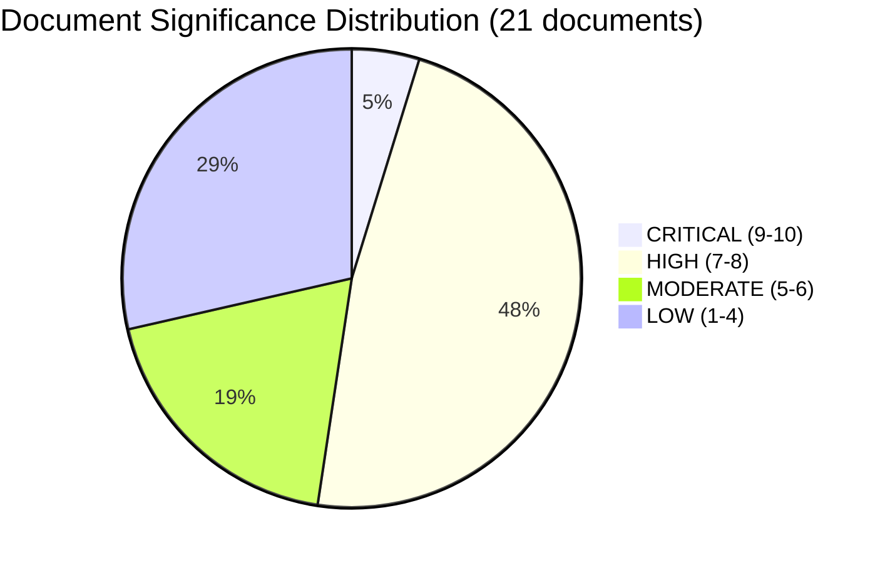

# Document Significance Scoring — Evening Analysis 2026-04-16

**Generated**: 2026-04-16 19:30 UTC
**Documents Analyzed**: 21 (cross-referenced from all sibling types + fresh MCP data)
**Confidence**: HIGH
**Riksmöte**: 2025/26
**Analysis Depth**: deep (2 iterations)
**Methodology**: ai-driven-analysis-guide.md v5.0, significance-scoring template

## Scoring Methodology

Each document scored on 5 dimensions (0-2 per dimension, max 10):
- **Policy Scope** (0-2): How broadly does this affect Swedish policy? 0=minor admin, 1=significant sector, 2=fundamental reform
- **Coalition Impact** (0-2): How does this affect government-opposition dynamics? 0=consensus, 1=moderate debate, 2=coalition-defining
- **Citizen Impact** (0-2): How directly are citizens affected? 0=bureaucratic, 1=indirect, 2=direct material impact
- **EU/International** (0-2): International dimension? 0=domestic only, 1=EU alignment, 2=multilateral commitment
- **Media Salience** (0-2): Media attention expected? 0=none, 1=specialist, 2=front-page/broadcast

## 5-Dimension Scoring Framework

| dok_id | Title | Policy Scope (0-2) | Coalition Impact (0-2) | Citizen Impact (0-2) | EU/Intl (0-2) | Media Salience (0-2) | **Total** |
|--------|-------|:-:|:-:|:-:|:-:|:-:|:-:|
| HD03246 | Skärpta regler för unga lagöverträdare | 2 | 2 | 2 | 1 | 2 | **9/10** |
| HD03231 | Ukraine aggression tribunal | 2 | 1 | 1 | 2 | 2 | **8/10** |
| HD03232 | Ukraine damages commission | 2 | 1 | 1 | 2 | 2 | **8/10** |
| HD01SkU23 | EV charging + fuel deductions | 2 | 2 | 2 | 1 | 1 | **8/10** |
| HD024090 | V rejects deportation (Prop 235) | 1 | 2 | 2 | 1 | 2 | **8/10** |
| HD03244 | Public admin interoperability | 2 | 1 | 2 | 2 | 0 | **7/10** |
| HD03242 | Active forestry regulation | 2 | 1 | 1 | 1 | 2 | **7/10** |
| HD024091 | V rejects war material (Prop 228) | 1 | 2 | 1 | 2 | 1 | **7/10** |
| HD024092 | V opposes fuel tax cut (Prop 236) | 1 | 2 | 2 | 0 | 2 | **7/10** |
| HD01MJU19 | Waste recycling reform | 2 | 1 | 1 | 2 | 1 | **7/10** |
| HD01MJU20 | Climate framework audit | 2 | 1 | 1 | 2 | 1 | **7/10** |
| HD024095 | C on deportation (Prop 235) | 1 | 2 | 2 | 1 | 1 | **7/10** |
| HD024097 | MP on deportation (Prop 235) | 1 | 2 | 2 | 1 | 1 | **7/10** |
| HD024093 | C on cybersecurity (Prop 214) | 1 | 1 | 2 | 1 | 1 | **6/10** |
| HD024096 | MP bans war material to dictatorships | 1 | 1 | 1 | 2 | 1 | **6/10** |
| HD024094 | C on health care (Prop 216) | 1 | 1 | 2 | 0 | 1 | **5/10** |
| HD10435 | Bernadotte murder interpellation | 1 | 0 | 1 | 2 | 1 | **5/10** |
| HD10436 | Space industry interpellation | 1 | 0 | 1 | 1 | 1 | **4/10** |
| HD01SfU20 | Parental leave notification | 1 | 0 | 2 | 0 | 1 | **4/10** |
| HD01TU16 | Driving practice removal | 1 | 0 | 2 | 0 | 1 | **4/10** |
| HD01SkU32 | Savings agreement termination | 1 | 0 | 1 | 0 | 0 | **2/10** |

## Composite Score Distribution

**Average Composite Score**: 6.3/10 — elevated, reflecting dense legislative day with flagship reform
**Publication Decision**: PUBLISH with priority — 11 documents score ≥7/10

## Classification Rationale

### HD03246 — Significance: 9/10 (Critical)
- **Policy Scope (2/2)**: Fundamentally restructures juvenile criminal justice. Introduces tougher sentences for under-18 offenders — the most significant youth crime reform in decades. Affects sentencing guidelines, social services involvement, and court procedures for minors.
- **Coalition Impact (2/2)**: Core Tidöavtalet commitment delivered by Gunnar Strömmer (M). SD specifically demanded stricter youth penalties in the agreement. Successful delivery strengthens M-SD trust; failure would undermine coalition's central promise.
- **Citizen Impact (2/2)**: Directly affects juvenile justice system, families of at-risk youth, social services, schools, and crime victims. Highly polarizing — children's rights organizations (BRIS, Rädda Barnen) will oppose; crime victim organizations (Brottsofferjouren) will support.
- **EU/International (1/2)**: ECHR Article 3 implications + CRC compliance concern. UN Committee on the Rights of the Child will include this in Sweden's next periodic review. Does not reach 2/2 because reform is domestic, not multilateral.
- **Media Salience (2/2)**: Government held dedicated press conference April 16. Gang violence involving minors is the #1 media story in Sweden. Demoskop: 57% crime concern.

### HD03231 + HD03232 — Significance: 8/10 (High)
- **Policy Scope (2/2)**: Sweden joins two international accountability mechanisms — aggression tribunal (expanded partial agreement) + international damages commission. Creates lasting treaty obligations.
- **Coalition Impact (1/2)**: Broad cross-party consensus expected. Ukraine support is bipartisan — does not differentiate government from opposition. Low differentiation = lower coalition impact score.
- **Citizen Impact (1/2)**: Indirect. Signals Sweden's post-NATO international commitments and may involve future budgetary contributions, but no direct citizen-facing impact today.
- **EU/International (2/2)**: Major international law commitment. Places Sweden alongside Netherlands, Germany, France in Ukraine accountability leadership. Demonstrates post-NATO multilateral engagement.
- **Media Salience (2/2)**: Ukraine remains top foreign policy story globally. Two companion propositions from same minister (Malmer Stenergard) on same day creates strong media package.

### HD01SkU23 — Significance: 8/10 (High)
- **Policy Scope (2/2)**: Permanent tax exemption for workplace EV charging + expanded fuel deductions — creates dual green transport incentive framework. "Permanent" status signals policy stability.
- **Coalition Impact (2/2)**: Responds to green transition criticism from left (insufficient ambition) AND right (too costly). V's Dadgostar specifically opposes fuel deductions (HD024092), creating clear party differentiation on energy policy.
- **Citizen Impact (2/2)**: Direct consumer benefit — millions of employees with workplace parking affected by EV charging exemption. Fuel deductions provide immediate cost-of-living relief.
- **EU/International (1/2)**: Aligns with EU Green Deal transport decarbonization goals but is a domestic fiscal measure.
- **Media Salience (1/2)**: Energy costs widely covered but not today's lead story (youth crime dominates).

### HD024090/95/97 — Deportation Motions: 7-8/10 (High)
- **Cross-party significance**: Three parties (V, C, MP) independently targeting the same proposition (Prop 235 on deportation) on the same day demonstrates opposition coordination capacity. V's full rejection (HD024090, Haddou) vs. C's moderate amendment (HD024095, Paarup-Petersen) vs. MP's principled position (HD024097, Hirvonen) covers the full opposition spectrum.
- **Coalition Impact (2/2)**: This is the most significant opposition coordination event of the spring session — if it hardens into a formal alliance, it reshapes Election 2026 dynamics.
- **Citizen Impact (2/2)**: Deportation rules directly affect immigrants, their families, and communities.

---

**Document Control:** v1.0 → v2.0 (improved Pass 2) | Generated 2026-04-16 19:30 UTC | news-evening-analysis | Hack23 AB
