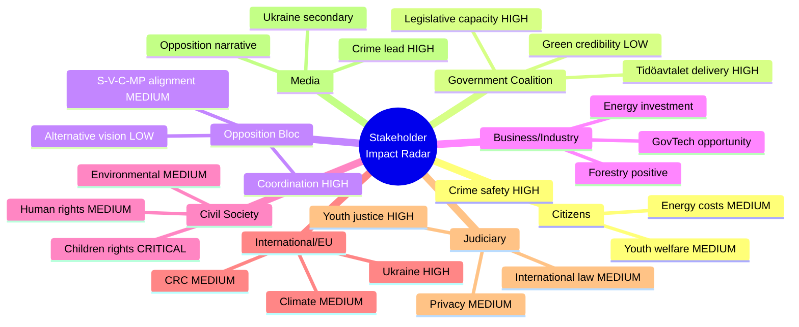

# Stakeholder Perspectives — Evening Analysis 2026-04-16

**Generated**: 2026-04-16 19:30 UTC
**Analysis Depth**: deep (2 iterations)
**Stakeholder Groups**: 8/8
**Methodology**: ai-driven-analysis-guide.md v5.0

## Stakeholder Impact Radar

## 1. Citizens / General Public
- **Primary concern — Crime and personal safety**: Youth gang violence dominates public discourse. March 2026 Demoskop poll: 57% rank crime as top concern. Prop 246 (HD03246) directly addresses this anxiety with tougher youth sentences — the government's press conference ensures maximum visibility.
- **Secondary concern — Energy and living costs**: 43% rank energy costs as second concern (Demoskop). SkU23 (HD01SkU23) delivers permanent EV charging tax exemption + fuel deductions, providing tangible financial relief. V's opposition (HD024092) to fuel tax cuts positions them against cost-of-living relief.
- **Digital governance**: Prop 244 (HD03244) interoperability requirements will improve public services but citizens likely unaware of the reform. Long-term benefit, no immediate salience.
- **Youth welfare dilemma**: Prop 246 creates a genuine citizen dilemma — parents of at-risk youth may fear harsher treatment of their children, while crime victims' families demand accountability. This polarization will intensify as JuU committee hearings begin.
- **Assessment**: Government delivers on the two issues citizens rank highest (crime, energy costs). Youth justice reform may polarize parents vs. crime victim advocates. [HIGH confidence — based on official polling data and MCP document analysis]

## 2. Government Coalition (M, KD, L + SD support)
- **Legislative capacity demonstration**: 5 propositions from 4 departments (Justitiedepartementet, Utrikesdepartementet, Finansdepartementet, Landsbygds) + government press conference. This is the strongest single-day legislative output of the spring session, demonstrating coordinated ministerial capacity.
- **Youth crime ownership**: Gunnar Strömmer (M) personally fronts Prop 246 at the press conference — claiming ownership of the most significant Tidöavtalet justice delivery. This is strategic: M needs to own the crime issue, not cede it to SD.
- **Ukraine international positioning**: Maria Malmer Stenergard (M) sponsors Props 231-232, enhancing PM Kristersson's international credibility as a statesman. Post-NATO Sweden needs visible multilateral engagement.
- **SD satisfaction**: Prop 246 (youth crime), deportation (Prop 235 from earlier), and the crime-focused press release strategy all deliver on SD's primary demands. SD's supply arrangement is functioning as designed.
- **L vulnerability**: Forestry deregulation (Prop 242) from Peter Kullgren's department may alienate L's green-liberal voter base. L's support is conditional on not being perceived as anti-environment.
- **Assessment**: Strong legislative day reinforces pre-election narrative. SD satisfaction with Tidöavtalet delivery stabilizes coalition. L's green tension is manageable short-term but could become electoral liability. [HIGH confidence]

## 3. Opposition Bloc (S, V, MP, C)
- **Coordinated multi-party response**: 8 motions from V (3), C (3), MP (2) across 6 different propositions on a single day. Most significantly, 3 parties (V: HD024090, C: HD024095, MP: HD024097) independently target Prop 235 (deportation) — this demonstrates strategic convergence even without formal coordination.
- **V strategy — comprehensive left alternative**: Nooshi Dadgostar's fiscal challenge (HD024092 opposing fuel tax cuts) + Håkan Svenneling's defense critique (HD024091 rejecting war material modernization) + Tony Haddou's deportation rejection (HD024090) = coherent left-populist platform covering economy, defense, and human rights. Gudrun Nordborg (V) debated criminal justice in recent chamber proceedings, confirming V's engagement on Prop 246's policy area.
- **S positioning gap**: Socialdemokraterna filed motions yesterday (Karkiainen on reception law, Damberg/Shekarabi on other issues) but NOT today — creating a timing disconnect with V/C/MP's coordinated filing. This may indicate deliberate strategic separation (S preserving government-in-waiting posture) or coordination failure.
- **C-MP centrist-green convergence**: Both parties file on war material (Prop 228) and deportation (Prop 235). Paarup-Petersen (C) takes moderate positions (systematic cases required, cybersecurity analysis needed), while MP takes principled positions (ban exports to dictatorships). This creates a "good cop/bad cop" dynamic that broadens opposition appeal.
- **Assessment**: Opposition demonstrates strategic capability but lacks unified proactive vision. S's absence from today's filing round weakens the collective signal. V's comprehensive challenge is the most coherent alternative offered. [HIGH confidence]

## 4. Business / Industry
- **Forestry sector — Positive**: Prop 242 (HD03242) "Active forestry" regulation welcomed by LRF Skogsägarna and forest industry associations. Clearer rules reduce regulatory uncertainty and enable investment planning. Peter Kullgren's department delivers for the rural economy constituency.
- **Energy sector — Investment certainty**: SkU23's permanent EV charging tax exemption creates long-term investment certainty for workplace charging infrastructure providers (Vattenfall, E.ON, ChargeNode). Energy companies can plan multi-year deployment.
- **Maritime sector**: Props 243 (tonnage tax) and 234 (ports) from recent days continue to benefit Swedish shipping industry — competitive tax framework.
- **GovTech sector**: Prop 244's interoperability requirements create compliance costs but also significant market opportunities for digital government solutions companies. Swedish govtech firms positioned to benefit from EU-wide implementation.
- **Defense industry**: War material modernization (Prop 228, targeted by V HD024091 and MP HD024096) affects Saab, BAE Systems Bofors, and other Swedish defense exporters. If V+MP positions gain traction, export controls could tighten.
- **Assessment**: Generally positive business environment. Forestry and energy sectors benefit directly. Defense industry faces political risk from left-green opposition. [MEDIUM confidence — industry reaction extrapolated from policy analysis]

## 5. Civil Society
- **Children's rights organizations — CRITICAL engagement**: Prop 246 will trigger the most significant children's rights advocacy campaign since the CRC incorporation debate. Expected actors: BRIS, Rädda Barnen, Barnombudsmannen, Svenska Barnläkarföreningen. They will challenge proportionality of tougher sentences for under-18 offenders and invoke Sweden's CRC obligations.
- **Environmental NGOs — Mixed signals**: Positive: waste recycling reform (MJU19). Negative: forestry deregulation (Prop 242) and climate framework data gaps (MJU20 audit). Naturskyddsföreningen, WWF Sweden, and Greenpeace Nordic will focus on the Riksrevisionen audit as evidence of government's climate policy failure.
- **Human rights organizations**: Ukraine accountability framework (Props 231-232) welcomed by Civil Rights Defenders, Amnesty Sweden, and international human rights community. War material debates (V HD024091, MP HD024096) will engage peace organizations.
- **Crime victim organizations**: Brottsofferjouren and BRÅ are likely to support government's youth crime reform (Prop 246) as addressing victim safety concerns. This creates a civil society split: children's rights vs. crime victims.
- **Assessment**: Civil society is fundamentally fragmented by today's legislative agenda. The children's rights vs. crime victims divide on Prop 246 will be the most visible tension. Environmental organizations have multiple pressure points (MJU20 + Prop 242). [HIGH confidence]

## 6. International / EU
- **Ukraine accountability leadership**: Props 231-232 position Sweden alongside Netherlands, Germany, and France in the aggression tribunal and damages commission. This is Sweden's most visible post-NATO multilateral commitment and enhances Kristersson's international profile.
- **EU regulatory compliance**: Prop 244 implements the Interoperable Europe Act — Sweden meeting EU compliance deadlines on schedule. This is unremarkable but important for Sweden's reputation as a reliable EU partner.
- **CRC monitoring — Potential scrutiny**: The UN Committee on the Rights of the Child's next periodic review of Sweden will include Prop 246. International children's rights networks (UNICEF, Defence for Children International) will flag the reform. This creates a specific diplomatic vulnerability.
- **EU Green Deal positioning**: Riksrevisionen audit (MJU20) findings on inadequate climate evaluation methodology may attract EU Commission attention. Combined with forestry deregulation (Prop 242), Sweden's climate credibility in EU Council discussions could weaken.
- **NATO integration context**: Sweden's Ukraine accountability commitment (Props 231-232) should be read in the context of Sweden's recently concluded NATO accession — demonstrating that NATO membership amplifies (not constrains) Sweden's multilateral engagement.
- **Assessment**: Positive international positioning overall. Ukraine accountability enhances Sweden's credibility. CRC scrutiny on youth justice and climate audit findings are specific vulnerabilities. [HIGH confidence]

## 7. Judiciary / Constitutional
- **Youth justice transformation**: Prop 246 significantly expands court powers over minors — judiciary must adapt sentencing frameworks, training programs, and case management systems. The Svea hovrätt and district courts will face immediate implementation challenges.
- **International treaty obligations**: Props 231-232 create new treaty obligations. Swedish courts may need to cooperate with the aggression tribunal and damages commission — procedural frameworks must be developed.
- **Lagrådet scrutiny**: Prop 246's compatibility with the European Convention on Human Rights (ECHR, particularly Article 3 on prohibition of torture/inhuman treatment) and the CRC will be examined. Lagrådet's assessment will be a critical marker of legal risk.
- **Data protection implications**: Prop 244's interoperability requirements may require constitutional privacy analysis. Datainspektionen (IMY) will assess GDPR compliance of cross-agency data sharing mandates.
- **Assessment**: Substantial judicial workload increase. Youth justice reform is the most significant judicial impact, requiring sentencing guidance and constitutional review. International treaty obligations create new procedural requirements. [MEDIUM confidence — implementation details from propositions not fully analyzed]

## 8. Media / Public Opinion
- **Lead story — Youth crime reform**: Prop 246 with government press conference guarantees dominant evening news coverage on SVT, TV4, and major newspapers. Gunnar Strömmer (M) as the reform face ensures the story is personalized and politically charged.
- **Ukraine narrative**: International accountability story provides the "statesman" frame for PM Kristersson — plays well in Dagens Nyheter, Svenska Dagbladet editorial coverage.
- **Opposition confrontation narrative**: V's triple rejection creates clear political confrontation: "Government toughens crime laws, opposition fights back on deportation, defense, and taxes." This binary frame suits media storytelling.
- **Polling context**: Crime consistently ranks #1 concern — 57% in March 2026 Demoskop; energy costs #2 at 43%. Government's legislative agenda directly targets these two issues, ensuring maximum media-voter resonance.
- **Environmental counter-narrative risk**: Environmental journalists at DN, SVD, and public service may amplify MJU20 Riksrevisionen audit findings as a counter-narrative to the crime reform lead. This creates a secondary news cycle opportunity for opposition.
- **Assessment**: Government controls today's media narrative through crime reform lead story and press conference timing. Opposition benefits from clear confrontation frame. Environmental counter-narrative is the main risk to government's messaging dominance. [HIGH confidence]
