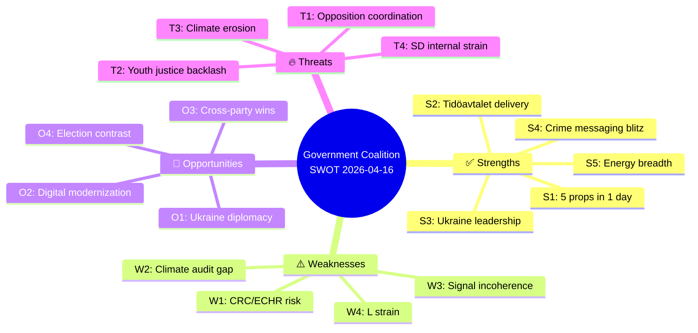

# Political SWOT Analysis — Evening Analysis 2026-04-16

## 📋 SWOT Context

| Field | Value |
|-------|-------|
| **SWOT ID** | `SWT-2026-04-16-EVE` |
| **Analysis Date** | 2026-04-16 19:30 UTC |
| **Analysis Scope** | Full parliamentary landscape — Government coalition, opposition bloc, cross-party dynamics |
| **Reference Period** | 2026-04-15 to 2026-04-16 |
| **Produced By** | news-evening-analysis workflow |
| **Primary MCP Sources** | get_propositioner, get_betankanden, get_motioner, get_interpellationer, search_regering |
| **Validity Window** | Valid until 2026-04-23 |
| **Temporal Window** | 2026-04-15 to 2026-04-16 — 5 propositions, 6 committee reports, 8 opposition motions, 2 interpellations, 9 government press releases |

---

## 🏛️ Section 1: Government Coalition SWOT

### ✅ Strengths — Government Coalition

| # | Strength Statement | Evidence (dok_id) | Confidence | Impact | Entry Date |
|---|-------------------|-------------------|:----------:|:------:|:----------:|
| S1 | Legislative delivery pace: 5 propositions tabled on single day demonstrates governing capacity and coordinated ministerial output | HD03246, HD03231, HD03232, HD03244, HD03242 | H | VH | 2026-04-16 |
| S2 | Tidöavtalet fulfillment on youth crime: Prop 246 delivers core SD-demanded reform with press conference positioning Strömmer (M) as justice reform architect | HD03246, pressträff-om-skärpta-regler-för-unga-brottslingar | H | VH | 2026-04-16 |
| S3 | International credibility enhancement: Ukraine accountability framework (aggression tribunal + damages commission) positions Sweden alongside Netherlands, Germany, France in post-NATO international leadership | HD03231, HD03232 | VH | H | 2026-04-16 |
| S4 | Unified crime-and-security communications: 7 of 9 press releases (Apr 15-16) reinforce law-and-order messaging — indefinite sentences, benefit bans, cybersecurity, anti-fraud, social services tools | search_regering results | H | H | 2026-04-16 |
| S5 | Energy policy breadth: EV charging tax exemption (SkU23) + fuel deductions serve both green transition and cost-of-living agendas simultaneously | HD01SkU23 | H | H | 2026-04-16 |

**Coalition Strength Summary:** The Kristersson government demonstrates its strongest legislative day of the spring session, combining Tidöavtalet delivery (youth crime), international positioning (Ukraine), and domestic policy breadth (energy, digital, forestry) with disciplined communications focused on the #1 voter concern (crime/safety).

---

### ⚠️ Weaknesses — Government Coalition

| # | Weakness Statement | Evidence (dok_id) | Confidence | Impact | Entry Date |
|---|-------------------|-------------------|:----------:|:------:|:----------:|
| W1 | ECHR/CRC vulnerability on youth justice: Prop 246 toughens sentences for under-18 offenders, creating risk of Convention on Rights of the Child scrutiny from UN Committee and domestic children's rights organizations (BRIS, Rädda Barnen) | HD03246 | H | H | 2026-04-16 |
| W2 | Climate framework credibility gap: Riksrevisionen audit (MJU20) reveals inadequate data and evaluation methodology in government's climate policy framework — opposition will exploit this for environmental credibility attacks | HD01MJU20 | H | M | 2026-04-16 |
| W3 | Policy signal incoherence: Forestry deregulation (Prop 242) alongside waste recycling reform (MJU19) sends mixed environmental signals; fuel deduction expansion alongside EV charging push creates dual messaging that may confuse green voters | HD03242, HD01MJU19, HD01SkU23 | M | M | 2026-04-16 |
| W4 | L's green-liberal wing strain: Forestry deregulation benefiting industry may alienate Liberalerna's urban, environmentally-conscious voter base, creating internal coalition tension | HD03242 | M | M | 2026-04-16 |

**Coalition Weakness Summary:** The government's aggressive legislative pace creates vulnerabilities on children's rights (Prop 246) and environmental credibility (climate audit + forestry deregulation), while dual energy messaging risks confusing the green transition narrative.

---

### 🚀 Opportunities — Government Coalition

| # | Opportunity Statement | Evidence (dok_id) | Confidence | Impact | Entry Date |
|---|---------------------|-------------------|:----------:|:------:|:----------:|
| O1 | Ukraine post-war leadership role: Aggression tribunal + damages commission positions Sweden for reconstruction/justice diplomacy — potential NATO-era signature contribution | HD03231, HD03232 | H | H | 2026-04-16 |
| O2 | Digital transformation modernization: EU Interoperable Europe Act implementation (Prop 244) could showcase Sweden's public sector innovation capacity | HD03244 | H | M | 2026-04-16 |
| O3 | Cross-party consensus areas: EV charging, anti-fraud measures, Ukraine support, cybersecurity enjoy broad political consensus — potential for bipartisan legislative wins | HD01SkU23, HD024093 | M | M | 2026-04-16 |
| O4 | Pre-election policy contrast: Clear differentiation between government's law-and-order + cost-of-living + international engagement agenda vs. opposition's welfare-focused critique | Multiple | H | VH | 2026-04-16 |

**Coalition Opportunity Summary:** The government can leverage Ukraine leadership and digital modernization as non-partisan achievements while maintaining clear pre-election differentiation on crime and energy.

---

### 🔥 Threats — Government Coalition

| # | Threat Statement | Evidence (dok_id) | Confidence | Impact | Entry Date |
|---|-----------------|-------------------|:----------:|:------:|:----------:|
| T1 | Opposition coordination escalation: V+C+MP filing motions against 6 different propositions demonstrates strategic alignment across ideological divides — deportation (3 separate motions against Prop 235), war material (2 motions), fuel tax | HD024090, HD024091, HD024092, HD024095, HD024096, HD024097 | H | H | 2026-04-16 |
| T2 | Youth justice polarization: Risk of electoral backlash if CRC criticism gains media traction and reform is perceived as targeting vulnerable minors rather than gang criminals | HD03246 | M | H | 2026-04-16 |
| T3 | Climate credibility erosion: Riksrevisionen audit + forestry deregulation + fuel deductions collectively undermine Sweden's international climate image before EU Green Deal review | HD01MJU20, HD03242 | H | M | 2026-04-16 |
| T4 | SD-government internal strain: Earlier interpellation data shows SD questioning coalition partner on free speech issues — internal tensions may surface as election approaches | HD10429 (earlier data) | M | M | 2026-04-16 |

**Coalition Threat Summary:** The opposition's coordinated multi-front challenge and potential CRC backlash on youth justice represent the most significant threats to the government's legislative momentum.

---

## 📊 SWOT Quadrant Mapping

---

## 🏛️ Section 2: Opposition Bloc SWOT

### ✅ Strengths — Opposition

| # | Strength Statement | Evidence (dok_id) | Confidence | Impact | Entry Date |
|---|-------------------|-------------------|:----------:|:------:|:----------:|
| OS1 | Strategic multi-party coordination: V, C, MP filing on same propositions from different ideological angles demonstrates emerging "anyone but government" coalition logic | HD024090, HD024095, HD024097 (3 parties × Prop 235) | H | H | 2026-04-16 |
| OS2 | V's comprehensive left alternative: Dadgostar's fiscal challenge (HD024092) + Svenneling's defense critique (HD024091) + Haddou's deportation rejection (HD024090) creates coherent left-populist platform | HD024090, HD024091, HD024092 | H | H | 2026-04-16 |
| OS3 | C-MP centrist-green bridge: Both file on war material (Prop 228) and deportation (Prop 235) — building centrist-green electoral alternative | HD024095, HD024096, HD024097 | M | M | 2026-04-16 |

### ⚠️ Weaknesses — Opposition

| # | Weakness Statement | Evidence (dok_id) | Confidence | Impact | Entry Date |
|---|-------------------|-------------------|:----------:|:------:|:----------:|
| OW1 | Lack of unified alternative narrative: 8 motions reject government proposals but offer no coordinated policy vision — reactive rather than proactive | Multiple HD0240xx | H | H | 2026-04-16 |
| OW2 | S absence from today's filings: Socialdemokraterna notably filed motions yesterday, not today — senior figures (Damberg, Shekarabi, Karkiainen) lead but timing disconnect reduces opposition impact | Yesterday's S motions | M | M | 2026-04-16 |
| OW3 | Ideological fragmentation: V's hard-left rejection of war material modernization (HD024091) vs C's moderate cybersecurity position (HD024093) reveals deep policy differences | HD024091, HD024093 | H | M | 2026-04-16 |

---

## 🔄 TOWS Strategic Options

### SO Strategies (Strengths × Opportunities)
1. **Government leverages legislative pace + Ukraine positioning** to dominate pre-election foreign policy narrative while delivering on Tidöavtalet domestically
2. **Crime messaging blitz + election contrast** enables government to set the campaign agenda around law-and-order — forcing opposition to respond on government's terms

### WO Strategies (Weaknesses × Opportunities)
1. **Counter climate audit criticism through digital governance**: Frame Prop 244 (interoperability) as modernization that will improve climate data collection — addressing MJU20 gaps
2. **Cross-party cooperation on Ukraine/cybersecurity** can offset environmental policy incoherence by showing governance maturity on non-partisan issues

### ST Strategies (Strengths × Threats)
1. **Use legislative delivery as evidence against opposition's criticism**: 5 propositions in one day demonstrates that government governs, not just talks — counter opposition coordination with results
2. **Preempt CRC backlash on Prop 246** by emphasizing rehabilitation elements alongside sentencing — press conference framing is critical

### WT Strategies (Weaknesses × Threats)
1. **Climate credibility is the critical vulnerability**: Combine Riksrevisionen audit (MJU20) + forestry deregulation (Prop 242) + opposition environmental motions and the government risks losing the green voter segment entirely
2. **If SD-government strain escalates** while opposition coordinates, coalition stability becomes the primary risk before Election 2026

---

## 🔗 Cross-SWOT Interference Analysis

| Government Element | Opposition Element | Interference Effect |
|-------------------|-------------------|-------------------|
| S2 (Tidöavtalet delivery) | T1 (Opposition coordination) | Opposition files coordinated rejection motions precisely because government is delivering on SD agenda — delivery provokes resistance |
| W1 (CRC risk) | OS1 (Multi-party coordination) | CRC criticism gives V, C, MP a shared human rights critique that transcends their ideological differences |
| S4 (Crime messaging) | OW1 (No alternative narrative) | Government's communications discipline exploits opposition's reactive positioning — opposition must develop proactive agenda |
| W2 (Climate audit gap) | OS3 (C-MP bridge) | Climate weakness creates space for C-MP green alternative to attract voters from both L and S |

---

## 📊 Strategic Implications

### Key Watch Items
1. **JuU committee hearings on Prop 246**: Expert testimony on CRC compliance — within 2 weeks
2. **Deportation motion consolidation**: 3 parties filed against Prop 235 — watch for joint opposition statement
3. **V's fiscal alternative**: Dadgostar's fuel tax motion signals V counter-budget narrative for Election 2026
4. **Climate debate escalation**: MJU20 audit + forestry deregulation = environmental mobilization before summer

### Forward Indicators (MCP-Detectable)
- New motions filed against Prop 246 (youth crime) → indicates CRC backlash spreading
- SD interpellations or motions against coalition partners → coalition strain escalating
- Cross-party committee amendments on SkU23 → consensus or polarization signal
- Riksrevisionen follow-up on MJU20 → climate accountability pressure mounting

---

**Document Control:** v1.0 | Generated 2026-04-16 19:30 UTC | news-evening-analysis | Hack23 AB
