# Analysis Synthesis Summary — Evening Analysis 2026-04-16

**Generated**: 2026-04-16 18:37 UTC
**Data Sources**: get_betankanden, get_propositioner, get_motioner, get_interpellationer, search_anforanden, search_regering, cross-referenced sibling analysis (committeeReports, propositions, motions, interpellations, realtime)
**Documents Analyzed**: 24 primary + 32 cross-referenced from siblings
**Confidence**: HIGH
**Riksmöte**: 2025/26
**Analysis Depth**: deep (2 iterations)
**Methodology**: ai-driven-analysis-guide.md v5.0

## Summary

April 16, 2026 marks one of the most legislatively dense days of the spring session. The Kristersson government launched a multi-front legislative offensive: stricter youth criminal justice (Prop 246 with press conference), Ukraine international accountability (Props 231-232), digital governance reform (Prop 244), and forestry deregulation (Prop 242). Simultaneously, six committee reports advanced green transport incentives (SkU23), waste recycling reform (MJU19), and climate framework accountability (MJU20). The opposition responded with 8 motions — Vänsterpartiet leading with 3 rejections (deportation, war material, fuel tax), joined by Centerpartiet and Miljöpartiet in a coordinated challenge across justice, defense, and fiscal policy. Two new interpellations on the space industry and the Folke Bernadotte murder add diplomatic and historical dimensions. The government's press releases reveal a unified crime-and-security messaging strategy: young offender crackdown, indefinite sentences, criminal benefit bans, cybersecurity, and anti-fraud measures — a clear pre-Election 2026 law-and-order narrative.

## Recommended Article Metadata

- **Title (EN)**: Kristersson Government Launches Youth Crime Crackdown as Opposition Mobilizes on Multiple Fronts
- **Title (SV)**: Kristerssons regering lanserar hårdare ungdomsstraff medan oppositionen mobiliserar på flera fronter
- **Meta Description (EN)**: Sweden's government introduces stricter rules for young offenders and joins Ukraine accountability framework as V, C, MP file 8 opposition motions challenging deportation, war material, and fuel tax policies.
- **Meta Description (SV)**: Sveriges regering inför skärpta regler för unga lagöverträdare och ansluter sig till Ukrainas ansvarsutkrävande medan V, C, MP lämnar 8 oppositionsmotioner mot utvisning, krigsmateriel och bränslebeskattning.

## Key Findings

1. **Youth Crime Crackdown (HD03246)**: Government press conference today. Prop 2025/26:246 introduces stricter sentences for under-18 offenders — core Tidöavtalet delivery. Strömmer (M) positions this as the flagship pre-election justice reform [HIGH confidence, 9/10 significance].

2. **Ukraine Accountability Framework (HD03231 + HD03232)**: Sweden joins the expanded partial agreement for the Special Tribunal for the Crime of Aggression against Ukraine AND the International Register of Damage. Two propositions from Utrikesdepartementet signal Sweden's post-NATO international leadership [HIGH confidence, 8/10].

3. **Green Transport Tax Reform (HD01SkU23)**: SkU advances permanent tax exemption for workplace EV charging + expanded fuel deductions. Creates dual incentive: electrification push AND short-term cost relief [HIGH confidence, 8/10].

4. **Opposition Triple Challenge**: Vänsterpartiet files 3 motions (HD024090, HD024091, HD024092) rejecting deportation rules, war material modernization, AND fuel tax cuts. Dadgostar leads the fiscal challenge; Svenneling the defense critique [HIGH confidence, 8/10].

5. **Climate Framework Accountability (HD01MJU20)**: MJU reports on Riksrevisionen's audit of the government's climate policy framework — revealing gaps in data and evaluation that undermine Sweden's climate commitments [HIGH confidence, 7/10].

6. **Digital Governance (HD03244)**: New interoperability requirements for public sector data sharing — implements EU Interoperable Europe Act [HIGH confidence, 7/10].

7. **Forestry Deregulation (HD03242)**: "Active forestry" regulation clarifies rules — environmental groups warn of biodiversity impacts while forest industry celebrates reduced bureaucracy [HIGH confidence, 7/10].

8. **Government Crime Messaging**: 9 press releases in 24 hours (April 15-16) all reinforce law-and-order: indefinite sentences, benefit bans, anti-fraud, cybersecurity, social services tools. Coordinated pre-election communication strategy [HIGH confidence].

## SWOT Analysis

### Strengths (Government)
- **Legislative delivery pace**: 5 propositions + 6 committee reports in single day demonstrates governing capacity
- **Tidöavtalet fulfillment**: Youth crime (246), deportation (235), criminal sanctions — SD-demanded agenda advancing
- **International positioning**: Ukraine accountability framework enhances Sweden's NATO-era credibility
- **Energy policy breadth**: EV incentives + fuel deductions simultaneously serve green and cost-of-living agendas

### Weaknesses (Government)
- **ECHR risk on youth justice**: Prop 246 may face Convention on the Rights of the Child scrutiny
- **Climate framework gaps**: MJU20 reveals Riksrevisionen found inadequate evaluation methodology — opposition will exploit
- **Forestry backlash**: MJU19 + Prop 242 tension — waste recycling reform alongside forestry deregulation sends mixed environmental signals
- **Dual messaging contradiction**: Fuel deduction expansion alongside EV charging push creates policy incoherence

### Opportunities (System)
- **Ukraine leadership**: Aggression tribunal + damages commission positions Sweden for post-war reconstruction role
- **Digital transformation**: Interoperability Act implementation (Prop 244) could modernize Sweden's public sector data infrastructure
- **Cross-party cooperation**: EV charging, anti-fraud measures, and Ukraine support enjoy broad consensus
- **Election policy contrast**: Clear differentiation between government's law-and-order agenda vs opposition's welfare focus

### Threats (System)
- **Opposition coordination**: V+C+MP filing motions against 6 different propositions shows strategic alignment despite ideological differences
- **Coalition strain signals**: Earlier interpellation data shows SD questioning coalition partner on free speech (HD10429) — internal tensions emerging
- **Climate credibility gap**: Riksrevisionen audit + forestry deregulation + fuel deductions undermine Sweden's international climate image
- **Youth justice polarization**: Risk of electoral backlash if reform is perceived as targeting vulnerable minors

## Election 2026 Implications

### Electoral Impact: HIGH 🟩
The youth crime reform and energy tax measures are designed to mobilize the government's core voter base. Crime and cost-of-living are the top 2 voter concerns.

### Coalition Scenarios: MEDIUM 🟧
V's triple rejection strengthens V's position as principal opposition voice. But V+C+MP coordination on deportation (3 separate motions against Prop 235) suggests potential "anyone but the current government" dynamic.

### Voter Salience: VERY HIGH 🟦
Youth gang crime (Prop 246) and fuel/energy costs (SkU23 + Prop 236 opposition) directly address the issues Swedish voters rank highest in polls.

### Campaign Vulnerability: MEDIUM 🟧
Climate framework criticism (MJU20) and forestry deregulation could alienate environmentally conscious swing voters in urban centers.

### Policy Legacy: HIGH 🟩
Ukraine accountability framework (Props 231-232) represents potentially lasting international law commitment regardless of election outcome.

## Legislative Pipeline

```mermaid
flowchart TD
    subgraph Today["April 16 - New Propositions"]
        P246["Prop 246\nYouth Crime\n🔴 CRITICAL"]
        P231["Prop 231\nUkraine Tribunal"]
        P232["Prop 232\nUkraine Damages"]
        P244["Prop 244\nDigital Interop"]
        P242["Prop 242\nForestry Rules"]
    end
    subgraph Committee["Committee Reports"]
        SKU23["SkU23\nEV + Fuel Tax"]
        MJU19["MJU19\nWaste Reform"]
        MJU20["MJU20\nClimate Audit"]
        SFU20["SfU20\nParental Leave"]
        TU16["TU16\nDriving Practice"]
    end
    subgraph Opposition["Opposition Motions"]
        V1["V: Reject Deportation\nHD024090"]
        V2["V: Reject War Material\nHD024091"]
        V3["V: Reject Fuel Tax\nHD024092"]
        C1["C: Cybersecurity\nHD024093"]
        MP1["MP: War Material Ban\nHD024096"]
    end
    P246 --> |"Committee review"| JuU["JuU"]
    P231 --> |"Committee review"| UU["UU"]
    SKU23 --> |"Chamber vote"| Plenary["Plenary Decision"]
    V1 --> SfU["SfU"]
    V2 --> UU
    style P246 fill:#ff4444,color:#fff
    style SKU23 fill:#00cc66,color:#fff
    style V1 fill:#cc0000,color:#fff
```

## Forward Indicators

1. **JuU committee hearings on Prop 246**: Watch for expert testimony on CRC compliance — timeline: within 2 weeks [HIGH confidence]
2. **SkU23 plenary vote**: Permanent EV charging tax exemption heading to chamber — could pass within April [HIGH confidence]
3. **V's fiscal alternative**: Dadgostar's fuel tax motion (HD024092) signals V will present a counter-budget narrative for Election 2026 [MEDIUM confidence]
4. **Interpellation responses**: HD10435 (Bernadotte) and HD10436 (space industry) responses due by May — both test diplomatic sensitivity [MEDIUM confidence]
5. **Climate debate escalation**: MJU20 audit findings + forestry deregulation = environmental groups will mobilize before summer [HIGH confidence]

## Risk Matrix

| Risk | Likelihood (1-5) | Impact (1-5) | L×I | Mitigation |
|------|------------------|--------------|-----|------------|
| CRC backlash on Prop 246 | 4 | 4 | **16** | Government to emphasize rehabilitation elements alongside sentencing |
| Climate credibility erosion | 3 | 4 | **12** | Point to EV charging reform + waste recycling as green commitments |
| Opposition coordination hardening | 4 | 3 | **12** | Government to pursue cross-party deals on Ukraine, digital governance |
| SD-government strain on free speech | 3 | 3 | **9** | Quiet management of interpellation HD10429 response |
| Forestry environmental protest | 2 | 3 | **6** | Industry stakeholder engagement, environmental impact assessments |
