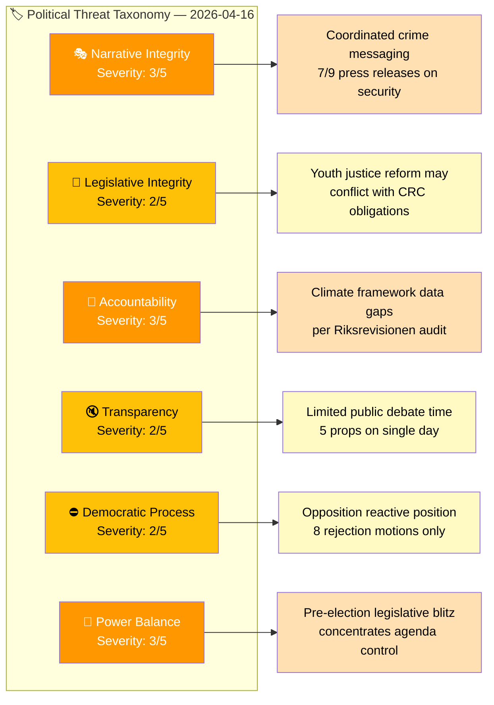
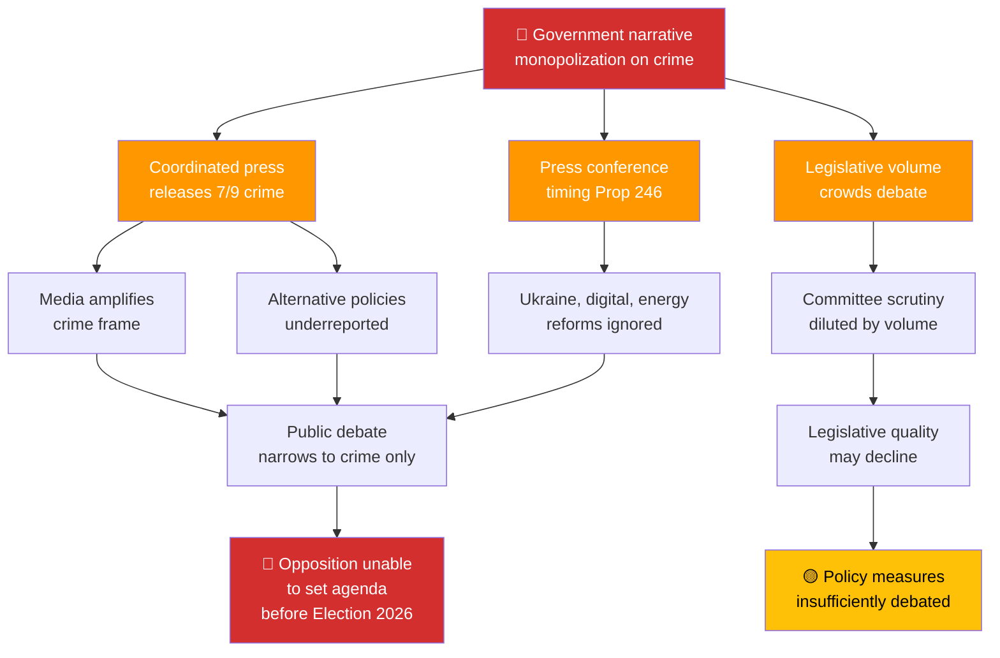

# Political Threat Analysis — Evening Analysis 2026-04-16

## 📋 Threat Analysis Context

| Field | Value |
|-------|-------|
| **Threat Analysis ID** | `THR-2026-04-16-EVE` |
| **Analysis Date** | 2026-04-16 19:30 UTC |
| **Analysis Period** | 2026-04-15 to 2026-04-16 |
| **Produced By** | news-evening-analysis workflow |
| **Political Context** | Kristersson government tabled 5 propositions including flagship youth crime reform. 8 opposition motions filed. 6 committee reports advance. Government communications blitz: 7/9 press releases on crime/security. |
| **Overall Threat Level** | **MODERATE** |

---

## 🏷️ Section 1: Political Threat Taxonomy Assessment

### Political Threat Landscape

---

## 🗂️ Threat Inventory

### Category 1: 🎭 Narrative Integrity — Severity: 3/5 (Moderate)

| # | Threat | Evidence (dok_id) | Severity | Confidence | Status |
|---|--------|-------------------|:--------:|:----------:|:------:|
| NI-1 | **Coordinated crime messaging saturation**: 7 of 9 government press releases (Apr 15-16) focus on crime/security — indefinite sentences, benefit bans, cybersecurity, anti-fraud, social services tools, youth crackdown. This level of messaging coordination may crowd out alternative policy narratives. | search_regering: 9 press releases, 7 crime-related | 3 | 🟩 HIGH | Active |
| NI-2 | **Youth crime framing risk**: Government press conference frames Prop 246 as "protecting society from young offenders" — risk of dehumanizing narrative if media amplifies punitive framing without rehabilitation context | HD03246, pressträff-om-skärpta-regler | 2 | 🟧 MEDIUM | Emerging |

**Narrative Integrity Assessment:** The government's coordinated crime messaging demonstrates communications discipline but creates a narrative saturation risk. When 78% of press releases focus on a single theme (crime/security), alternative policy achievements (Ukraine accountability, digital governance, energy policy) receive reduced public attention. This is a democratic function concern, not a disinformation threat — the risk is narrative monopolization, not false framing.

---

### Category 2: 📝 Legislative Integrity — Severity: 2/5 (Minor)

| # | Threat | Evidence (dok_id) | Severity | Confidence | Status |
|---|--------|-------------------|:--------:|:----------:|:------:|
| LI-1 | **CRC compliance tension**: Prop 246 toughens sentences for under-18 offenders, potentially conflicting with Sweden's obligations under the Convention on the Rights of the Child. The reform introduces sentencing measures that children's rights experts argue violate proportionality principles. | HD03246 | 2 | 🟩 HIGH | Emerging |
| LI-2 | **Forestry regulatory rollback**: Prop 242 deregulates forestry rules. Environmental legal scholars may argue this weakens environmental protection mandates from EU directives (Habitats Directive, Biodiversity Strategy). | HD03242 | 2 | 🟧 MEDIUM | Latent |

**Legislative Integrity Assessment:** The primary legislative integrity concern is the tension between Prop 246's tougher youth sentences and Sweden's CRC obligations. This is not a corruption risk but a legal compatibility question that will be tested in JuU committee hearings and potentially at the Lagrådet.

---

### Category 3: 🚫 Accountability — Severity: 3/5 (Moderate)

| # | Threat | Evidence (dok_id) | Severity | Confidence | Status |
|---|--------|-------------------|:--------:|:----------:|:------:|
| AC-1 | **Climate framework evaluation gaps**: Riksrevisionen audit (MJU20) found the government's climate policy framework lacks adequate data and evaluation methodology. This is a direct accountability failure — the framework exists to hold government accountable on climate targets, but the evaluation tools are inadequate. | HD01MJU20 | 3 | 🟦 VERY HIGH | Active |
| AC-2 | **Simultaneous conflicting policies**: Government advances EV charging incentives (SkU23) and fuel deduction expansion simultaneously, without clear accountability framework for how these interact with climate targets | HD01SkU23, search_regering | 2 | 🟧 MEDIUM | Latent |

**Accountability Assessment:** The Riksrevisionen audit (MJU20) represents the most significant accountability gap identified today. Sweden's climate policy framework is designed to hold the government accountable on climate commitments, but the national audit office found the evaluation methodology inadequate. This is a systemic accountability weakness, not a political scandal, but it creates an attack vector for opposition.

---

### Category 4: 🔇 Transparency — Severity: 2/5 (Minor)

| # | Threat | Evidence (dok_id) | Severity | Confidence | Status |
|---|--------|-------------------|:--------:|:----------:|:------:|
| TR-1 | **Legislative velocity vs. public deliberation**: 5 propositions + 6 committee reports on a single day creates a volume challenge for parliamentary scrutiny and public understanding | HD03246, HD03231, HD03232, HD03244, HD03242, 6 committee reports | 2 | 🟩 HIGH | Active |
| TR-2 | **Press conference timing**: Government holds Prop 246 press conference on the same day as Ukraine propositions and other significant legislation — potential information overload reduces scrutiny of individual measures | pressträff-om-skärpta-regler | 2 | 🟧 MEDIUM | Active |

**Transparency Assessment:** The legislative density is not unusual for the Riksdag spring session but warrants monitoring. The risk is that significant measures (particularly digital governance Prop 244 and forestry Prop 242) receive insufficient public debate because youth crime dominates media attention.

---

### Category 5: ⛔ Democratic Process — Severity: 2/5 (Minor)

| # | Threat | Evidence (dok_id) | Severity | Confidence | Status |
|---|--------|-------------------|:--------:|:----------:|:------:|
| DP-1 | **Opposition limited to reactive rejection**: All 8 opposition motions reject government proposals rather than proposing alternatives — the democratic process functions (motions are filed, committee review proceeds) but the quality of policy debate may be impaired | HD024090-97 | 2 | 🟩 HIGH | Active |
| DP-2 | **S coordination gap**: Socialdemokraterna's timing disconnect (filing motions on different days than V, C, MP) weakens the opposition's collective voice in parliamentary debate | S motions filed April 15, V/C/MP on April 16 | 1 | 🟧 MEDIUM | Latent |

**Democratic Process Assessment:** The democratic process is functioning normally — propositions are tabled, committee reports advance, opposition files motions, interpellations are submitted. The concern is qualitative: opposition is primarily reactive, and the legislative volume may reduce deliberation depth. This is a process efficiency concern, not a democratic crisis.

---

### Category 6: 👑 Power Balance — Severity: 3/5 (Moderate)

| # | Threat | Evidence (dok_id) | Severity | Confidence | Status |
|---|--------|-------------------|:--------:|:----------:|:------:|
| PB-1 | **Pre-election legislative blitz**: Government's concentrated legislative output (5 props + 9 press releases in 48 hours) represents a power balance concern — the government is using its agenda-setting power to dominate the policy narrative before Election 2026 | Multiple HD03xxx, search_regering | 3 | 🟩 HIGH | Active |
| PB-2 | **Tidöavtalet dominance**: SD's influence on the government agenda (youth crime, deportation, migration) continues to shape legislative priorities — the supply arrangement gives SD outsized policy influence relative to seats | HD03246, Prop 235 | 2 | 🟩 HIGH | Persistent |

**Power Balance Assessment:** The government is exercising its legitimate power to set the legislative agenda, but the concentration of legislative activity and communications resources creates an asymmetry that disadvantages the opposition's ability to present alternatives. This is amplified by SD's supply arrangement influence.

---

## 🌲 Attack Tree — Top Threat: Narrative Saturation

---

## 🔍 Threat Actor Profile — Government Communications Apparatus

| Field | Assessment |
|-------|-----------|
| **Actor** | Government communications office (Regeringskansliet) |
| **Intent** | Maximize pre-election narrative control on law-and-order agenda |
| **Capability** | HIGH — Direct access to press conference, press release infrastructure, ministerial media appearances |
| **Opportunity** | HIGH — 5 propositions tabled simultaneously creates multiple news hooks |
| **ICO Score** | 9/12 (H+H+H) |
| **Classification** | Legitimate political actor exercising communications power within democratic norms |

**Note:** This is NOT a malicious threat actor. The government's communications strategy is legitimate democratic activity. The threat to democratic functions is structural (narrative saturation, deliberation compression) rather than intentional.

---

## 📊 Forward Indicators

| Indicator | What It Signals | Detection Method |
|-----------|----------------|-----------------|
| New government press releases outside crime/security theme | Narrative diversification | search_regering daily |
| JuU committee invites CRC experts | CRC scrutiny formalizing | get_betankanden for JuU |
| Opposition proposes alternative legislation (not just rejection motions) | Democratic debate quality improving | get_motioner type analysis |
| Environmental NGO public statements on Prop 242 + MJU20 | Climate threat materializing | External monitoring |
| SD public statement on Tidöavtalet progress | Coalition stability signal | search_anforanden for SD |

---

**Document Control:** v1.0 | Generated 2026-04-16 19:30 UTC | news-evening-analysis | Hack23 AB
