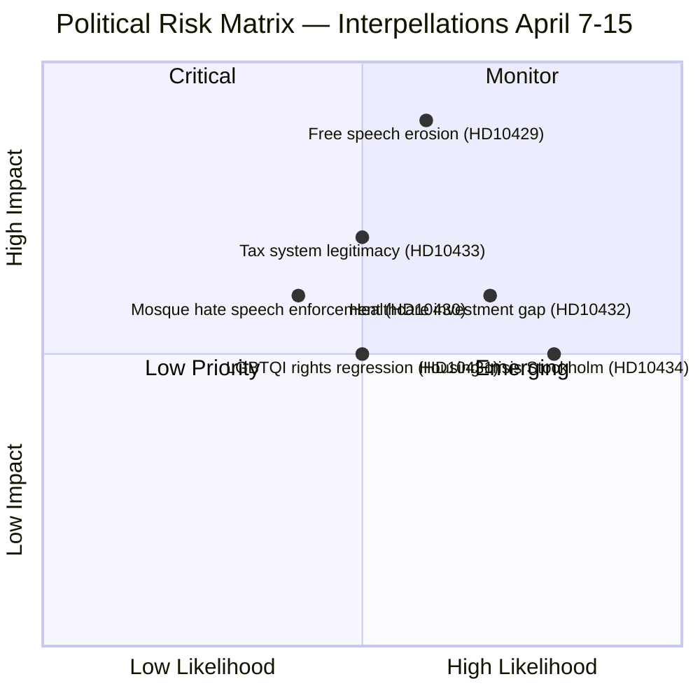

# Political Risk Assessment — 2026-04-16

**Generated**: 2026-04-16 07:10 UTC
**Data Sources**: get_interpellationer, get_dokument_innehall
**Documents Analyzed**: 6 (HD10429–HD10434)
**Confidence**: HIGH
**Produced By**: AI-driven deep analysis (news-journalist agent)

## Summary

Six interpellations present moderate political risk concentrated on two axes: (1) welfare infrastructure accountability pressure on KD ministers, and (2) fundamental rights tensions within the Tidö coalition as SD challenges M on demonstration freedom.

## Risk Matrix

## Detailed Risk Analysis

### 1. Constitutional Rights Risk — FREE SPEECH (HD10429)
- **Risk Level**: HIGH (L=3 × I=5 = 15)
- **Description**: Proposition 2025/26:133 creates legal basis for police to relocate or cancel demonstrations based on "safety" — potentially institutionalizing a "heckler's veto" where threats silence free expression
- **Actors**: Farivar (SD) vs Strömmer (M)
- **Coalition Impact**: SD questioning government signals Tidö Agreement stress on rights issues
- **Response Deadline**: April 24, 2026

### 2. Welfare Infrastructure Risk — HEALTHCARE (HD10432)
- **Risk Level**: MEDIUM (L=4 × I=3 = 12)
- **Description**: Aging hospital infrastructure from 1960s-70s creates patient safety risks; regional economic strain prevents necessary investment
- **Actors**: Olesen (S) vs Lann (KD)
- **Coalition Impact**: Exposes KD healthcare minister's capacity to deliver
- **Response Deadline**: April 29, 2026

### 3. Fiscal Legitimacy Risk — TAX REVIEW (HD10433)
- **Risk Level**: MEDIUM (L=3 × I=3 = 9)
- **Description**: Growing gap between labor and capital taxation undermines social contract; Sweden has most billionaires per capita while inequality rises
- **Actors**: Ekeroth Clausson (S) vs Svantesson (M)
- **Coalition Impact**: Challenges core M fiscal policy position before election
- **Response Deadline**: April 29, 2026

### 4. Housing Supply Risk — STOCKHOLM (HD10434)
- **Risk Level**: MEDIUM (L=4 × I=3 = 12)
- **Description**: Stockholm housing starts declining (11,091 projected 2026, down 900 from 2025) amid persistent demand-supply imbalance
- **Actors**: Nysmed (S) vs Carlson (KD)
- **Coalition Impact**: KD infrastructure minister faces repeated housing pressure
- **Response Deadline**: April 29, 2026

### 5. Religious Extremism Risk — MOSQUE HATE SPEECH (HD10430)
- **Risk Level**: MEDIUM (L=2 × I=4 = 8)
- **Description**: Expressen exposé of imam in Kristianstad preaching antisemitic hatred and calls for revenge against Jews
- **Actors**: Jomshof (SD) vs Forssmed (KD)
- **Coalition Impact**: SD pushes enforcement agenda from outside government
- **Response Deadline**: May 8, 2026

### 6. International Rights Risk — LGBTQI (HD10431)
- **Risk Level**: MODERATE (L=3 × I=3 = 9)
- **Description**: Global anti-LGBTQI movements strengthened by US-based funding; 60+ countries still criminalize same-sex relations
- **Actors**: Lasses (C) vs Dousa (M)
- **Coalition Impact**: C challenges government's global rights leadership credentials
- **Response Deadline**: April 24, 2026

## Coalition Risk Score: 25/100 (LOW-MODERATE)

**Key factors**: SD's free speech challenge (HD10429) represents the most significant coalition risk — a support party questioning the government on constitutional principles. Combined with C's liberal critique on LGBTQI rights, the government faces pressure from both flanks.
