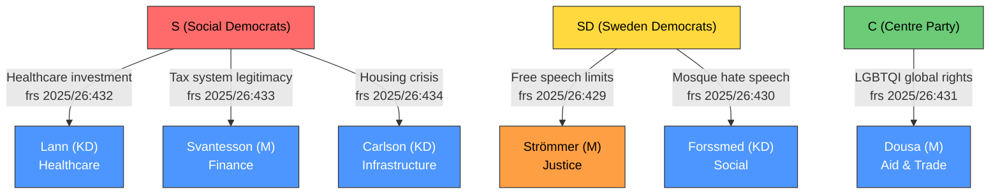

# Analysis Synthesis Summary — 2026-04-16

**Generated**: 2026-04-16 07:10 UTC
**Data Sources**: get_interpellationer, get_dokument_innehall, search_anforanden
**Documents Analyzed**: 6 (HD10429–HD10434)
**Confidence**: HIGH
**Produced By**: AI-driven deep analysis (news-journalist agent)
**Analysis Depth**: deep (2 iterations)
**Methodology**: ai-driven-analysis-guide.md v5.0

## Summary

Six new interpellations filed between April 7–15, 2026 reveal a multi-party pressure campaign targeting KD and M ministers across healthcare, fiscal policy, housing, constitutional rights, religious extremism, and LGBTQI rights. The Social Democrats (S) dominate with 3 filings focused on welfare infrastructure, while Sweden Democrats (SD) — the government's parliamentary support party — file 2 interpellations challenging the Justice Minister on fundamental rights, signaling potential coalition strain. Centre Party (C) adds a liberal critique on LGBTQI global advocacy.

## AI-Recommended Article Metadata

- **Recommended Title (EN)**: "Social Democrats Target KD Ministers on Welfare as Sweden Democrats Challenge Coalition Partner on Free Speech"
- **Recommended Title (SV)**: "Socialdemokraterna pressar KD-ministrar om välfärd medan Sverigedemokraterna utmanar koalitionspartner om yttrandefrihet"
- **Meta Description (EN)**: "Six new interpellations expose coalition tensions: S targets healthcare and housing while SD questions government's free speech commitment in rare support-party accountability move."
- **Meta Description (SV)**: "Sex nya interpellationer blottlägger koalitionsspänningar: S riktar in sig på vård och bostäder medan SD ifrågasätter regeringens yttrandefrihet."
- **Key Highlights**: SD challenges M on free speech (frs 2025/26:429); KD ministers face 4 of 6 interpellations; S welfare infrastructure offensive
- **Article Decision**: PUBLISH
- **Article Priority**: HIGH

## Key Findings

1. **KD ministers most targeted**: Carlson (KD) — housing/infrastructure, Lann (KD) — healthcare, Forssmed (KD) — social affairs face 4 of 6 interpellations [HIGH confidence]
2. **SD challenges coalition partner**: Farivar (SD) questions Strömmer (M) on proposition 2025/26:133 restricting demonstration rights — rare support-party accountability (frs 2025/26:429) [HIGH confidence]
3. **S welfare infrastructure offensive**: Three coordinated interpellations on healthcare investment (frs 2025/26:432), tax system legitimacy (frs 2025/26:433), and Stockholm housing crisis (frs 2025/26:434) — all filed April 15 [HIGH confidence]
4. **Jomshof (SD) escalates religious extremism agenda**: Interpellation on mosque hate speech (frs 2025/26:430) pushes government on enforcement gaps [MEDIUM confidence]
5. **C liberal critique**: Lasses (C) challenges Dousa (M) on LGBTQI global advocacy amid anti-rights movements (frs 2025/26:431) [HIGH confidence]
6. **Response deadline cluster**: All deadlines fall April 24–May 8, creating sustained pre-election scrutiny pressure [HIGH confidence]

## Top Documents by Significance

| Score | Type | dok_id | Title | Minister | Party |
|-------|------|--------|-------|----------|-------|
| 8/10 | interpellation | HD10429 | Skyddet för yttrandefriheten (prop 2025/26:133) | Strömmer (M) | SD |
| 7/10 | interpellation | HD10433 | En bred skatteöversyn | Svantesson (M) | S |
| 7/10 | interpellation | HD10431 | HBTQI-personers rättigheter internationellt | Dousa (M) | C |
| 6/10 | interpellation | HD10430 | Moskéer som sprider hat och hot | Forssmed (KD) | SD |
| 6/10 | interpellation | HD10432 | Investeringar i vårdbyggnader | Lann (KD) | S |
| 5/10 | interpellation | HD10434 | Bostadsbyggandet i Stockholmsregionen | Carlson (KD) | S |

## Ministerial Accountability Dashboard

| Minister | Party | Portfolio | Interpellations | Deadline |
|----------|-------|-----------|----------------|----------|
| Andreas Carlson | KD | Infrastructure & Housing | 1 (HD10434) | Apr 29 |
| Elisabet Lann | KD | Healthcare | 1 (HD10432) | Apr 29 |
| Elisabeth Svantesson | M | Finance | 1 (HD10433) | Apr 29 |
| Gunnar Strömmer | M | Justice | 1 (HD10429) | Apr 24 |
| Jakob Forssmed | KD | Social Affairs | 1 (HD10430) | May 8 |
| Benjamin Dousa | M | Aid & Trade | 1 (HD10431) | Apr 24 |

## Mermaid: Opposition Pressure Flow

## Election 2026 Implications

- **Electoral Impact** 🟧MEDIUM: SD challenging coalition partner on free speech signals pre-election positioning; S welfare offensive targets voter-salient issues
- **Coalition Scenarios** 🟧MEDIUM: SD's interpellation on prop 2025/26:133 raises questions about Tidö Agreement sustainability on rights issues
- **Voter Salience** 🟩HIGH: Healthcare, housing, and tax fairness rank among top voter concerns in 2026
- **Campaign Vulnerability** 🟧MEDIUM: KD ministers face disproportionate pressure — 4 of 6 interpellations — exposing junior coalition partner
- **Policy Legacy** 🟧MEDIUM: Proposition 2025/26:133 (demonstration restrictions) could become defining legacy issue

## Data Quality Notes

Overall confidence: **HIGH**. Full-text content available for all 6 interpellations. All data from official riksdag-regering-mcp API. Minister response status: all pending (newly filed).
