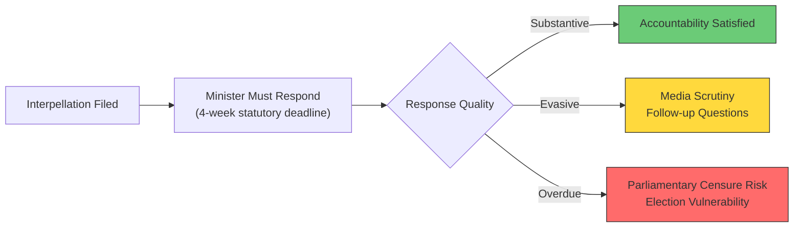

# Political Threat Analysis — 2026-04-16

**Generated**: 2026-04-16 07:10 UTC
**Documents Analyzed**: 6 (HD10429–HD10434)
**Confidence**: HIGH
**Produced By**: AI-driven deep analysis (news-journalist agent)

## Summary

Three distinct threat vectors identified: (1) constitutional rights erosion through demonstration restrictions, (2) welfare infrastructure deterioration creating long-term societal risks, and (3) coalition cohesion threats from multi-directional accountability pressure.

## Threat 1: Constitutional Erosion — Demonstration Rights

- **Vector**: Proposition 2025/26:133 → Police authority expansion → Protest relocation/cancellation
- **Actor**: Government (M/KD/L) — challenged by SD support party
- **Evidence**: frs 2025/26:429 (HD10429) — Farivar (SD) identifies hecklers veto risk where threat of violence determines which demonstrations proceed
- **Impact**: HIGH — fundamental democratic freedoms at stake
- **Probability**: MEDIUM — law already proposed, implementation phase
- **Mitigation**: Judicial review, parliamentary oversight, SD opposition may force amendments

## Threat 2: Welfare Infrastructure Collapse

- **Vector**: Regional economic strain → Delayed hospital modernization → Patient safety degradation
- **Actor**: Structural (demographic/economic) — government accountability via Lann (KD)
- **Evidence**: frs 2025/26:432 (HD10432) — 1960s-70s hospital buildings, rising maintenance debt
- **Impact**: HIGH — patient safety and workforce retention at risk
- **Probability**: HIGH — already occurring in multiple regions
- **Mitigation**: State investment guarantees, PPP models, earmarked infrastructure funds

## Threat 3: Coalition Fragmentation

- **Vector**: Multi-party interpellation pressure → KD minister exposure → SD distance signaling
- **Evidence**: 4/6 interpellations target KD ministers; SD files 2 interpellations challenging M/KD
- **Impact**: MEDIUM — potential Tidö Agreement renegotiation pressure
- **Probability**: LOW-MEDIUM — elections 2026 create incentive for distance
- **Mitigation**: Substantive ministerial responses, policy delivery on key issues

## Mermaid: Threat Progression

