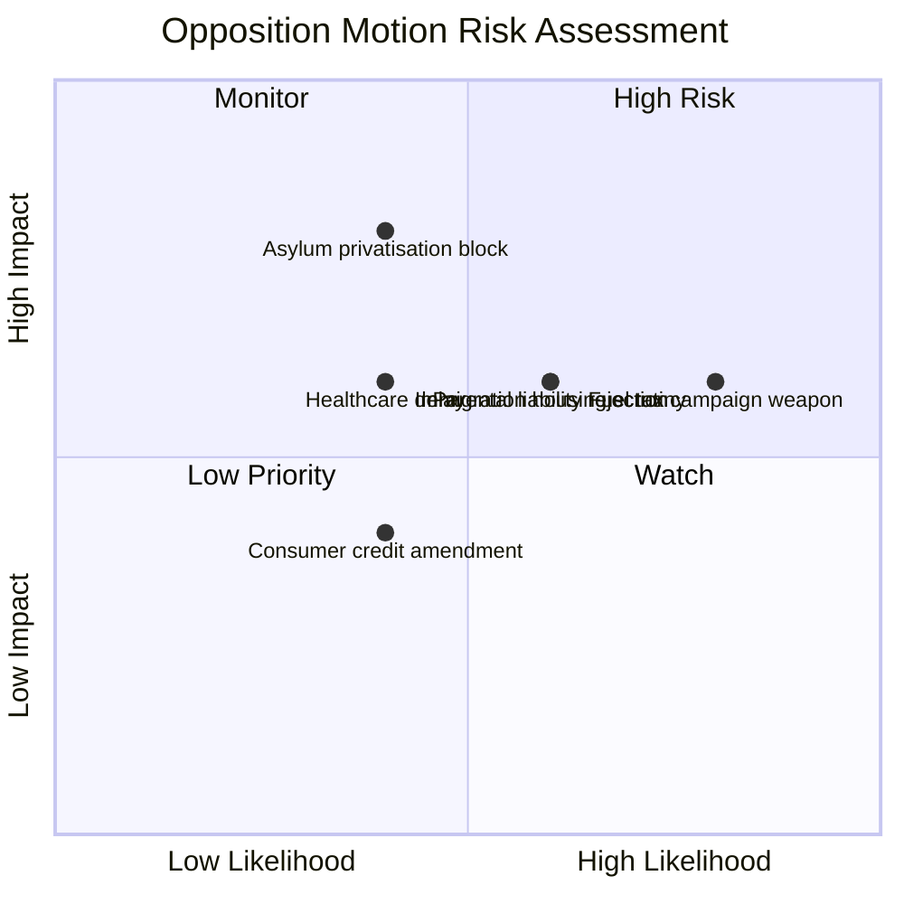

# Political Risk Assessment — Opposition Motions 2026-04-16

**Generated**: 2026-04-16 07:16 UTC
**Data Sources**: get_motioner, get_dokument_innehall, CIA coalition metrics, AI-enriched
**Documents Analyzed**: 12
**Confidence**: HIGH
**Analysis Depth**: deep (2 iterations)
**Methodology**: ai-driven-analysis-guide.md v5.0

## Summary

Coalition risk score: **4/100** (LOW). However, the opposition's coordinated multi-party responses to 6 government propositions create **moderate policy-specific risks** for the government's legislative agenda. Immigration-related motions (5 of 12) signal the highest risk to government control of the policy narrative ahead of Election 2026.

## Risk Matrix (Likelihood × Impact)

| # | Risk | Likelihood (1-5) | Impact (1-5) | L×I Score | Risk Level | Evidence |
|---|------|-------------------|--------------|-----------|------------|----------|
| 1 | Opposition blocks asylum reception privatisation | 2 | 4 | **8** | MEDIUM | mot. 4080 (S), 4087 (MP), 4089 (C) — 3-party alignment on prop. 229 |
| 2 | Parental liability rejected in committee | 3 | 3 | **9** | MEDIUM | mot. 4084 (V), 4085 (MP) reject; S modifies (4078) — split complicates CU deliberation |
| 3 | Extra budget fuel tax framing weaponised in campaign | 4 | 3 | **12** | HIGH | mot. 4082 (S, Damberg) challenges fiscal strategy; high voter salience |
| 4 | Healthcare proposition delayed by SoU objections | 2 | 3 | **6** | LOW | mot. 4081 (S), 4083 (V) both oppose prop. 216 |
| 5 | Immigration housing law faces prolonged committee scrutiny | 3 | 3 | **9** | MEDIUM | mot. 4079 (S), 4086 (MP) contest prop. 215; AU referral |
| 6 | Consumer credit reform amendment weakens bank protections | 2 | 2 | **4** | LOW | mot. 4088 (C) targets bank switching costs in prop. 223 |

## Forward Indicators

| # | Indicator | Trigger | Timeline | Monitoring Source |
|---|-----------|---------|----------|-------------------|
| 1 | SfU committee scheduling for prop. 229 motions | Agenda published for committee deliberation | 2-4 weeks | Riksdag calendar |
| 2 | CU handling of 3-party split on parental liability | Committee signals compromise or rejection | 2-3 weeks | CU meeting protocol |
| 3 | FiU debate on extra budget (prop. 236) | Chamber debate scheduled; S amendment vote | 1-3 weeks | Riksdag calendar |
| 4 | S election manifesto incorporating motion themes | Policy platform released | By September 2026 | Party communications |
| 5 | Media coverage intensity of asylum/fuel tax issues | Editorial coverage peaks | Ongoing | Media monitoring |

## Election 2026 Implications

- **Electoral Impact**: Fuel tax and immigration motions target the government's two most vulnerable flanks [HIGH]
- **Coalition Scenarios**: If S-MP-V-C converge on asylum reception, government must rely solely on SD support [MEDIUM]
- **Voter Salience**: Energy costs (prop. 236) rated highest voter concern in recent polls [HIGH]
- **Campaign Vulnerability**: Government's 6-proposition legislative sprint may appear panicked pre-election [MEDIUM]
- **Policy Legacy**: Opposition motions establish alternative policy platform for post-election governance [HIGH]

## Data Quality Notes

Risk assessment: HIGH confidence. Based on coalition metrics (stability 83/100, majority adequate), document analysis of 12 motions with full-text enrichment for 11/12.
