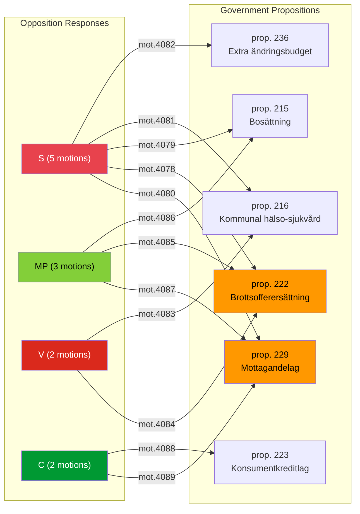

# Political SWOT Analysis — Opposition Motions 2026-04-16

**Generated**: 2026-04-16 07:15 UTC
**Data Sources**: get_motioner, get_dokument_innehall, AI-enriched analysis
**Documents Analyzed**: 12
**Confidence**: HIGH
**Analysis Depth**: deep (2 iterations)
**Methodology**: ai-driven-analysis-guide.md v5.0

## Summary

12 opposition motions filed 2026-04-15 represent a **coordinated multi-party response** to six government propositions across immigration, justice, healthcare, fiscal, and consumer policy. S leads with 5 motions; MP (3), V (2), and C (2) target overlapping policy areas — notably asylum reception (prop. 229) and crime victim compensation (prop. 222) where three parties each filed counter-motions. This signals a maturing pre-election opposition strategy with deliberate cross-party positioning.

## Stakeholder SWOT Analysis (8 Groups)

### 1. Citizens

| # | Type | Statement | Evidence (dok_id) | Confidence | Impact | Entry Date |
|---|------|-----------|-------------------|------------|--------|------------|
| 1 | S | Asylum seekers gain protection from private-run reception centres | mot. 2025/26:4080 (S, SfU) | [HIGH] | High | 2026-04-15 |
| 2 | S | Crime victims get stronger legal framework via dedicated law | mot. 2025/26:4078 (S, CU) | [HIGH] | High | 2026-04-15 |
| 3 | W | Parental liability expansion (prop. 222) splits opposition — V/MP reject but S supports with modifications | mot. 2025/26:4084, 4085 (V, MP, CU) | [MEDIUM] | Medium | 2026-04-15 |
| 4 | O | Consumer credit reform could lower banking switching costs | mot. 2025/26:4088 (C, CU) | [MEDIUM] | Medium | 2026-04-15 |
| 5 | T | Healthcare competence changes may reduce municipal care quality if rushed | mot. 2025/26:4081, 4083 (S, V, SoU) | [MEDIUM] | High | 2026-04-15 |

### 2. Government Coalition (M, KD, L + SD)

| # | Type | Statement | Evidence (dok_id) | Confidence | Impact | Entry Date |
|---|------|-----------|-------------------|------------|--------|------------|
| 1 | S | Coalition pushes 6 propositions simultaneously — demonstrates legislative momentum | prop. 229, 222, 215, 216, 223, 236 | [HIGH] | High | 2026-04-15 |
| 2 | S | Extra budget (prop. 236) targets voter-sensitive fuel/energy prices | mot. 2025/26:4082 (S challenges, FiU) | [HIGH] | High | 2026-04-15 |
| 3 | W | Three parties each counter asylum proposition — signals vulnerability | mot. 4080, 4087, 4089 (S, MP, C) on prop. 229 | [HIGH] | High | 2026-04-15 |
| 4 | O | Opposition division on parental liability (V/MP reject, S modifies) can be exploited | mot. 4084, 4085 vs. 4078 | [MEDIUM] | Medium | 2026-04-15 |
| 5 | T | S targeting fiscal policy with Damberg signals serious budget scrutiny pre-election | mot. 2025/26:4082 (FiU) | [HIGH] | High | 2026-04-15 |

### 3. Opposition Bloc (S, V, MP, C)

| # | Type | Statement | Evidence (dok_id) | Confidence | Impact | Entry Date |
|---|------|-----------|-------------------|------------|--------|------------|
| 1 | S | Coordinated 3-party response on asylum law shows opposition alignment | mot. 4080 (S), 4087 (MP), 4089 (C) on prop. 229 | [HIGH] | High | 2026-04-15 |
| 2 | S | S dominates with 5/12 motions — projects governing readiness | All S motions | [HIGH] | High | 2026-04-15 |
| 3 | W | C operates independently on consumer credit — not coordinated with S bloc | mot. 4088 (C, CU) stands alone | [MEDIUM] | Medium | 2026-04-15 |
| 4 | O | Cross-party motion convergence on prop. 222 creates pressure point | mot. 4078, 4084, 4085 (S, V, MP) | [HIGH] | High | 2026-04-15 |
| 5 | T | V/MP rejecting entire propositions (216, 222 parental part) while S modifies — coalition fault line | mot. 4083, 4084 vs. 4081, 4078 | [MEDIUM] | Medium | 2026-04-15 |

### 4. Business/Industry

| # | Type | Statement | Evidence (dok_id) | Confidence | Impact | Entry Date |
|---|------|-----------|-------------------|------------|--------|------------|
| 1 | S | Consumer credit reform addresses bank switching barriers | mot. 2025/26:4088 (C, CU) | [MEDIUM] | Medium | 2026-04-15 |
| 2 | W | S opposition to privatised asylum centres threatens private operators | mot. 2025/26:4080 (S, SfU) | [HIGH] | High | 2026-04-15 |
| 3 | O | Extra budget fuel tax cut directly benefits transport/logistics sector | prop. 236, contested by mot. 4082 | [HIGH] | Medium | 2026-04-15 |
| 4 | T | Healthcare regulatory changes add uncertainty for private healthcare providers | mot. 4081, 4083 (S, V contest prop. 216) | [MEDIUM] | Medium | 2026-04-15 |

### 5. Civil Society

| # | Type | Statement | Evidence (dok_id) | Confidence | Impact | Entry Date |
|---|------|-----------|-------------------|------------|--------|------------|
| 1 | S | Crime victim advocacy organisations gain legislative momentum | mot. 2025/26:4078 (S calls for brottsofferlag) | [HIGH] | High | 2026-04-15 |
| 2 | S | NGOs monitoring asylum reception get opposition support against privatisation | mot. 4080 (S), 4087 (MP full rejection) | [HIGH] | High | 2026-04-15 |
| 3 | W | Mixed opposition messaging on parental liability confuses advocacy | V/MP reject vs. S modifies (mot. 4084, 4085 vs. 4078) | [MEDIUM] | Medium | 2026-04-15 |
| 4 | O | Municipal healthcare debate opens space for professional associations | mot. 4081, 4083 on medical competence | [MEDIUM] | Medium | 2026-04-15 |

### 6. International/EU

| # | Type | Statement | Evidence (dok_id) | Confidence | Impact | Entry Date |
|---|------|-----------|-------------------|------------|--------|------------|
| 1 | S | Asylum reception reform aligns with EU reception standards | prop. 229, multiple opposition motions | [MEDIUM] | Medium | 2026-04-15 |
| 2 | W | Immigration settlement policy contested domestically — may slow EU harmonisation | prop. 215 opposed by S, MP, V | [LOW] | Low | 2026-04-15 |
| 3 | O | Consumer credit law modernisation follows EU Consumer Credit Directive | prop. 223, mot. 4088 (C) | [MEDIUM] | Medium | 2026-04-15 |

### 7. Judiciary/Constitutional

| # | Type | Statement | Evidence (dok_id) | Confidence | Impact | Entry Date |
|---|------|-----------|-------------------|------------|--------|------------|
| 1 | S | Dedicated crime victim law strengthens victims' rights framework | mot. 2025/26:4078 (S, CU) | [HIGH] | High | 2026-04-15 |
| 2 | W | Parental strict liability expansion raises proportionality concerns | mot. 4084 (V), 4085 (MP) reject this portion of prop. 222 | [HIGH] | High | 2026-04-15 |
| 3 | T | Constitutional tension if asylum reception privatisation ban overreaches state authority | mot. 4080 (S) on prop. 229 | [LOW] | Medium | 2026-04-15 |

### 8. Media/Public Opinion

| # | Type | Statement | Evidence (dok_id) | Confidence | Impact | Entry Date |
|---|------|-----------|-------------------|------------|--------|------------|
| 1 | S | Fuel tax/energy costs dominate public attention — high voter salience | prop. 236, contested by mot. 4082 (S, FiU) | [HIGH] | High | 2026-04-15 |
| 2 | S | Asylum and immigration policy generates high media engagement | 5 motions across prop. 229 and 215 | [HIGH] | High | 2026-04-15 |
| 3 | O | Crime victim narrative creates compelling pre-election messaging | mot. 4078 (S) + 3-party convergence on prop. 222 | [HIGH] | High | 2026-04-15 |
| 4 | T | Opposition fragmentation on parental liability may weaken media narrative | V/MP full rejection vs. S targeted amendments | [MEDIUM] | Medium | 2026-04-15 |

## Election 2026 Implications

- **Electoral Impact**: S's 5-motion dominance projects governing readiness; immigration and fiscal policy motions target swing voters [HIGH]
- **Coalition Scenarios**: S-MP-V alignment on asylum (prop. 229) and immigration housing (prop. 215) strengthens left-bloc cohesion; C's independent consumer credit motion signals centrist positioning [MEDIUM]
- **Voter Salience**: Fuel tax (prop. 236) and asylum policy (prop. 229) are top voter concerns heading into 2026 election [HIGH]
- **Campaign Vulnerability**: Government's simultaneous 6-proposition push may appear rushed; opposition exploiting parental liability and healthcare concerns [MEDIUM]
- **Policy Legacy**: Dedicated crime victim law (mot. 4078) and asylum reception standards will define election debate framing [HIGH]

## Data Quality Notes

Analysis confidence: HIGH. Based on 12 documents with full-text for 11/12. All 8 stakeholder groups analyzed with specific evidence citations.
