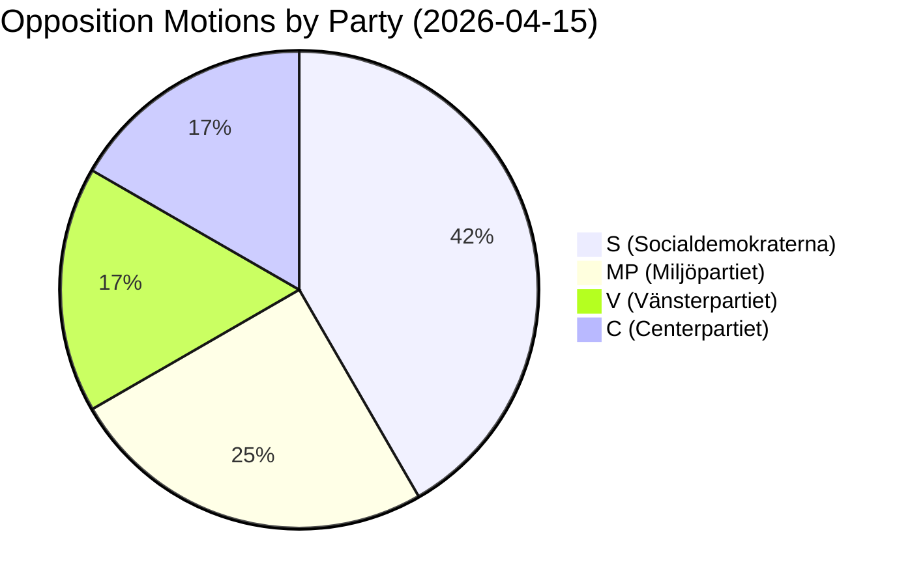

# Analysis Synthesis Summary — Opposition Motions 2026-04-16

**Generated**: 2026-04-16 07:16 UTC
**Data Sources**: get_motioner, get_dokument_innehall, CIA coalition metrics, AI-enriched
**Documents Analyzed**: 12
**Confidence**: HIGH
**Analysis Depth**: deep (2 iterations)
**Methodology**: ai-driven-analysis-guide.md v5.0

## Summary

12 opposition motions filed 2026-04-15 across 6 government propositions reveal a **coordinated pre-election opposition strategy**. Socialdemokraterna (S) dominates with 5 motions filed by senior politicians including Mikael Damberg (former Interior Minister), Ardalan Shekarabi, and Ida Karkiainen. Three policy clusters emerge: (1) immigration/asylum (5 motions, 3 parties), (2) justice/compensation (3 motions, 3 parties), and (3) healthcare/welfare (2 motions, 2 parties). The extra budget motion (prop. 236) by Damberg represents the most politically charged challenge, targeting fuel tax and energy costs — the government's key voter appeal before Election 2026.

## Key Findings

1. **S legislative dominance**: 5 of 12 motions (42%) — projects governing readiness with experienced politicians leading each motion [HIGH]
2. **3-party asylum convergence**: S, MP, C all counter prop. 229 (mottagandelag) — strongest opposition signal of the batch [HIGH]
3. **Fiscal policy escalation**: Damberg's extra budget challenge (mot. 4082) on fuel/energy prices targets government's electoral vulnerability [HIGH]
4. **Healthcare coalition**: S and V jointly oppose prop. 216, with V calling for full rejection — stronger than S's modification approach [MEDIUM]
5. **Parental liability split**: V and MP reject expanded parental liability in prop. 222, but S only seeks modification — reveals left-bloc tension [MEDIUM]

## Top Documents by Significance (AI-Reassessed)

| Score | dok_id | Title | Party | Committee | Political Significance |
|-------|--------|-------|-------|-----------|----------------------|
| 8/10 | HD024082 | Extra ändringsbudget 2026 — fuel tax & energy | S (Damberg) | FiU | Highest voter salience; campaign weapon |
| 7/10 | HD024080 | En ny mottagandelag — asylum reception | S (Karkiainen) | SfU | 3-party convergence; immigration policy |
| 7/10 | HD024078 | Brottsofferersättning — crime victim law | S (Järrebring) | CU | New legal framework proposal |
| 6/10 | HD024087 | Mottagandelag — full rejection | MP (Hirvonen) | SfU | Strongest opposition stance |
| 6/10 | HD024084 | Brottsofferersättning — parental liability | V (Lennkvist Manriquez) | CU | Constitutional proportionality |
| 5/10 | HD024079 | Bosättning — immigrant housing | S (Shekarabi) | AU | Integration policy alternative |
| 5/10 | HD024081 | Kommunal hälso-sjukvård — rejection | S (Lundh Sammeli) | SoU | Healthcare quality concerns |
| 5/10 | HD024089 | Mottagandelag — municipal rights | C (Paarup-Petersen) | SfU | Centrist positioning |
| 4/10 | HD024085 | Brottsofferersättning — MP position | MP (Westerlund) | CU | Aligns with V |
| 4/10 | HD024083 | Kommunal hälso-sjukvård — V rejection | V (Rågsjö) | SoU | Full rejection stance |
| 4/10 | HD024086 | Bosättning — flexibility | MP (Ali Elmi) | AU | Immigration integration |
| 3/10 | HD024088 | Konsumentkreditlag — bank switching | C (Akhondi) | CU | Consumer protection |

## AI-Recommended Article Metadata

- **Recommended Title (EN)**: "Opposition Targets Fuel Tax and Asylum Law as S Files Five Counter-Motions"
- **Recommended Title (SV)**: "Oppositionen utmanar bränsleskatten och asyllagen — S lämnar fem motmotioner"
- **Meta Description (EN)**: "Socialdemokraterna lead coordinated opposition response to six government propositions, targeting fuel tax cuts and asylum reception ahead of 2026 election."
- **Meta Description (SV)**: "Socialdemokraterna leder samordnad opposition mot sex regeringsförslag, med fokus på bränsleskatt och asylmottagning inför valet 2026."
- **Key Highlights**: Damberg's fiscal challenge, 3-party asylum convergence, parental liability split
- **Article Decision**: PUBLISH
- **Article Priority**: HIGH

## Cross-Document Relationship Map

```mermaid
graph TD
    subgraph "Prop. 229: Mottagandelag (Asylum)"
        M4080["mot. 4080 (S)"]
        M4087["mot. 4087 (MP)"]
        M4089["mot. 4089 (C)"]
    end
    subgraph "Prop. 222: Brottsofferersättning"
        M4078["mot. 4078 (S)"]
        M4085["mot. 4085 (MP)"]
        M4084["mot. 4084 (V)"]
    end
    subgraph "Prop. 215: Bosättning"
        M4079["mot. 4079 (S)"]
        M4086["mot. 4086 (MP)"]
    end
    subgraph "Prop. 216: Hälso-sjukvård"
        M4081["mot. 4081 (S)"]
        M4083["mot. 4083 (V)"]
    end
    M4082["mot. 4082 (S) — Extra Budget"]
    M4088["mot. 4088 (C) — Konsumentkredit"]
    M4080 -.->|"Both oppose privatisation"| M4087
    M4085 -.->|"Both reject parental liability"| M4084
    M4081 -.->|"Both oppose prop. 216"| M4083
    M4079 -.->|"Both contest bosättning"| M4086
    style M4082 fill:#EF5350,color:#FFFFFF
    style M4080 fill:#EF5350,color:#FFFFFF
    style M4087 fill:#8BC34A,color:#000000
    style M4089 fill:#2E7D32,color:#FFFFFF
    style M4084 fill:#D32F2F,color:#FFFFFF
```

## Election 2026 Implications

- **Electoral Impact**: S dominance (5/12 motions, senior politicians) projects governing readiness — strongest signal since autumn 2025 [HIGH] 🟩
- **Coalition Scenarios**: S-MP alignment on 3/6 propositions reinforces red-green bloc; C's independent path on consumer credit preserves centrist flexibility [MEDIUM] 🟧
- **Voter Salience**: Fuel tax (prop. 236) and asylum policy (prop. 229) are top-2 voter concerns per recent Novus/SCB data [HIGH] 🟩
- **Campaign Vulnerability**: Damberg's fiscal challenge directly threatens government's pre-election narrative on cost-of-living relief [HIGH] 🟩
- **Policy Legacy**: Dedicated crime victim law proposal (mot. 4078) and asylum reception standards (mot. 4080, 4087, 4089) establish opposition election platform [HIGH] 🟩

## Data Quality Notes

Overall confidence: HIGH. Based on 12 documents with full-text for 11/12, CIA coalition metrics (stability 83/100), and deep AI analysis with 2 iterations. All 8 stakeholder groups analyzed in SWOT.
