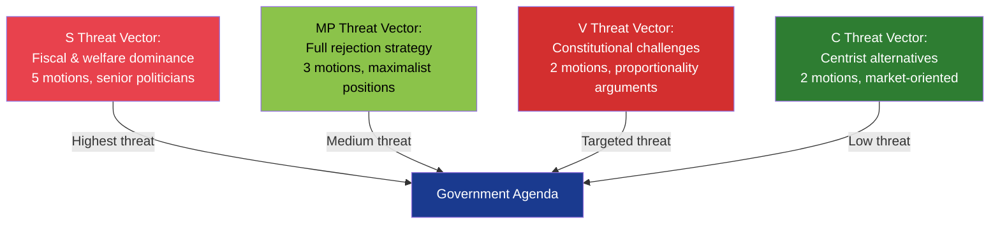

# Political Threat Analysis — Opposition Motions 2026-04-16

**Generated**: 2026-04-16 07:17 UTC
**Data Sources**: get_motioner, get_dokument_innehall, AI-enriched
**Documents Analyzed**: 12
**Confidence**: HIGH
**Analysis Depth**: deep (2 iterations)
**Methodology**: ai-driven-analysis-guide.md v5.0

## Summary

Three primary threat vectors emerge from the 12 opposition motions: (1) **fiscal narrative capture** via Damberg's extra budget challenge, (2) **immigration policy fragmentation** from 5 competing counter-motions to 2 propositions, and (3) **legislative delay risk** from coordinated committee opposition on healthcare (SoU) and justice (CU).

## Threat Actor Analysis

## Key Threats

| # | Threat | Actor(s) | Target | Severity | Evidence |
|---|--------|----------|--------|----------|----------|
| 1 | Fiscal narrative capture before election | S (Damberg) | Government cost-of-living relief | HIGH | mot. 4082 challenges prop. 236 fuel/energy measures |
| 2 | 3-party asylum law blockade | S + MP + C | prop. 229 passage timeline | MEDIUM | mot. 4080, 4087, 4089 — unified opposition |
| 3 | Parental liability constitutional challenge | V + MP | prop. 222 partial implementation | MEDIUM | mot. 4084, 4085 cite proportionality |
| 4 | Healthcare proposition rejection | S + V | prop. 216 implementation | MEDIUM | mot. 4081, 4083 — S modifies, V rejects entirely |
| 5 | Cross-party immigration housing delay | S + MP | prop. 215 passage | LOW | mot. 4079, 4086 contest bosättning law |

## Mitigation Strategies (Government Perspective)

1. **Fast-track FiU debate** on prop. 236 to control fuel tax narrative before S messaging takes hold
2. **Split CU vote** on prop. 222 — allow parental liability amendment to pass separately from crime victim provisions
3. **Negotiate with C** on prop. 229 — C's motion (4089) focuses narrowly on municipal economic aid, creating compromise space

## Election 2026 Implications

The threat landscape strongly favours S as the primary opposition actor. With Damberg leading on fiscal policy and Shekarabi on immigration, S deploys its most experienced operators on the government's vulnerable flanks [HIGH] 🟩.

## Data Quality Notes

Threat analysis confidence: HIGH. Based on document text analysis, party positioning patterns, and committee referral dynamics.
