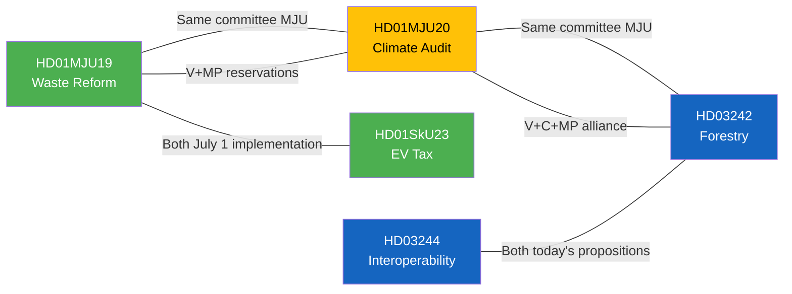

# Cross-Document Reference Map — 2026-04-16 (Realtime Monitor)

**Generated**: 2026-04-16 10:37 UTC
**Cross-references identified**: 8

---

## Cross-Reference Network

## Key Linkages

| From | To | Relationship |
|------|----|-------------|
| HD01MJU19 | HD01MJU20 | Same committee (MJU); overlapping opposition (V+MP) |
| HD01MJU20 | HD03242 | Same committee (MJU); environmental policy tension |
| HD01MJU19 | HD01SkU23 | Both take effect July 1, 2026; environmental/fiscal crossover |
| HD03244 | HD03242 | Both new government propositions submitted same day |
| HD01MJU19 | HD03242 | Environmental compliance vs. deregulation tension |
