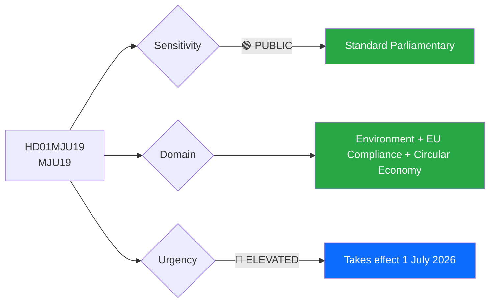
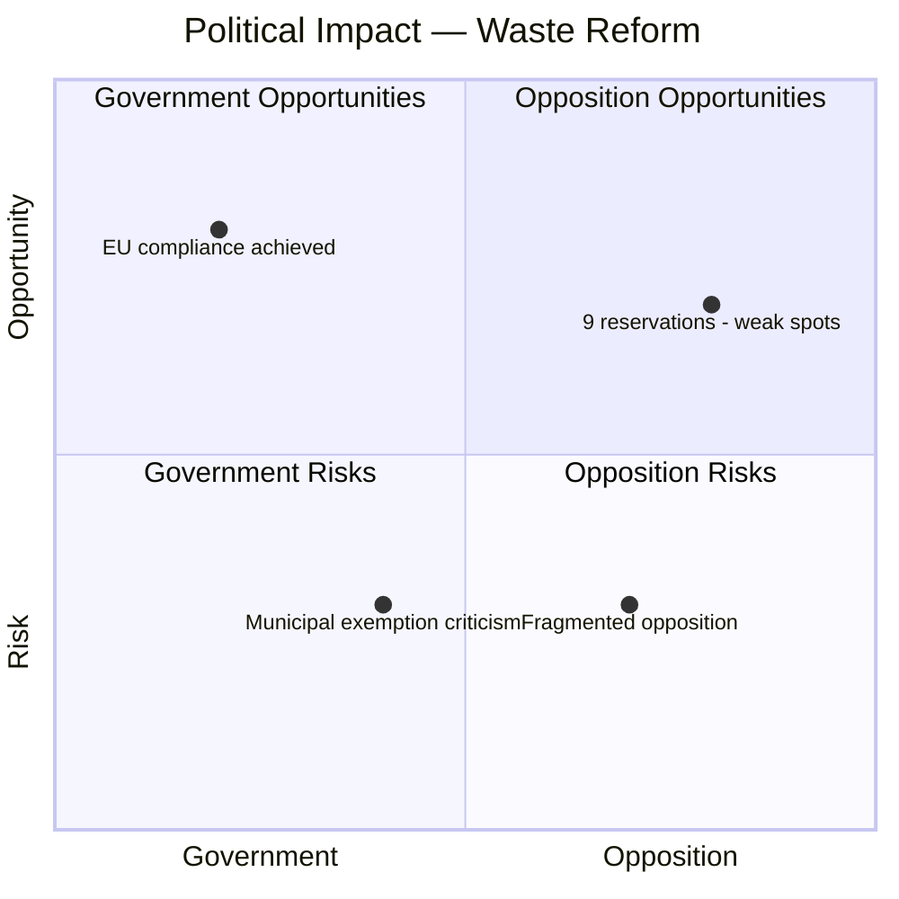

# Document Analysis: Waste Legislation Reform for Increased Material Recycling

**Generated**: 2026-04-16 10:37 UTC
**dok_id**: HD01MJU19
**Document Type**: Betänkande (Committee Report)
**Committee**: MJU (Miljö- och jordbruksutskottet)
**Date**: 2026-04-16
**Riksmöte**: 2025/26
**Significance**: 🟡 Medium (5/10)
**Confidence**: HIGH (80%)
**Data Depth**: FULL-TEXT

---

## Executive Summary

MJU approves the government's comprehensive waste legislation reform (Prop 2025/26:108), amending the Environmental Code and three additional laws to strengthen Sweden's circular economy framework. The nine reservations from S, V, C, and MP — covering waste producer responsibility, recycling targets, illegal waste handling, and evaluation mechanisms — reveal coordinated but fragmented opposition. The reform introduces new responsibility provisions clarifying when waste obligations begin and end, while exempting state/municipality/regional entities from economic security requirements for waste disposal. **[HIGH confidence]**

---

## Political Classification

| Field | Assessment |
|-------|-----------|
| **Sensitivity Level** | PUBLIC |
| **Primary Domain** | Environment (ENV) + EU Compliance |
| **Urgency** | ELEVATED — multiple law amendments take effect 1 July 2026 |
| **Significance Score** | 5/10 |
| **Confidence** | HIGH |

---

## SWOT Impact Assessment

### Government Coalition Impact

| Quadrant | Statement | Evidence | Confidence | Impact |
|----------|-----------|----------|:----------:|:------:|
| ✅ Strength | Government delivers comprehensive EU-aligned waste reform — demonstrates ability to implement complex environmental legislation | HD01MJU19: Prop 2025/26:108 amends Environmental Code + 3 additional laws; approved by MJU | H | H |
| ✅ Strength | Exemption for state/municipalities from economic security requirements reduces public sector compliance costs | HD01MJU19: "staten, kommuner, regioner och kommunalförbund ska undantas från krav på att ställa ekonomisk säkerhet" | H | M |
| ⚠️ Weakness | Nine reservations from four opposition parties indicate multiple attack vectors on environmental policy | HD01MJU19: Reservations from S, V, C, MP covering 6 different points | H | M |
| 🔴 Threat | Opposition can claim government weakened environmental protections by exempting public entities from economic security requirements | HD01MJU19: V+MP reservation on waste producer responsibility (punkt 2) | M | M |

### Opposition Impact

| Quadrant | Statement | Evidence | Confidence | Impact |
|----------|-----------|----------|:----------:|:------:|
| ✅ Strength | V+MP coordination on environmental reservations builds green-left alliance narrative | HD01MJU19: Joint V+MP reservations on points 2, 3, 5 | H | M |
| ✅ Strength | S files separate reservations on illegal waste handling (punkt 5) and evaluation (punkt 6) — distinct policy positioning | HD01MJU19: S reservation on tillsyn och illegal avfallshantering | H | M |
| ⚠️ Weakness | Opposition fragmented — S, V, C, MP filed different reservations on same issues, weakening unified critique | HD01MJU19: 3 separate reservations on punkt 5 alone (S, V+MP, C) | H | M |
| 🚀 Opportunity | C files independent reservations — potential centre-green coalition narrative on environmental policy | HD01MJU19: C separate reservations on punkter 4, 5, 7 | M | L |

---

## Risk Assessment

| Risk | Likelihood | Impact | Score | Mitigation |
|------|:----------:|:------:|:-----:|------------|
| Municipal exemption from security requirements leads to waste dumping incidents | M | H | 5/10 | Regulatory oversight through Naturvårdsverket supervision |
| Opposition unifies fragmented positions into coherent environmental critique | L | M | 3/10 | Government's broad reform package provides counter-narrative |
| EU finds Swedish implementation insufficient on recycling targets | L | M | 3/10 | Amendment designed for EU compliance; ongoing reporting |

---

## Stakeholder Analysis

| Stakeholder Group | Impact | Assessment |
|-------------------|:------:|------------|
| **Citizens** | 🟢 Positive | Improved recycling infrastructure; clearer waste responsibility chain |
| **Government Coalition** | 🟢 Positive | Delivers on EU obligations; broad legislation with M, SD, KD, L support |
| **Opposition Bloc** | 🟡 Mixed | 9 reservations provide attack points but opposition is fragmented across S, V, C, MP |
| **Business/Industry** | 🟡 Mixed | Clearer responsibility rules but new compliance requirements; circular economy creates new markets |
| **Civil Society** | 🟡 Mixed | Environmental groups likely support recycling goals but may criticize public sector exemptions |
| **International/EU** | 🟢 Positive | Aligns with EU circular economy package and waste framework directive |
| **Judiciary/Constitutional** | ⚪ Neutral | Standard legislative procedure; four law amendments within normal scope |
| **Media/Public Opinion** | ⚪ Neutral | Moderate news value; waste policy lacks dramatic political tension |

---

## Key Insights

1. **Nine reservations from four parties** reveal opposition consensus that government's reform is insufficient — but their fragmentation weakens collective pressure **[HIGH confidence, dok_id: HD01MJU19]**
2. **Public sector exemption from economic security** is the most politically vulnerable provision — opposition can frame as double standards **[MEDIUM confidence, dok_id: HD01MJU19]**
3. **V+MP joint reservations** strengthen green-left bloc coordination on environmental policy ahead of 2026 election **[HIGH confidence, dok_id: HD01MJU19]**
4. **C files independent reservations** — positioning separately from both S and V+MP, maintaining centrist environmental credentials **[HIGH confidence, dok_id: HD01MJU19]**

## Forward Indicators

- Watch for: Chamber debate on MJU19 — reservation speeches will reveal opposition strategy
- Watch for: Naturvårdsverket implementation guidance post-July 1
- Watch for: V+MP joint campaigning on waste and circular economy
