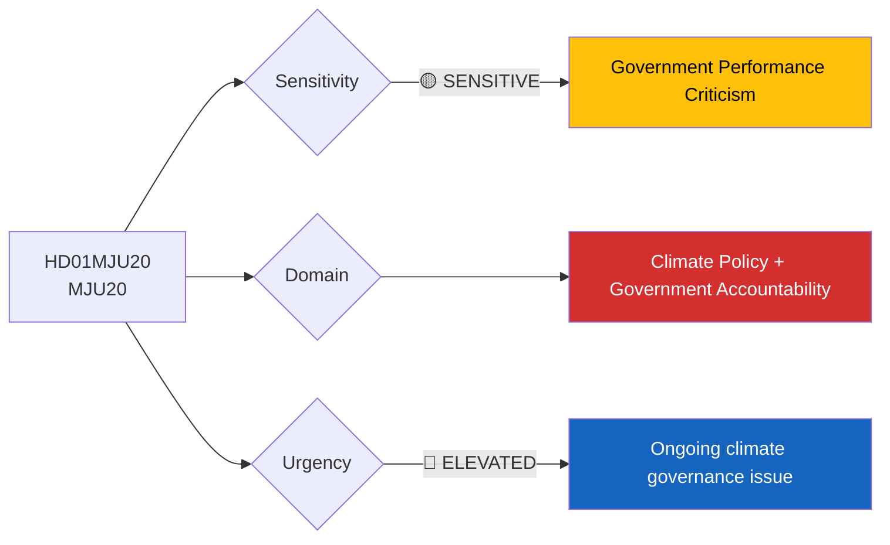
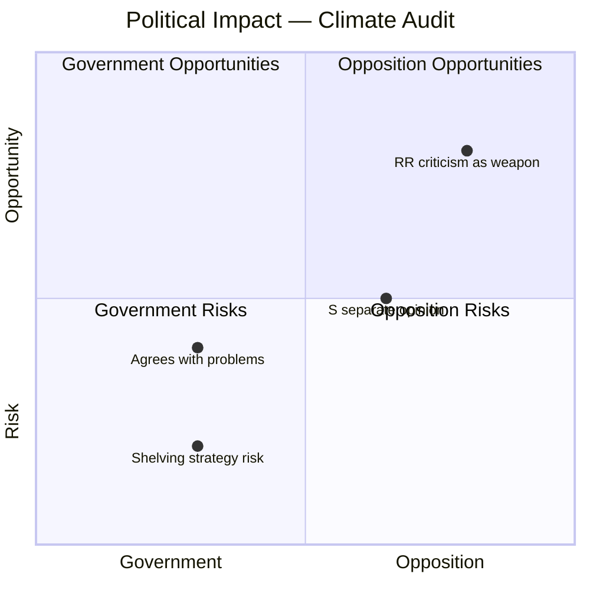

# Document Analysis: Climate Policy Framework Audit by Riksrevisionen

**Generated**: 2026-04-16 10:37 UTC
**dok_id**: HD01MJU20
**Document Type**: Betänkande (Committee Report)
**Committee**: MJU (Miljö- och jordbruksutskottet)
**Date**: 2026-04-16
**Riksmöte**: 2025/26
**Significance**: 🟡 Medium (5/10)
**Confidence**: HIGH (80%)
**Data Depth**: FULL-TEXT

---

## Executive Summary

MJU recommends shelving Riksrevisionen's critical report (Skr. 2025/26:122) on deficiencies in Sweden's climate policy framework data and evaluation work, while rejecting MP's follow-up motion. Riksrevisionen found "several deficiencies" in Naturvårdsverket's climate reporting and action plan preparation. The government "largely agrees" with the problem description but offers different solutions. The reservation from V+C+MP and S's separate opinion expose a government vulnerability: acknowledging climate governance failures while resisting opposition-demanded reforms. **[HIGH confidence]**

---

## Political Classification

| Field | Assessment |
|-------|-----------|
| **Sensitivity Level** | SENSITIVE — Riksrevisionen criticism of government performance |
| **Primary Domain** | Climate Policy (ENV) + Government Accountability |
| **Urgency** | ELEVATED — ongoing governance deficiency |
| **Significance Score** | 5/10 |
| **Confidence** | HIGH |

---

## SWOT Impact Assessment

### Government Coalition Impact

| Quadrant | Statement | Evidence | Confidence | Impact |
|----------|-----------|----------|:----------:|:------:|
| ✅ Strength | Government transparently acknowledges deficiencies identified by Riksrevisionen — demonstrates accountability | HD01MJU20: "Regeringen instämmer i huvudsak i Riksrevisionens problembeskrivning" | H | M |
| ⚠️ Weakness | Government's different solutions from Riksrevisionen's recommendations creates perception of inadequate response | HD01MJU20: "gör delvis en annan bedömning av vilka åtgärder som bör vidtas" | H | H |
| ⚠️ Weakness | Naturvårdsverket's reporting failures reflect on government oversight of its agencies | HD01MJU20: RR found "framför allt när det gäller Naturvårdsverkets arbete med att ta fram ett samlat underlag" | H | M |
| 🔴 Threat | Opposition can use Riksrevisionen's independent authority to attack government's climate governance credibility | HD01MJU20: MP motion 2025/26:3924 (Katarina Luhr et al.) demands stronger action | H | H |

### Opposition Impact

| Quadrant | Statement | Evidence | Confidence | Impact |
|----------|-----------|----------|:----------:|:------:|
| ✅ Strength | V+C+MP united reservation creates broad cross-opposition climate alliance | HD01MJU20: Joint reservation from V, C, MP on punkt 1 | H | H |
| ✅ Strength | S's separate opinion allows critique without joining V+C+MP bloc — strategic positioning | HD01MJU20: "ett särskilt yttrande (S)" on punkt 2 | H | M |
| 🚀 Opportunity | Riksrevisionen provides independent, non-partisan evidence for opposition climate attacks | HD01MJU20: RR report is independent audit with specific recommendations | H | H |
| ⚠️ Weakness | S choosing separate opinion rather than joining V+C+MP reservation fragments opposition on climate | HD01MJU20: S separate opinion vs V+C+MP reservation on different points | H | M |

---

## Risk Assessment

| Risk | Likelihood | Impact | Score | Mitigation |
|------|:----------:|:------:|:-----:|------------|
| Opposition uses RR report in election campaign to attack climate credibility | H | H | 7/10 | Government's partial agreement shows responsiveness |
| Naturvårdsverket reporting failures continue, triggering new RR follow-up | M | M | 5/10 | Government can direct agency reform |
| EU scrutiny of Sweden's climate governance based on RR findings | L | H | 4/10 | Swedish climate targets still formally in place |
| V+C+MP climate alliance strengthens into broader electoral cooperation | M | M | 4/10 | Different party priorities limit long-term alignment |

---

## Stakeholder Analysis

| Stakeholder Group | Impact | Assessment |
|-------------------|:------:|------------|
| **Citizens** | 🟡 Mixed | Climate governance deficiencies affect long-term environmental protection; accountability mechanisms working |
| **Government Coalition** | 🔴 Negative | RR criticism undermines climate governance credibility; "agrees but acts differently" is awkward position |
| **Opposition Bloc** | 🟢 Positive | Independent RR evidence strengthens climate critique; V+C+MP coordination builds alliance |
| **Business/Industry** | ⚪ Neutral | Climate policy framework uncertainties may affect green investment decisions |
| **Civil Society** | 🔴 Negative | Environmental NGOs gain ammunition from RR report; likely increased advocacy pressure |
| **International/EU** | 🟡 Mixed | RR audit shows functioning oversight mechanisms; but findings reveal governance gaps |
| **Media/Public Opinion** | 🟡 Mixed | RR reports generate media coverage; climate governance failures resonate with climate-concerned voters |

---

## Key Insights

1. **Government's "agree but different solutions" position** is the most politically vulnerable — it acknowledges the problem exists but disputes the fix, giving opposition a clear attack line **[HIGH confidence, dok_id: HD01MJU20]**
2. **V+C+MP climate alliance** bridges left-centre-green — a potentially significant electoral dynamic if sustained beyond single votes **[HIGH confidence, dok_id: HD01MJU20]**
3. **S positions separately from V+C+MP** — maintaining independence from green-left bloc while still criticizing government, consistent with S's centrist opposition strategy **[HIGH confidence, dok_id: HD01MJU20]**
4. **Riksrevisionen's criticism of Naturvårdsverket** specifically names agency-level failures, creating political pressure on Climate Minister to demonstrate reform **[HIGH confidence, dok_id: HD01MJU20]**

## Forward Indicators

- Watch for: MP using RR report in election campaign materials
- Watch for: Government directive to Naturvårdsverket on reporting improvements
- Watch for: V+C+MP joint climate statements beyond this single vote
- Watch for: Klimatpolitiska rådets response to RR findings
