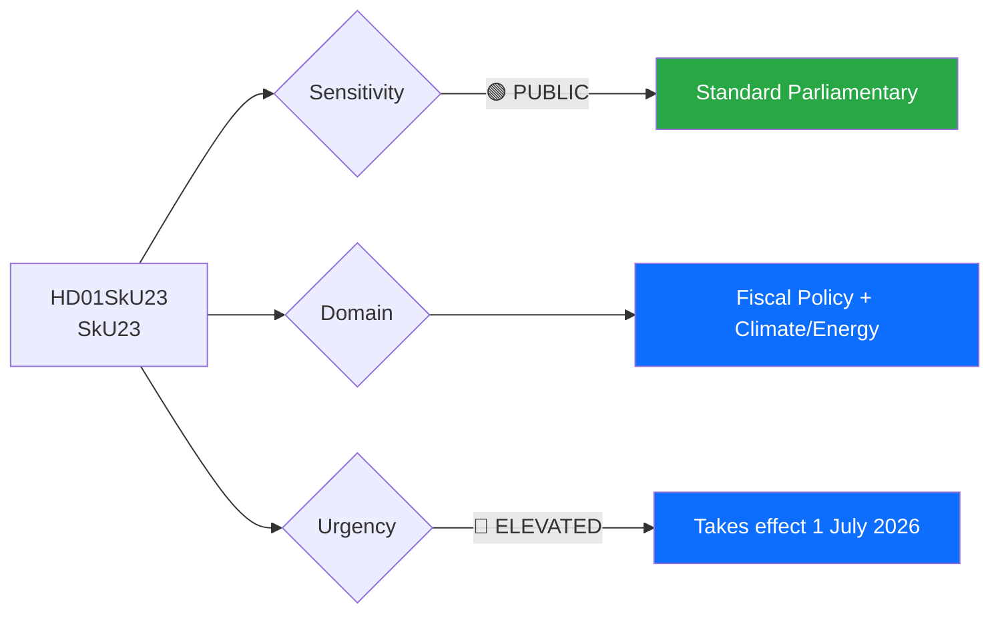
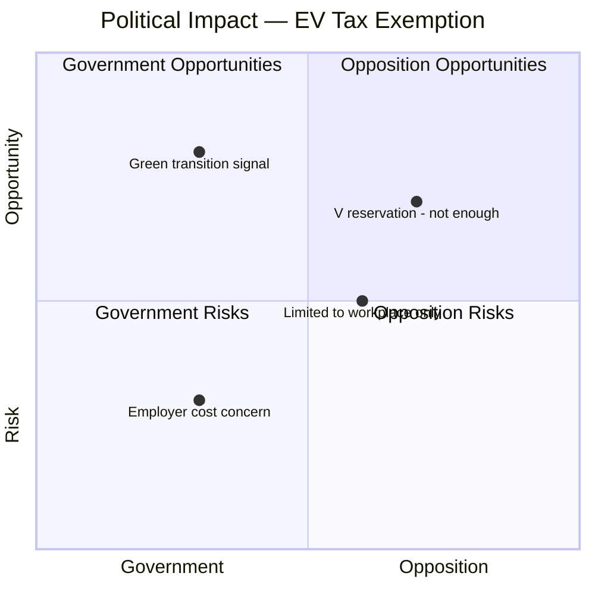

# Document Analysis: Permanent Tax-Free Workplace EV Charging and Expanded Fuel Deductions

**Generated**: 2026-04-16 10:37 UTC
**dok_id**: HD01SkU23
**Document Type**: Betänkande (Committee Report)
**Committee**: SkU (Skatteutskottet)
**Date**: 2026-04-16
**Riksmöte**: 2025/26
**Significance**: 🟡 Medium (5/10)
**Confidence**: HIGH (80%)
**Data Depth**: FULL-TEXT

---

## Executive Summary

Skatteutskottet unanimously (except V) approves making the temporary workplace EV charging tax exemption permanent while expanding fuel cost deductions for business trips with benefit cars. This dual-track fiscal measure signals the Kristersson government's commitment to green transition through tax incentives rather than mandates, while simultaneously cushioning the cost burden on employers and commuters. The single reservation from V (Vänsterpartiet) — arguing for a broader flat-rate deduction including home charging — reveals a left-green tactical opening to claim the government's measure doesn't go far enough. **[HIGH confidence]**

---

## Political Classification

| Field | Assessment |
|-------|-----------|
| **Sensitivity Level** | PUBLIC |
| **Primary Domain** | Fiscal Policy (ECO) + Climate/Energy (ENV) |
| **Urgency** | ELEVATED — legislation takes effect 1 July 2026 |
| **Significance Score** | 5/10 |
| **Confidence** | HIGH |

---

## SWOT Impact Assessment

### Government Coalition Impact

| Quadrant | Statement | Evidence | Confidence | Impact |
|----------|-----------|----------|:----------:|:------:|
| ✅ Strength | Government delivers permanent green tax incentive, demonstrating legislative follow-through on climate commitments | HD01SkU23: Prop 2025/26:80 approved by committee with broad support (S, M, SD, KD, C, L, MP participating) | H | H |
| ✅ Strength | Cross-bloc support for the measure — even S members voted in favour — prevents opposition from attacking government on green policy | HD01SkU23: Only V filed reservation; all other parties supported | H | M |
| ⚠️ Weakness | Measure limited to workplace charging — does not address home-charging costs that affect most EV owners | HD01SkU23: V motion 2025/26:3879 (Ilona Szatmári Waldau) argued for broader flat-rate including home charging | H | M |
| 🔴 Threat | V can campaign that government helps employers but not individual EV owners at home — class-based framing of green policy | HD01SkU23: V reservation specifically calls for "schablon som omfattar laddning av bil i anslutning till bostaden" | M | L |

### Opposition Impact

| Quadrant | Statement | Evidence | Confidence | Impact |
|----------|-----------|----------|:----------:|:------:|
| ✅ Strength | V establishes differentiated position on green transition — more inclusive than government's employer-focused approach | HD01SkU23: V reservation filed by Ilona Szatmári Waldau et al. | H | M |
| ⚠️ Weakness | S did not join V's reservation despite being in opposition — signals S acceptance of government's approach on this issue | HD01SkU23: S members Niklas Karlsson, Marie Olsson, Kalle Olsson, Ida Ekeroth Clausson, Mathias Tegnér all participated in decision without dissent | H | M |
| 🚀 Opportunity | MP's support despite being in opposition could be leveraged for cross-bloc climate cooperation narrative | HD01SkU23: Annika Hirvonen (MP) participated without reservation | M | L |

---

## Risk Assessment

| Risk | Likelihood | Impact | Score | Mitigation |
|------|:----------:|:------:|:-----:|------------|
| Fiscal cost underestimated as EV adoption accelerates | M | M | 4/10 | Government can adjust through future tax reforms |
| Employer compliance burden for charging infrastructure | L | L | 2/10 | Already established practice during temporary period |
| V leverages home-charging gap in 2026 election campaign | M | L | 3/10 | Government can propose separate home-charging measure |

---

## Stakeholder Analysis

| Stakeholder Group | Impact | Assessment |
|-------------------|:------:|------------|
| **Citizens** | 🟢 Positive | EV owners benefit from continued tax-free workplace charging; commuters get expanded fuel deductions |
| **Government Coalition** | 🟢 Positive | Demonstrates ability to deliver permanent legislation from temporary measures; broad support validates approach |
| **Opposition Bloc** | ⚪ Neutral | S supports; V gets differentiation opportunity; MP aligned with green objectives |
| **Business/Industry** | 🟢 Positive | Employers get permanent certainty on charging infrastructure tax treatment; reduced administrative burden |
| **Civil Society** | ⚪ Neutral | Environmental groups generally supportive but may echo V's call for broader measures |
| **International/EU** | 🟢 Positive | Aligns with EU Green Deal objectives on transport electrification |
| **Media/Public Opinion** | ⚪ Neutral | Moderate news value — permanent tax change but technically complex topic |

---

## Key Insights

1. **Cross-party consensus on green tax incentives** — only V dissented, suggesting EV policy is relatively non-controversial in Swedish politics **[HIGH confidence, dok_id: HD01SkU23]**
2. **S opposition party supports government proposal** — unusual alignment signals this is consensus policy, not partisan battleground **[HIGH confidence, dok_id: HD01SkU23]**
3. **V's isolated position** on broader EV charging deductions marks left-green differentiation strategy ahead of 2026 election **[MEDIUM confidence]**
4. **July 1, 2026 implementation** means tangible policy change within 2.5 months — actionable timeline for employers and EV owners **[HIGH confidence, dok_id: HD01SkU23]**

## Forward Indicators

- Watch for: V campaign messaging on "rättvisa i omställningen" (fairness in transition) using home-charging gap
- Watch for: Government follow-up on home-charging incentives to neutralize V's critique
- Watch for: Uptake data on workplace charging installations in H2 2026
