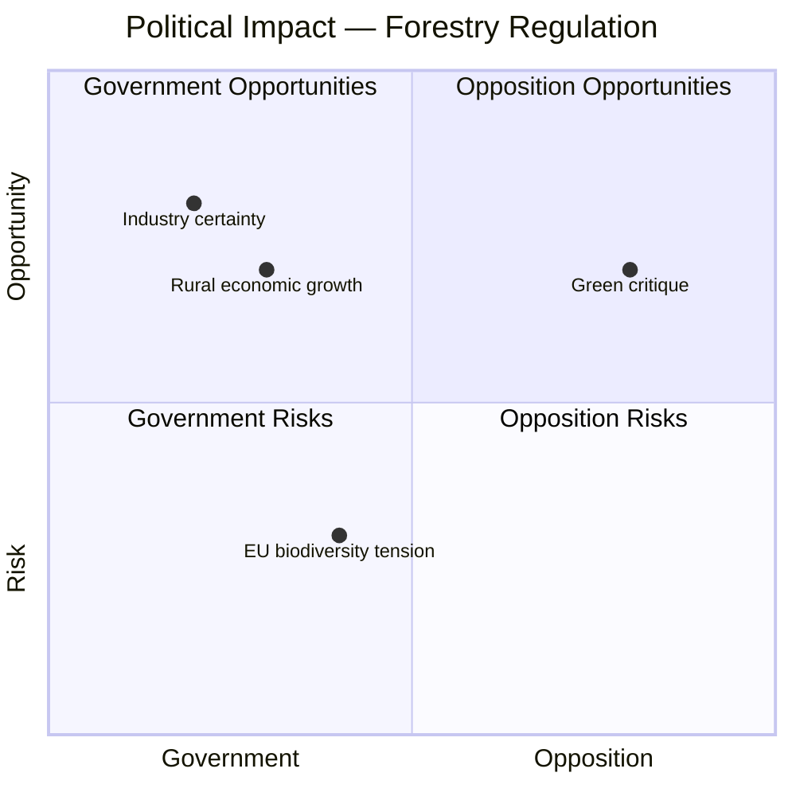

# Document Analysis: Clear Regulatory Framework for Active Forestry

**Generated**: 2026-04-16 10:37 UTC
**dok_id**: HD03242
**Document Type**: Proposition (Government Bill)
**Committee**: Referred to MJU (Miljö- och jordbruksutskottet)
**Date**: 2026-04-16
**Riksmöte**: 2025/26
**Significance**: 🟡 Medium (4/10)
**Confidence**: HIGH (75%)
**Data Depth**: FULL-TEXT

---

## Executive Summary

PM Kristersson and Rural Affairs Minister Peter Kullgren submit Prop 2025/26:242, establishing a clarified regulatory framework for active forestry in Sweden. This proposition addresses the tension between environmental protection and forest industry economic interests — a politically charged balance point where government coalition priorities (economic growth, rural development) intersect with EU biodiversity obligations. Referred to MJU, the bill enters a committee already processing waste reform (MJU19) and climate audit (MJU20), creating a concentrated environmental policy agenda for the committee. **[HIGH confidence]**

---

## Political Classification

| Field | Assessment |
|-------|-----------|
| **Sensitivity Level** | SENSITIVE — touches environment vs. industry balance |
| **Primary Domain** | Rural Policy + Environment (ENV) + EU Relations |
| **Urgency** | ELEVATED — addresses regulatory uncertainty in major industry |
| **Significance Score** | 4/10 |
| **Confidence** | HIGH |

---

## SWOT Impact Assessment

### Government Coalition Impact

| Quadrant | Statement | Evidence | Confidence | Impact |
|----------|-----------|----------|:----------:|:------:|
| ✅ Strength | Delivers regulatory certainty for Swedish forestry sector — core constituency for M, KD, C-adjacent voters | HD03242: "Ett tydligt regelverk för aktivt skogsbruk" — explicitly addresses regulatory clarity | H | H |
| ✅ Strength | Peter Kullgren (KD via Landsbygds- och infrastrukturdepartementet) advances rural policy agenda — KD coalition responsibility | HD03242: Signed by PM Kristersson and Minister Kullgren | H | M |
| ⚠️ Weakness | "Active forestry" framing may be seen as prioritizing industry over environmental protection | HD03242: Title emphasizes "aktivt skogsbruk" — active logging/management | M | M |
| 🔴 Threat | EU biodiversity regulations may conflict with Swedish forestry deregulation, creating Brussels tensions | General context: EU Deforestation Regulation, Nature Restoration Law | M | H |

### Opposition Impact

| Quadrant | Statement | Evidence | Confidence | Impact |
|----------|-----------|----------|:----------:|:------:|
| 🚀 Opportunity | MP and V can attack as prioritizing industry profits over forest biodiversity | HD03242: MJU already has V+MP joint reservations on related environmental issues | H | M |
| ⚠️ Weakness | S has historically supported active forestry — difficult to oppose without alienating northern Sweden voters | General context: S and forestry regions | M | M |

---

## Key Insights

1. **Concurrent MJU environmental agenda** — MJU19, MJU20, and HD03242 all landing in same committee simultaneously creates concentrated policy debate **[HIGH confidence, dok_id: HD03242, HD01MJU19, HD01MJU20]**
2. **KD ministerial profile** — Kullgren as signatory elevates KD's visibility on rural development policy within coalition **[HIGH confidence, dok_id: HD03242]**
3. **EU tension risk** — Swedish forestry deregulation in context of EU nature restoration and deforestation regulations may create diplomatic friction **[MEDIUM confidence]**
4. **Cross-document pattern**: Government simultaneously pushing environmental compliance (MJU19 waste reform) while potentially loosening forestry regulation (HD03242) — mixed environmental signal **[MEDIUM confidence]**

## Forward Indicators

- Watch for: MP and V critique of "active forestry" framing as anti-environmental
- Watch for: EU Commission response to Swedish forestry regulatory changes
- Watch for: LRF (agricultural lobby) and forest industry reaction
