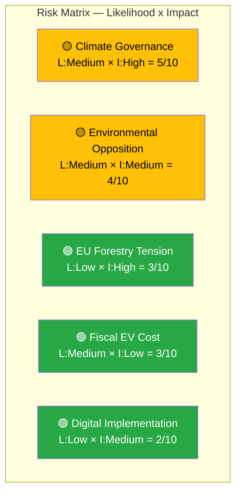

# Political Risk Assessment — 2026-04-16 (Realtime Monitor)

**Generated**: 2026-04-16 10:37 UTC
**Documents Analyzed**: 16
**Overall Risk Level**: LOW-MEDIUM
**Confidence**: HIGH

---

## Risk Matrix

| Risk ID | Risk | Likelihood | Impact | Score | Primary Document |
|---------|------|:----------:|:------:|:-----:|-----------------|
| R1 | RR climate criticism used in election campaign | Medium | High | 5/10 | HD01MJU20 |
| R2 | V+C+MP environmental alliance strengthens | Medium | Medium | 4/10 | HD01MJU19, HD01MJU20 |
| R3 | EU conflict over forestry deregulation | Low | High | 3/10 | HD03242 |
| R4 | EV tax exemption fiscal cost escalates | Medium | Low | 3/10 | HD01SkU23 |
| R5 | Municipal interoperability implementation difficulties | Low | Medium | 2/10 | HD03244 |

## Key Risk: Climate Governance (R1)

Riksrevisionen's independent audit identifying "several deficiencies" in climate policy framework data preparation provides a ready-made opposition weapon. The government's position of "agreeing with the problem but proposing different solutions" is politically vulnerable because it validates the criticism while appearing resistant to remedy. **Risk mitigation**: Government can pre-empt by directing Naturvårdsverket reforms before opposition campaign season.

## Cascading Risk: Environmental Opposition Alliance (R1 → R2)

If V+C+MP's climate alliance (MJU20) holds through waste reform debate (MJU19) and forestry regulation (Prop 242), it could crystallize into a sustained cross-opposition environmental front that complicates coalition management on all green policy areas.
