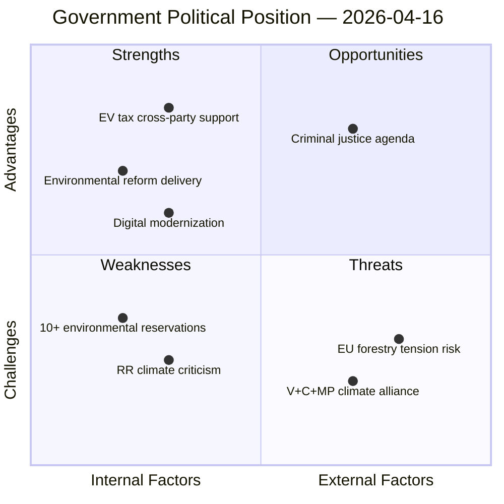

# Political SWOT Analysis — 2026-04-16 (Realtime Monitor)

**Generated**: 2026-04-16 10:37 UTC
**Documents Analyzed**: 16 (6 with full-text deep analysis)
**Confidence**: HIGH
**Analyst**: Realtime Monitor (AI-driven)

---

## Context

| Factor | Value |
|--------|-------|
| **Coalition** | M + KD + L (supported by SD) |
| **PM** | Ulf Kristersson (M) |
| **Parliament Margin** | Government bloc ~176 seats (majority with SD support) |
| **Key Events Today** | 2 propositions, 4 committee reports, PM Question Time, voting session |

---

## SWOT Quadrant Overview

---

## Strengths (Government Coalition)

| # | Statement | Evidence | Confidence |
|---|-----------|----------|:----------:|
| S1 | Broad cross-party support for EV charging tax reform — even S votes with government | HD01SkU23: Only V reserved; S members participated in committee decision without dissent | H |
| S2 | Comprehensive waste reform delivers on EU circular economy obligations | HD01MJU19: Prop 2025/26:108 amends Environmental Code + 3 laws; approved by MJU | H |
| S3 | Digital government modernization agenda progresses with interoperability requirements | HD03244: Prop 2025/26:244 mandates cross-agency data sharing standards | H |
| S4 | Criminal justice dominance — press conference on young criminals continues policy momentum | Government press conference 2026-04-16 + yesterday's indefinite punishment announcement | M |

## Weaknesses (Government Coalition)

| # | Statement | Evidence | Confidence |
|---|-----------|----------|:----------:|
| W1 | Riksrevisionen criticism of climate governance — "agrees with problems but different solutions" is weak position | HD01MJU20: Government acknowledges RR finding of "flera brister" but proposes different remedies | H |
| W2 | Opposition fragmentation masks depth of environmental policy criticism — 10+ reservations across MJU19/MJU20 | HD01MJU19: 9 reservations from S, V, C, MP; HD01MJU20: 1 reservation V+C+MP | H |
| W3 | Forestry regulation may create EU friction if perceived as deregulation | HD03242: "Aktivt skogsbruk" framing in context of EU Nature Restoration Law | M |

## Opportunities (External/Future)

| # | Statement | Evidence | Confidence |
|---|-----------|----------|:----------:|
| O1 | Criminal justice agenda resonates with voters — tougher youth crime rules announced at press conference today | Government press release: "Pressträff om skärpta regler för unga brottslingar" | M |
| O2 | Green tax incentives build business-environment alliance — employers and EV industry supported | HD01SkU23: Permanent EV tax exemption creates regulatory certainty for employers | H |
| O3 | Digital government reform can be framed as efficiency and service improvement for citizens | HD03244: Interoperability requirements address fragmented public IT systems | M |

## Threats (External/Future)

| # | Statement | Evidence | Confidence |
|---|-----------|----------|:----------:|
| T1 | V+C+MP climate alliance could crystallize into broader opposition environmental front | HD01MJU20: Joint reservation from three parties spanning left-centre-green spectrum | H |
| T2 | EU tensions over Swedish forestry policy if interpreted as weakening environmental protections | HD03242: Context of EU Deforestation Regulation and Nature Restoration Law | M |
| T3 | Riksrevisionen report provides ammunition for 2026 election climate campaign | HD01MJU20: Independent audit with specific governance failure findings | H |

---

## Strategic Assessment

The government maintains a **strong legislative position** with cross-party EV support and advancing environmental compliance reforms. The primary vulnerability is the **climate governance criticism** from Riksrevisionen, which the emerging **V+C+MP climate alliance** could exploit. The criminal justice agenda provides political cover with broad voter appeal. The forestry regulation introduces EU-level risk that requires careful diplomatic management.
