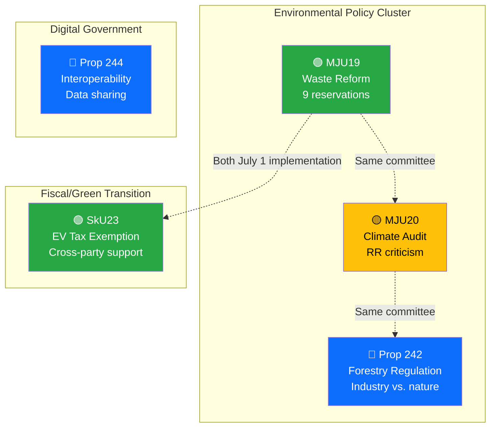

# Analysis Synthesis Summary — 2026-04-16 (Realtime Monitor 1037)

**Generated**: 2026-04-16 10:37 UTC
**Data Sources**: get_propositioner, get_betankanden, search_dokument, search_voteringar, search_anforanden, get_interpellationer, search_regering, get_dokument_innehall
**Documents Analyzed**: 16 (6 high-priority with full-text analysis)
**Confidence**: HIGH
**Analyst**: Realtime Monitor (AI-driven)

---

## Summary

Active parliamentary day: 2 new government propositions (data interoperability, forestry regulation) and 4 committee reports (waste reform, climate audit, EV tax exemption, savings agreements) published on 2026-04-16. PM Question Time at 14:00 and voting session at 15:20 scheduled. Government press conference on tougher rules for young criminals. The environmental cluster (MJU19 waste reform + MJU20 climate audit + Prop 242 forestry) reveals coordinated policy push with 10+ opposition reservations across documents, while SkU23 demonstrates rare cross-party consensus on green tax incentives.

## Key Findings

1. **Environmental policy cluster in MJU**: Three simultaneous documents — waste reform (MJU19), climate audit (MJU20), forestry regulation (Prop 242) — create concentrated environmental debate. Opposition files 10+ reservations across documents, with V+C+MP alliance on climate and V+MP on waste. **[HIGH confidence]**
2. **Cross-party EV consensus**: SkU23 permanent workplace EV charging tax exemption passes with only V dissenting — rare cross-party support including S voting with government. **[HIGH confidence]**
3. **Riksrevisionen climate governance criticism**: Government acknowledges "several deficiencies" in climate policy framework data work but proposes different solutions than RR recommends — politically vulnerable "agree but act differently" position. **[HIGH confidence]**
4. **Government digitalization push**: Prop 244 on interoperability requirements for public administration data sharing continues digital government modernization agenda. **[MEDIUM confidence]**
5. **Criminal justice press conference**: Government press conference on tougher rules for young criminals signals continued law-and-order priority, building on yesterday's indefinite punishment and benefit ban announcements. **[MEDIUM confidence]**

## Top Documents by Significance (AI-Assessed)

| Score | Type | dok_id | Title |
|-------|------|--------|-------|
| 5/10 | Betänkande | HD01SkU23 | Permanent skattefrihet för förmån av laddel på arbetsplatsen och utvidgad rätt till avdrag |
| 5/10 | Betänkande | HD01MJU19 | Reformering av avfallslagstiftningen för ökad materialåtervinning |
| 5/10 | Betänkande | HD01MJU20 | Riksrevisionens rapport om statens arbete med klimatpolitiska ramverket |
| 4/10 | Proposition | HD03244 | Nya krav på interoperabilitet vid datadelning inom den offentliga förvaltningen |
| 4/10 | Proposition | HD03242 | Ett tydligt regelverk för aktivt skogsbruk |
| 3/10 | Betänkande | HD01SkU32 | Uppsägning av sparandeavtal |

## Cross-Document Patterns

## Opposition Alliance Dynamics

| Alliance | Documents | Parties | Issue |
|----------|-----------|---------|-------|
| Green-Left | MJU19 | V + MP | Waste producer responsibility, recycling targets |
| Climate Alliance | MJU20 | V + C + MP | Climate framework governance reform |
| Centre-Green | MJU19 | C (separate) | Environmental regulation, illegal waste |
| Green Tax | SkU23 | V (alone) | Home EV charging deduction expansion |

## Overall Political Risk: **LOW-MEDIUM**
- No coalition-threatening votes or proposals
- Environmental cluster creates sustained but manageable opposition pressure
- Criminal justice agenda continues uncontested
- Digital government reform likely non-controversial

## Implications

The environmental policy cluster (MJU19+MJU20+Prop 242) will generate the most political friction over coming weeks as MJU processes all three simultaneously. The V+C+MP climate alliance (MJU20) is the most politically significant dynamic — bridging left and centre opposition on climate governance. EV tax exemption cross-party consensus demonstrates green transition policy is relatively depoliticized in Sweden.
