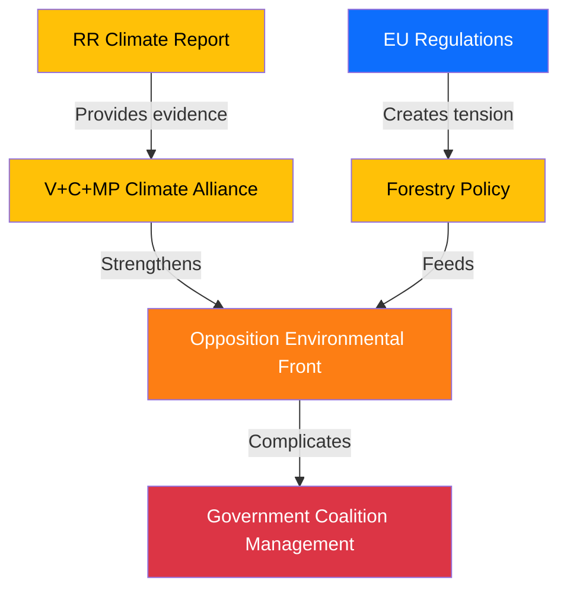

# Political Threat Analysis — 2026-04-16 (Realtime Monitor)

**Generated**: 2026-04-16 10:37 UTC
**Documents Analyzed**: 16
**Threat Level**: LOW-MEDIUM
**Confidence**: HIGH

---

## Threat Landscape

## Active Threats

| Threat | Actors | Mechanism | Severity | Confidence |
|--------|--------|-----------|:--------:|:----------:|
| Climate governance attack | V, C, MP | RR report as independent evidence in debates/campaigns | Medium | HIGH |
| Environmental coalition | V, MP, C | Joint reservations building habitual voting patterns | Medium | HIGH |
| EU regulatory friction | EU Commission | Swedish forestry regulation vs. EU environmental framework | Low | MEDIUM |
| Social Democratic positioning | S | Separate opinions allowing future pivot either direction | Low | MEDIUM |

## Assessment

No immediate threats to coalition stability. The primary medium-term threat is the V+C+MP environmental alliance crystallizing into a sustained opposition dynamic. Government maintains strong position on criminal justice and digital government.
