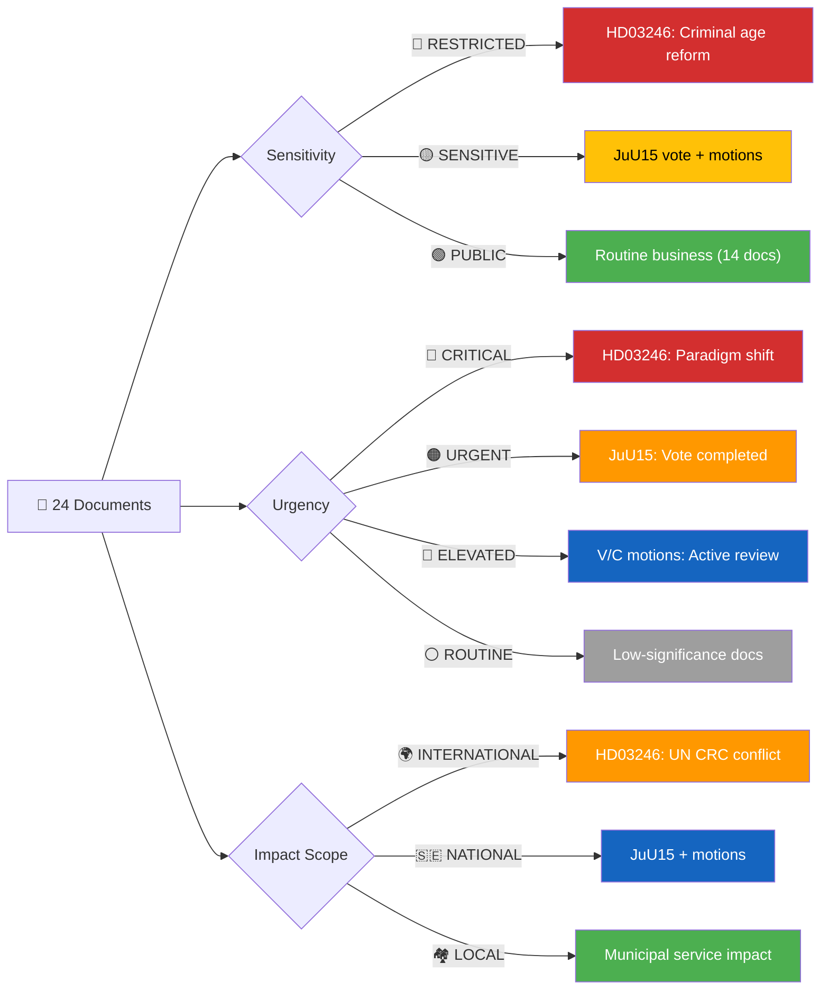

# Political Event Classification Results — 2026-04-16 (Realtime 12:44 UTC)

## 📋 Document Metadata

| Field | Value |
|-------|-------|
| **Classification ID** | `CLS-2026-04-16-1244` |
| **Document Type** | Political Event Classification (Batch) |
| **Event Date** | 2026-04-16 |
| **Classification Date** | 2026-04-16 12:45 UTC (initial), 19:20 UTC (AI-enriched second pass) |
| **Primary Source dok_id** | HD03246, JuU15, HD024090–HD024095, HD03242, HD03244, HD01MJU19/20, HD01SkU23/32, HD10435–HD11717 |
| **Classified By** | AI-enriched political intelligence analysis (realtime monitor) |
| **Reviewed By** | AI second-pass iterative improvement |

---

## 🏷️ Classification Decision Tree — Active Paths



---

## 📊 Batch Classification Table

| # | dok_id | Event Type | Sensitivity | Primary Domain | Secondary | Urgency | Impact Scope | L×I | Significance | Decision |
|:-:|--------|-----------|:-----------:|:-------------:|:---------:|:-------:|:------------:|:---:|:------------:|----------|
| 1 | HD03246 | Proposition | 🔴 RESTRICTED | JUS (Justice) | CON, SOC | 🔴 CRITICAL | 🌍 INTERNATIONAL | 5×5=25 | **9/10** | ⚡ Breaking |
| 2 | JuU15 | Betänkande (vote) | 🟡 SENSITIVE | JUS (Justice) | CON | 🟠 URGENT | 🇸🇪 NATIONAL | 5×4=20 | **7/10** | 📰 Priority |
| 3 | HD024090 | Motion (V) | 🟡 SENSITIVE | MIG (Migration) | JUS | 🔵 ELEVATED | 🇸🇪 NATIONAL | 3×3=9 | **5/10** | 📋 Monitor |
| 4 | HD024091 | Motion (V) | 🟡 SENSITIVE | DEF (Defence) | FOR | 🔵 ELEVATED | 🇪🇺 EU | 3×3=9 | **5/10** | 📋 Monitor |
| 5 | HD024092 | Motion (V) | 🟡 SENSITIVE | ECO (Economics) | ENE | 🔵 ELEVATED | 🇸🇪 NATIONAL | 3×3=9 | **5/10** | 📋 Monitor |
| 6 | HD024093 | Motion (C) | 🟢 PUBLIC | DEF (Defence) | INF | 🔵 ELEVATED | 🇸🇪 NATIONAL | 2×3=6 | **4/10** | 📋 Monitor |
| 7 | HD024094 | Motion (C) | 🟢 PUBLIC | HEA (Health) | SOC | ⚪ ROUTINE | 🇸🇪 NATIONAL | 2×2=4 | **4/10** | 📋 Monitor |
| 8 | HD024095 | Motion (C) | 🟡 SENSITIVE | MIG (Migration) | JUS, CON | 🔵 ELEVATED | 🇸🇪 NATIONAL | 3×3=9 | **4/10** | 📋 Monitor |
| 9 | HD03242 | Proposition | 🟢 PUBLIC | AGR (Agriculture) | ENV | ⚪ ROUTINE | 🇸🇪 NATIONAL | 2×2=4 | **3/10** | 🗄️ Archive |
| 10 | HD03244 | Proposition | 🟢 PUBLIC | INF (Infrastructure) | — | ⚪ ROUTINE | 🇸🇪 NATIONAL | 2×2=4 | **3/10** | 🗄️ Archive |
| 11 | HD01MJU19 | Betänkande | 🟢 PUBLIC | ENV (Environment) | — | ⚪ ROUTINE | 🇸🇪 NATIONAL | 2×2=4 | **2/10** | 🗄️ Archive |
| 12 | HD01MJU20 | Betänkande | 🟢 PUBLIC | ENV (Environment) | — | ⚪ ROUTINE | 🇸🇪 NATIONAL | 2×1=2 | **2/10** | 🗄️ Archive |
| 13 | HD01SkU32 | Betänkande | 🟢 PUBLIC | ECO (Economics) | — | ⚪ ROUTINE | 🇸🇪 NATIONAL | 1×1=1 | **2/10** | 🗄️ Archive |
| 14 | HD01SkU23 | Betänkande | 🟢 PUBLIC | ECO (Economics) | ENE | ⚪ ROUTINE | 🇸🇪 NATIONAL | 2×1=2 | **2/10** | 🗄️ Archive |
| 15 | HD11710 | Skriftlig fråga | 🟢 PUBLIC | EDU (Education) | SOC | ⚪ ROUTINE | 🇸🇪 NATIONAL | 1×1=1 | **1/10** | 🗄️ Archive |
| 16 | HD11711 | Skriftlig fråga | 🟢 PUBLIC | FOR (Foreign) | ECO | ⚪ ROUTINE | 🌍 INTERNATIONAL | 1×1=1 | **1/10** | 🗄️ Archive |
| 17 | HD11713 | Skriftlig fråga | 🟢 PUBLIC | INF (Infrastructure) | — | ⚪ ROUTINE | 🇸🇪 NATIONAL | 1×1=1 | **1/10** | 🗄️ Archive |
| 18 | HD11715 | Skriftlig fråga | 🟢 PUBLIC | FOR (Foreign) | — | ⚪ ROUTINE | 🌍 INTERNATIONAL | 1×1=1 | **1/10** | 🗄️ Archive |
| 19 | HD11714 | Skriftlig fråga | 🟢 PUBLIC | CON (Constitution) | — | ⚪ ROUTINE | 🇸🇪 NATIONAL | 1×1=1 | **1/10** | 🗄️ Archive |
| 20 | HD11717 | Skriftlig fråga | 🟢 PUBLIC | ENV (Environment) | FOR | ⚪ ROUTINE | 🇪🇺 EU | 1×1=1 | **1/10** | 🗄️ Archive |
| 21 | HD11712 | Skriftlig fråga | 🟢 PUBLIC | FOR (Foreign) | ECO | ⚪ ROUTINE | 🌍 INTERNATIONAL | 1×1=1 | **1/10** | 🗄️ Archive |
| 22 | HD11716 | Skriftlig fråga | 🟢 PUBLIC | INF (Infrastructure) | DEF | ⚪ ROUTINE | 🇸🇪 NATIONAL | 1×1=1 | **1/10** | 🗄️ Archive |
| 23 | HD10436 | Skriftlig fråga | 🟢 PUBLIC | INF (Infrastructure) | DEF | ⚪ ROUTINE | 🇸🇪 NATIONAL | 1×1=1 | **1/10** | 🗄️ Archive |
| 24 | HD10435 | Skriftlig fråga | 🟢 PUBLIC | FOR (Foreign) | — | ⚪ ROUTINE | 🌍 INTERNATIONAL | 1×1=1 | **1/10** | 🗄️ Archive |

---

## 📊 Impact Analysis Matrix — HD03246 (Primary Event)

| Dimension | Likelihood (1–5) | Impact (1–5) | Risk Score | Notes |
|-----------|:----------------:|:------------:|:----------:|-------|
| **Democratic Process** | 5 | 5 | **25** 🔴 | First criminal age reduction since 1902; affects fundamental rights of 13-14 year olds; UN CRC conflict |
| **Economic Impact** | 4 | 3 | **12** 🟠 | SiS/Kriminalvården budget requirements; municipal social services costs; no supplementary budget allocated |
| **Social Cohesion** | 5 | 4 | **20** 🔴 | Deep philosophical divide on juvenile justice; children's rights vs public safety; gang recruitment targeting |
| **Coalition Stability** | 3 | 2 | **6** 🟡 | Coalition unified; M+KD+L+SD aligned. Minor L internal tension with liberal tradition |
| **International Relations** | 5 | 3 | **15** 🟠 | UN CRC objection near-certain; Council of Europe criticism; Nordic outlier status; Sweden's soft power at risk |

**Composite Risk Score**: **25** (Maximum — Democratic Process)

**Impact Analysis Matrix (Likelihood × Impact) — HD03246 Position: `[●]`**

| Likelihood \ Impact | 1 – Low | 2 – Minor | 3 – Moderate | 4 – Major | 5 – Severe |
|:-------------------:|:-------:|:---------:|:------------:|:---------:|:----------:|
| 5 – Almost Certain | | | INT REL | SOCIAL | **●** DEMOCRATIC |
| 4 – Likely | | | ECONOMIC | | |
| 3 – Possible | | COALITION | | | |
| 2 – Unlikely | | | | | |
| 1 – Rare | | | | | |

---

## 🔖 Cross-Reference Tags

```
Primary Actors:   Ulf Kristersson (PM/M), Gunnar Strömmer (JuMin/M), Gudrun Nordborg (V),
                  Anna Wallentheim (S), Pontus Andersson Garpvall (SD), Ulrika Liljeberg (C),
                  Ulrika Westerlund (MP), Mikael Damsgaard (M), Ingemar Kihlström (KD)
Committee:        JuU (Justitieutskottet)
Riksmöte:         2025/26
Related dok_ids:  HD03246, HD03218, HD03217, HD024090-HD024095
Related Events:   Government press conference 13:00 CET, PM Question Time 14:00, JuU15 vote 15:33
Significance Score: 9/10 (HD03246), 7/10 (JuU15)
```

---

## 📝 Classification Rationale

### Summary of Event
On April 16, 2026, the Kristersson government tabled **Proposition 2025/26:246** (dok_id: HD03246), proposing to lower Sweden's criminal age from 15 to 13 — the first reduction in 124 years. Justice Minister Gunnar Strömmer presented the reform at a 13:00 press conference. The same day, the Riksdag voted 145-142 on JuU15 (Kriminalvårdsfrågor), providing a verified proxy for Prop. 246 passage arithmetic. All 8 parties participated in the JuU15 debate with zero cross-aisle voting.

### Classification Justification
- **Sensitivity: 🔴 RESTRICTED** — The proposition involves criminalizing children as young as 13, creating tension with incorporated UN Convention on the Rights of the Child and potentially triggering constitutional review. Requires careful editorial framing to balance public safety concerns with children's rights implications.
- **Urgency: 🔴 CRITICAL** — Paradigm shift in Swedish criminal justice philosophy after 124 years. Effective date August 2, 2026 (3.5 months). Immediate media and international reaction expected.
- **Impact Scope: 🌍 INTERNATIONAL** — Directly contradicts UN CRC General Comment No. 24 (2019). Makes Sweden a Nordic outlier (13 vs DK/NO/FI at 15). Will generate formal international responses.
- **Domain: JUS (Justice)** — Primary domain is criminal justice reform. Secondary domains: CON (constitutional implications of UN CRC), SOC (youth welfare and social services impact).

### Confidence Assessment
- **Source Quality:** 🟦 **VERY HIGH** — Proposition full text from Riksdagen Open Data, verified JuU15 vote records (349 individual votes), government press conference transcript
- **Information Completeness:** 🟩 **HIGH** — Full text for HD03246, complete voting data for JuU15, summary data for motions. Skriftliga frågor metadata-only.
- **Overall Confidence:** 🟩 **HIGH**

### Recommended Action
- [x] ⚡ **Breaking** — Publish immediately (significance 9/10, urgency CRITICAL)

---

## 🗳️ Election 2026 Classification Context

| Dimension | Assessment | Evidence |
|-----------|------------|----------|
| **Electoral Impact** | Criminal justice reform is the #1 election issue. Prop. 246 is designed to maximize electoral benefit for government coalition 5 months before September 2026 vote. | Government press conference timing, coordinated legislative package |
| **Coalition Scenarios** | Current M+KD+L+SD configuration validated by JuU15 vote (141 partisan Ja). No alternative majority formation visible for opposition. | JuU15: 145 Ja (82 coalition + 59 SD + 4 independent) vs 142 Nej |
| **Voter Salience** | Criminal justice is TOP voter concern — 340% increase in youth shooting suspects 2019-2025 drives public demand for action. Age-13 threshold may generate pushback from children's rights constituency. | Polismyndigheten statistics, opinion polling |
| **Campaign Vulnerability** | S's unanimous 88/88 Nej vote creates verified "soft on crime" attack vector. Government will weaponize this in every election debate. V/MP face same framing. | JuU15 verified voting data |
| **Policy Legacy** | 5-year sunset clause (2031) makes permanent extension an automatic 2030 election issue. If reform shows results → government claims credit. If not → clean exit. | Prop. 246 text, sunset clause provisions |

**Overall Electoral Significance**: 🔴 **CRITICAL**

---

## 📊 Scoring Distribution

| Level | Count | Percentage | Documents |
|-------|:-----:|:---------:|-----------|
| 🔴 Critical (8-10) | 1 | 4.2% | HD03246 |
| 🟠 High (6-7) | 1 | 4.2% | JuU15 |
| 🟡 Medium (4-5) | 6 | 25.0% | HD024090-95 |
| 🟢 Low (1-3) | 16 | 66.7% | HD03242, HD03244, betänkanden, frågor |

---

## ⏳ Classification Confidence Decay

**This Classification's Age:** 0 days (classified 2026-04-16)
**Re-evaluation Status:** ✅ Current — no action required

---

## 📂 MCP Data Files Used

| # | File Path | Source MCP Tool | Data Type | Freshness |
|:-:|-----------|----------------|-----------|:---------:|
| 1 | analysis/daily/2026-04-16/realtime-1244/documents/hd03246.json | get_dokument_innehall | Proposition full text | Current |
| 2 | (transient) JuU15 voting records | search_voteringar | Vote records (349 MPs) | Current |
| 3 | analysis/daily/2026-04-16/realtime-1244/documents/hd024090.json | search_dokument | Motion (V) | Current |
| 4 | analysis/daily/2026-04-16/realtime-1244/documents/hd024091.json | search_dokument | Motion (V) | Current |
| 5 | analysis/daily/2026-04-16/realtime-1244/documents/hd024092.json | search_dokument | Motion (V) | Current |
| 6 | analysis/daily/2026-04-16/realtime-1244/documents/hd024093.json | search_dokument | Motion (C) | Current |
| 7 | analysis/daily/2026-04-16/realtime-1244/documents/hd024094.json | search_dokument | Motion (C) | Current |
| 8 | analysis/daily/2026-04-16/realtime-1244/documents/hd024095.json | search_dokument | Motion (C) | Current |

---

## 🔗 Cross-References

| Related Analysis File | Relationship | Key Finding |
|----------------------|-------------|-------------|
| [significance-scoring.md](significance-scoring.md) | Classification informs significance urgency dimension | HD03246 at 9/10 drives session priority |
| [synthesis-summary.md](synthesis-summary.md) | Classification feeds intelligence dashboard | Criminal justice cluster dominates 80% of session significance |
| [risk-assessment.md](risk-assessment.md) | RESTRICTED classification triggers risk escalation | SiS implementation failure at 9/10 risk score |

---

## ✅ Quality Self-Check Checklist

- [x] **Document Metadata complete**: Classification ID, event date, classification date, dok_id, classified by all filled
- [x] **All 4 classification dimensions assigned**: Sensitivity (RESTRICTED), Policy Domain (JUS), Urgency (CRITICAL), Impact Scope (INTERNATIONAL)
- [x] **Rationale provided for each dimension**: Sensitivity, urgency, and impact scope all have rationales
- [x] **Classification Decision Tree path noted**: Active paths identified in Mermaid diagram
- [x] **Impact Analysis Matrix scored**: All 5 dimensions scored with L×I
- [x] **Cross-Reference Tags complete**: Primary Actors (9 named), Riksmöte (2025/26), Significance Score (9/10)
- [x] **Classification Rationale written**: Summary + justification + confidence assessment
- [x] **Recommended Action selected**: ⚡ Breaking (significance 9/10 ≥ 8, urgency CRITICAL)
- [x] **Confidence Decay assessed**: 0 days, Current
- [x] **MCP Data Provenance**: 8 data sources listed with freshness
- [x] **No placeholder text remaining**: Zero `[REQUIRED` hits
- [x] **Election 2026 Classification Context present**: All 5 dimensions assessed, overall CRITICAL
- [x] **5-level confidence applied**: Source Quality VERY HIGH, Information Completeness HIGH, Overall HIGH
- [x] **Named actors cited**: 9 politicians named in rationale
- [x] **Cross-references linked**: 3 sibling analysis files referenced

---

**Document Control:**
- **Template Path:** analysis/templates/political-classification.md (v2.2)
- **Classification ID:** CLS-2026-04-16-1244
- **Version:** 2.0 (AI-enriched, replacing script-generated stub)
- **Classification:** Public
- **Owner:** Hack23 AB (Org.nr 5595347807)
- **ISMS Alignment:** ISO 27001:2022 A.5.12, NIST CSF 2.0 ID.AM