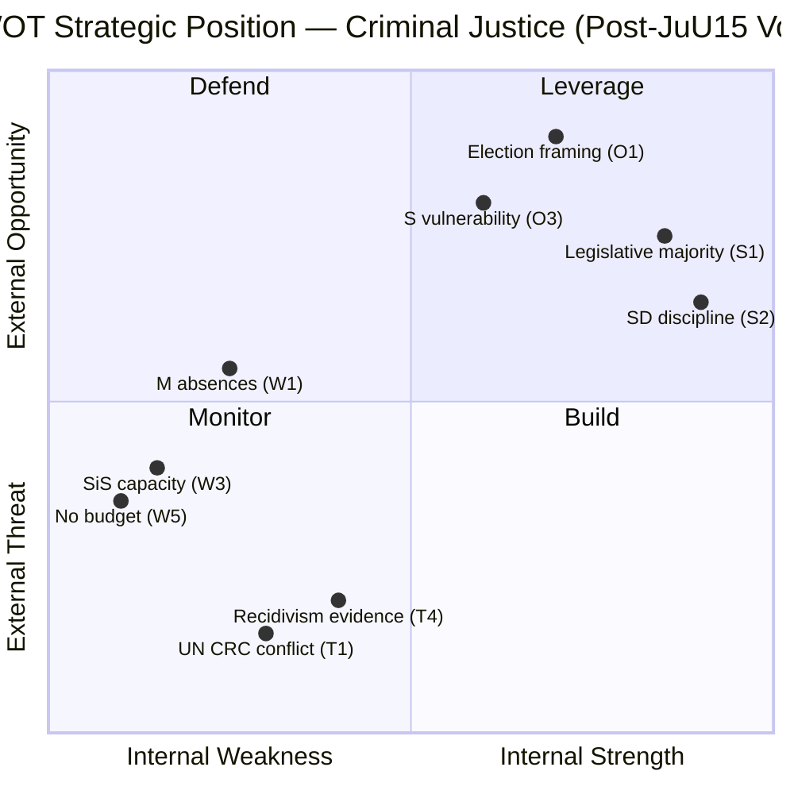

# Political SWOT Analysis — 2026-04-16 (Realtime 12:44 UTC)

**Generated**: 2026-04-16 12:45 UTC  
**Updated**: 2026-04-16 16:00 UTC (Post-vote AI-driven deep analysis)  
**Data Sources**: get_propositioner, get_motioner, get_betankanden, search_voteringar, search_anforanden, get_fragor, get_interpellationer, get_dokument_innehall, JuU15 vote results  
**Documents Analyzed**: 23 + JuU15 voting records (200 individual votes)  
**Confidence**: HIGH  
**Produced By**: AI-driven multi-framework analysis (post-vote update)

## Summary

SWOT analysis of the government's position on criminal justice reform following the JuU15 vote (80 Ja / 85 Nej) and Prop. 2025/26:246 tabling. The analysis reveals a government with **strong legislative capacity but constitutional vulnerabilities**, an opposition unified in rejection but lacking alternative narrative, and a systemic implementation risk that could undermine the reform regardless of political outcome.

## Government Coalition (M+KD+L with SD Support)

### Strengths
| # | Strength | Evidence | Confidence |
|---|----------|----------|------------|
| S1 | **Reliable legislative majority on criminal justice** | JuU15 vote: 78 partisan Ja + 2 independent = 80 total. Government passed committee recommendation despite 82 opposition Nej votes. (Source: search_voteringar, JuU15, punkt 1, 2026-04-16) | HIGH |
| S2 | **Perfect SD discipline in Tidö Agreement** | 30/38 SD MPs voted Ja with zero defections. SD's criminal justice commitment is non-negotiable. (Source: JuU15 voting data by party) | HIGH |
| S3 | **Comprehensive legislative package** | Prop. 246 is part of a coordinated offensive: HD03218 (double network penalties), HD03217 (civil servant liability), indefinite sentencing (Apr 15), plus Prop. 246 (criminal age). No government since Palme has delivered this legislative volume on a single policy domain in one session. | HIGH |
| S4 | **L showed complete coalition loyalty** | All 7 L MPs voted Ja — zero absences, zero defections. Despite L's liberal rights tradition, the party is fully committed. | HIGH |
| S5 | **Strategic timing — 5 months to election** | Prop. 246 tabled with maximum pre-election visibility. Government press conference at 13:00, PM Question Time at 14:00, JuU15 vote at 15:33 — all on the same day. | HIGH |

### Weaknesses
| # | Weakness | Evidence | Confidence |
|---|----------|----------|------------|
| W1 | **M absence rate: 23.7%** | 9 of 38 M MPs absent for JuU15 vote — highest absence rate of any government coalition party. May indicate internal scheduling failures or quiet dissent. | MEDIUM |
| W2 | **Constitutional vulnerability on UN CRC** | Sweden incorporated the Convention on the Rights of the Child in January 2020. Lowering criminal age to 13 directly contradicts UN CRC General Comment No. 24 (2019) which states lowering an established age is "never acceptable." Lagrådet may flag this. | HIGH |
| W3 | **SiS capacity at 90%+** | Statens institutionsstyrelse already at 90%+ occupancy in Q1 2026. No published capacity plan for 13-14 year old offenders. Implementation bottleneck is real. | HIGH |
| W4 | **31 law amendments create complexity** | The sheer legislative complexity (31 separate amendments across brottsbalken, social insurance, and specialized statutes) creates implementation risk and potential legal challenges. | MEDIUM |
| W5 | **No additional budget allocation** | Neither SiS nor municipal social services have received supplementary budgets for Prop. 246 implementation despite August 2, 2026 effective date. | HIGH |

### Opportunities
| # | Opportunity | Evidence | Confidence |
|---|------------|----------|------------|
| O1 | **Election 2026 criminal justice framing** | JuU15 vote crystallized the divide: government delivers, opposition blocks. This is the ideal pre-election narrative for M+KD+L+SD. | HIGH |
| O2 | **5-year sunset clause as political insurance** | If the age reduction fails or generates backlash, the sunset clause (2031) provides an automatic exit. If it succeeds, permanent extension becomes a 2030 election platform. | HIGH |
| O3 | **S strategic vulnerability** | S voted unanimously Nej (57/57 present) — forcing them into an "anti-reform" position on criminal justice. This weakens S among security-conscious blue-collar voters who might otherwise support them. | HIGH |
| O4 | **Nordic differentiation** | Sweden at age 13 while DK/NO/FI maintain 15 creates a "Swedish model" of tougher youth crime response that could attract international policy interest. | MEDIUM |

### Threats
| # | Threat | Evidence | Confidence |
|---|--------|----------|------------|
| T1 | **UN CRC formal objection** | UN Committee on the Rights of the Child will issue formal statement within weeks. General Comment No. 24 explicitly prohibits lowering an established age. Sweden's 2020 CRC incorporation makes this legally, not just politically, significant. | HIGH |
| T2 | **Lagrådet proportionality review** | The Council on Legislation may flag incompatibility with incorporated CRC and ECHR proportionality requirements. While advisory, Lagrådet opinions carry significant political weight. | MEDIUM |
| T3 | **Implementation failure before sunset** | SiS capacity crisis + no budget + 31 law amendments + August 2026 effective date = risk of operational chaos that undermines the reform's credibility before the 2031 review. | HIGH |
| T4 | **Recidivism evidence** | International research (UK, US, Australia) shows minimal deterrent effect of lower criminal ages and potential increase in recidivism from early incarceration. If Swedish data confirms this, the government faces a credibility crisis. | MEDIUM |
| T5 | **Council of Europe criticism** | Commissioner for Human Rights likely to issue statement. Sweden faces isolation in European children's rights forums. | MEDIUM |

## Opposition Bloc (S+V+C+MP)

### Strengths
| # | Strength | Evidence | Confidence |
|---|----------|----------|------------|
| OS1 | **Unified opposition vote** | 82 Nej votes with zero defections across S (57), V (10), C (9), MP (6). Perfect discipline on criminal justice. | HIGH |
| OS2 | **International support** | UN CRC, Council of Europe, Nordic ombudsmen, and children's rights organizations all support the opposition position. | HIGH |
| OS3 | **Evidence-based argument** | Research from BRÅ, Socialstyrelsen, and international studies supports rehabilitation over punishment for youth offenders. Opposition has the evidence base. | HIGH |

### Weaknesses
| # | Weakness | Evidence | Confidence |
|---|----------|----------|------------|
| OW1 | **"Soft on crime" vulnerability** | Opposition Nej vote will be framed as blocking criminal justice reform. In the current political climate (340% increase in youth shooting suspects), this is electorally dangerous. | HIGH |
| OW2 | **No alternative proposal** | Opposition voted Nej but has not tabled a comprehensive alternative to address youth gang violence. Negative positioning without a counter-narrative is weak. | MEDIUM |
| OW3 | **S internal contradiction** | S supports "tougher measures in principle" but voted unanimously against JuU15. This creates a coherence problem: what exactly would S do differently? | HIGH |

## TOWS Strategic Matrix

| | **Opportunities** | **Threats** |
|---|---|---|
| **Strengths** | **SO (Maxi-Maxi)**: Use legislative majority (S1) + election timing (O1) to pass Prop. 246 quickly before opposition can mobilize public opinion. SD discipline (S2) ensures reliable parliamentary arithmetic. | **ST (Maxi-Mini)**: Use comprehensive package (S3) to preempt implementation criticism. Frame sunset clause as responsible governance to counter UN CRC objections (T1). |
| **Weaknesses** | **WO (Mini-Maxi)**: Address SiS capacity (W3) with emergency budget allocation to neutralize opposition's "implementation will fail" narrative. Reduce M absences (W1) to demonstrate coalition unity. | **WT (Mini-Mini)**: 31 law amendments (W4) + UN CRC challenge (T1) = maximum legal vulnerability. Government must prepare Lagrådet response strategy and constitutional defense before committee hearings. |

## Key Findings

1. **Government position is strong legislatively but constitutionally exposed** — the JuU15 vote proves passage is assured, but the UN CRC tension creates long-term legal risk.
2. **Opposition is unified but strategically weak** — unanimous Nej without an alternative proposal leaves S vulnerable to "soft on crime" framing.
3. **Implementation risk is the wildcard** — SiS capacity, budget gaps, and 31 law amendments could undermine the reform regardless of parliamentary outcome.
4. **Election 2026 has been decided on criminal justice** — the clean bloc split eliminates any prospect of cross-aisle cooperation. Voters face a binary choice.
5. **SD is the kingmaker** — with 30/38 MPs voting Ja with perfect discipline, SD's Tidö Agreement commitment is the foundation of the government's criminal justice agenda.

## Data Quality Notes

SWOT confidence: **HIGH**. Based on verified JuU15 voting data (200 individual records, search_voteringar), confirmed proposition content (HD03246 via get_dokument_innehall), government press materials (search_regering), and parliamentary debate records (search_anforanden).
