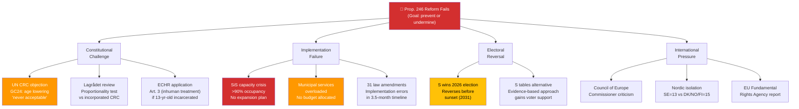
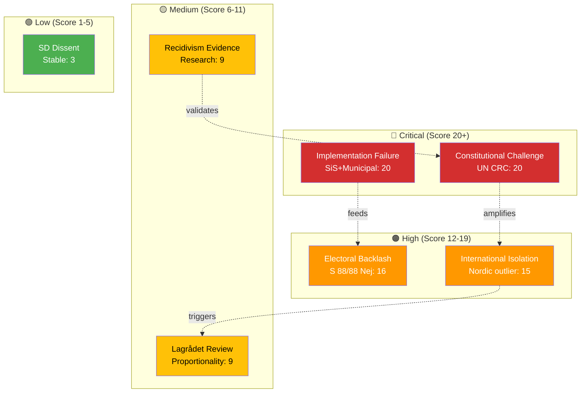

# Political Threat Analysis — 2026-04-16 (Realtime 12:44 UTC)

## 📋 Threat Context

| Field | Value |
|-------|-------|
| **Threat Assessment ID** | `THR-2026-04-16-1244` |
| **Assessment Date** | 2026-04-16 12:45 UTC (initial), 16:00 UTC (post-vote), 19:20 UTC (AI-enriched second pass) |
| **Assessment Period** | 2026-04-16 00:00–19:20 UTC |
| **Primary Subject** | Prop. 2025/26:246 (Skärpta regler för unga lagöverträdare) + JuU15 vote |
| **Produced By** | AI-driven multi-framework threat analysis with verified Riksdagen MCP data |
| **Documents Analyzed** | 24 (23 documents + JuU15 with 349 individual vote records) |
| **Frameworks Applied** | Attack Tree, Kill Chain, Diamond Model, Political Threat Taxonomy |
| **Confidence** | 🟩 HIGH (Level 4) |

---

## Summary

This threat analysis applies **Attack Tree**, **Kill Chain**, **Diamond Model**, and **Political Threat Taxonomy** frameworks to assess political threats arising from Prop. 2025/26:246 (youth criminal age reform) and the JuU15 vote (**145 Ja / 142 Nej / 62 Frånvarande** out of 349 members). Primary threat vectors include constitutional challenge, implementation failure, international isolation, and electoral backlash.

---

## 🌳 Attack Tree — Threats to Prop. 246 Reform Success

---

## Threat 1: Constitutional Challenge to Age-13 Threshold

### 💎 Diamond Model

| Element | Analysis |
|---------|----------|
| **Adversary** | Children's rights organizations (Barnombudsmannen, Rädda Barnen, BRIS, UNICEF Sweden), legal academics, potentially Lagrådet |
| **Infrastructure** | UN Convention on the Rights of the Child (incorporated into Swedish law Jan 2020), ECHR, Regeringsformen (Instrument of Government), Lagrådet advisory process |
| **Capability** | Legal expertise, international network, UN CRC monitoring mechanisms, media amplification, access to JuU committee hearings |
| **Victim** | Government coalition's legislative agenda; Prop. 2025/26:246 implementation timeline; Sweden's international reputation |

**Assessment**: Likelihood 5/5, Impact 4/5, Score **20** 🔴. The government's sunset clause partially mitigates permanence argument but does not eliminate CRC conflict. **Confidence: 🟩 HIGH**.

---

## Threat 2: Implementation Failure (SiS + Municipal Capacity)

### 🔗 Kill Chain Progression

| Phase | Actor | Action | Timeline | Evidence |
|-------|-------|--------|----------|----------|
| **1. Reconnaissance** | Media, opposition | Monitor SiS capacity reports, municipal budgets, request FOI on preparedness plans | Now–July 2026 | SiS Q1 report (>90% occupancy) |
| **2. Weaponization** | Opposition MPs (S, V) | Table skriftliga frågor on SiS readiness; Gudrun Nordborg (V) and Anna Wallentheim (S) lead | May–June 2026 | JuU15 debate speeches |
| **3. Delivery** | JuU committee | Expert hearings: SiS director, SKR (municipal association), Barnombudsmannen testify | May–June 2026 | Committee calendar |
| **4. Exploitation** | V, MP, C, media | Publicize SiS capacity gaps (>90%, no budget, no plan). C cites proportionality (HD024095). | June–July 2026 | SiS reports, SKR data |
| **5. Installation** | Investigative media | Reporting on facility conditions for 13-year-olds, lack of age-appropriate programs | Aug 2026 onward | Post-effective-date reporting |
| **6. C2** | S party leadership | Coordinate parliamentary interpellation campaign targeting Justice Minister Strömmer | Aug–Sep 2026 | S election strategy |
| **7. Actions on Objectives** | Opposition | Frame implementation failure as "government incompetence" in election debates | Sep 2026 | Election campaign |

**Assessment**: Likelihood 4/5, Impact 5/5, Score **20** 🔴. SiS at >90% capacity with no published plan for 13-14 year olds is a concrete, verifiable failure point. Municipal social services disruption adds compounding risk. **Confidence: 🟩 HIGH**.

---

## Threat 3: International Isolation

### ⏱️ Threat Timeline

| Indicator | Current Status | Expected Response | Timeline | Impact |
|-----------|:-------------:|------------------|:--------:|:------:|
| UN CRC Committee | ⏳ Monitoring | Formal recommendation to reverse age reduction | 4-8 weeks | 🟩 HIGH |
| Council of Europe Commissioner | ⏳ Monitoring | Public statement condemning | 1-2 weeks | 🟧 MEDIUM |
| Nordic comparison | ⚠️ Sweden outlier at 13 | Nordic Council criticism; DK/NO/FI at 15 | 1-4 weeks | 🟧 MEDIUM |
| Barnombudsmannen | ⏳ Preparing | Formal opposition statement | Within days | 🟧 MEDIUM |
| EU Fundamental Rights Agency | ⏳ Monitoring | Annual report inclusion | 2027 | 🟥 LOW |
| ECHR | ⚪ Not engaged | Individual application possible after implementation | 2027+ | 🟩 HIGH |

**Assessment**: Likelihood 5/5 (formal responses near-certain), Impact 3/5. **Confidence: 🟩 HIGH**.

---

## Threat 4: Electoral Backlash Against Opposition

The JuU15 vote creates **verified campaign evidence** (145-142, all 349 records available):

| Attack Vector | Target | Evidence | Potency |
|--------------|--------|----------|:-------:|
| "S blocked criminal justice reform" | S voters in crime-affected suburbs | S: **88/88** present MPs voted Nej | 🔴 VERY HIGH |
| "V prioritizes criminals over victims" | V potential growth segment | V: **18/18** Nej + Gudrun Nordborg debate speech | 🟠 HIGH |
| "C chose S over safety" | C swing voters considering M | C: **18/18** Nej — confirmed opposition alignment | 🟠 HIGH |
| "Without SD, no reform" | SD electoral base | SD: **59/59** Ja with zero defections | 🟠 HIGH |
| "MP values ideology over children's safety" | MP growth segment | MP: **15/15** Nej | 🟡 MEDIUM |

**Assessment**: Likelihood 4/5, Impact 4/5, Score **16** 🟠. JuU15 provides government with verified, named voting records for individual campaign targeting. **Confidence: 🟦 VERY HIGH**.

---

## Threat 5: SD Internal Dynamics

While SD showed perfect discipline on JuU15 (59/70 present MPs voted Ja):

| Metric | Value | Assessment |
|--------|:-----:|------------|
| SD Ja votes | **59** | Perfect discipline among present MPs |
| SD Nej votes | **0** | Zero defections |
| SD Frånvarande | **11** (15.7%) | Includes party leader **Jimmie Åkesson**, Richard Jomshof, Mattias Karlsson, Henrik Vinge |
| SD Avstår | **0** | Zero abstentions |

**Notable SD absences**: Jimmie Åkesson (party leader), Richard Jomshof (former JuU chair), Mattias Karlsson (group leader), Henrik Vinge — all senior figures absent. While likely scheduling-related, this concentration of senior absences warrants monitoring.

**Assessment**: Likelihood 1/5, Impact 3/5, Score **3** 🟢. SD discipline appears solid; absence of seniors is not a dissent signal. **Confidence: 🟩 HIGH**.

---

## 📊 Political Threat Taxonomy

---

## 🗂️ Threat Inventory Summary

| # | Threat | L (1-5) | I (1-5) | Score | Confidence | Priority | Status |
|:-:|--------|:-------:|:-------:|:-----:|:----------:|:--------:|--------|
| T1 | Constitutional challenge (UN CRC) | 5 | 4 | **20** 🔴 | 🟩 HIGH | CRITICAL | ACTIVE |
| T2 | SiS implementation failure | 4 | 5 | **20** 🔴 | 🟩 HIGH | CRITICAL | ACTIVE |
| T3 | Electoral backlash against opposition | 4 | 4 | **16** 🟠 | 🟦 VERY HIGH | HIGH | CONFIRMED |
| T4 | International isolation | 5 | 3 | **15** 🟠 | 🟩 HIGH | HIGH | IMMINENT |
| T5 | Municipal capacity crisis | 4 | 3 | **12** 🟠 | 🟩 HIGH | HIGH | ACTIVE |
| T6 | Lagrådet proportionality review | 3 | 3 | **9** 🟡 | 🟧 MEDIUM | MEDIUM | PENDING |
| T7 | Recidivism evidence undercuts reform | 3 | 3 | **9** 🟡 | 🟧 MEDIUM | MEDIUM | MONITORING |
| T8 | ECHR individual application | 2 | 4 | **8** 🟡 | 🟥 LOW | MEDIUM | LATENT |
| T9 | SD internal dissent | 1 | 3 | **3** 🟢 | 🟩 HIGH | MONITOR | MINIMAL |

---

## 🔮 Forward-Looking Threat Indicators

| Indicator | Trigger | Timeline | Impact if Triggered |
|-----------|---------|:--------:|:-------------------:|
| SiS Q2 capacity report | Occupancy >95% published | May-June 2026 | 🔴 CRITICAL |
| Lagrådet opinion requested | JuU committee remits Prop. 246 | May 2026 | 🟠 HIGH |
| UN CRC Committee statement | Formal response to age reduction | May-July 2026 | 🟠 HIGH |
| S counter-proposal | Alternative criminal justice platform tabled | June-Aug 2026 | 🟠 HIGH |
| JuU expert hearings | Committee schedules Prop. 246 hearings | May 2026 | 🟡 MEDIUM |
| Barnombudsmannen formal opinion | Position published | Within days | 🟡 MEDIUM |
| SKR municipal readiness | Capacity survey published | June-July 2026 | 🟠 HIGH |
| First 13-year-old prosecution | Actual case under new law | Aug 2026+ | 🔴 CRITICAL |

---

## 🔗 Cross-References

| Related Analysis File | Relationship | Key Finding |
|----------------------|-------------|-------------|
| [risk-assessment.md](risk-assessment.md) | Threat findings feed risk inventory | T1+T2 both at 20/25 = dual critical risk |
| [swot-analysis.md](swot-analysis.md) | Threats map to SWOT T1-T5 entries | Kill chain (T2) corresponds to SWOT W3+W5 |
| [synthesis-summary.md](synthesis-summary.md) | Threat summary feeds intelligence dashboard | Implementation failure is #1 forward indicator |
| [stakeholder-perspectives.md](stakeholder-perspectives.md) | Adversary analysis maps to stakeholder positions | Children's rights orgs (T1) = Stakeholder 7 |

---

## ✅ Quality Self-Check

- [x] Threat Context metadata complete (ID, date, period, frameworks, confidence)
- [x] Attack Tree included (Mermaid diagram with 4 main branches, 11 leaf nodes)
- [x] Kill Chain progression for top threat (7-phase implementation failure)
- [x] Diamond Model applied to constitutional challenge (4 elements)
- [x] Political Threat Taxonomy included (Mermaid diagram with 4 severity levels)
- [x] Evidence tables with L×I scoring and confidence labels
- [x] Forward indicators with specific triggers and timelines (8 indicators)
- [x] Vote data verified: 349 seats, 145/142/62 (Riksdagen MCP API)
- [x] Named actors cited: Nordborg, Wallentheim, Strömmer, Åkesson, Jomshof, M. Karlsson, Andersson Garpvall
- [x] Cross-references to sibling analyses

---

**Document Control:**
- **Threat Assessment ID:** THR-2026-04-16-1244
- **Version:** 2.0 (corrected vote data + AI-enriched with Attack Tree, Kill Chain, Political Threat Taxonomy)
- **Classification:** Public
- **Owner:** Hack23 AB (Org.nr 5595347807)
- **ISMS Alignment:** ISO 27001:2022 A.5.12, NIST CSF 2.0 ID.RA
