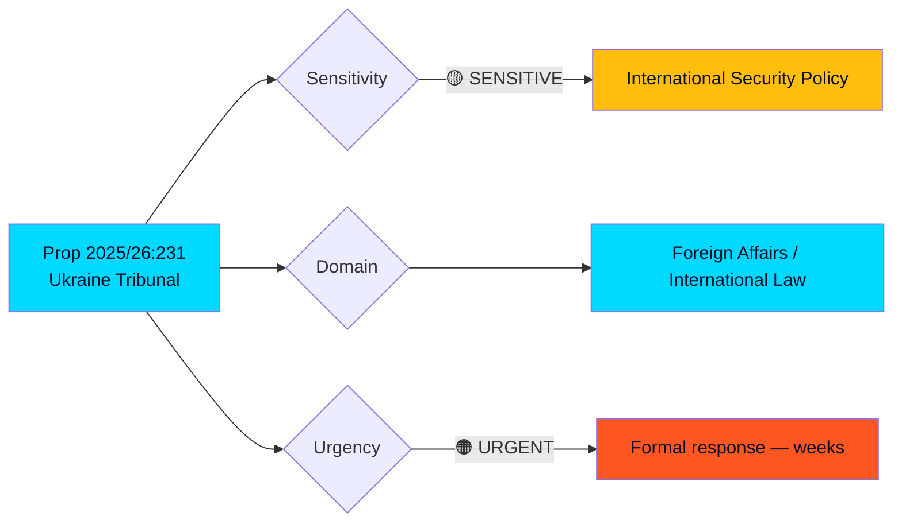

# 🔍 Per-File Political Intelligence Analysis: HD03231

## 📋 Document Identity

| Field | Value |
|-------|-------|
| **Document ID** | HD03231 |
| **Document Type** | proposition |
| **Title** | Sveriges anslutning till den utvidgade partiella överenskommelsen för den särskilda tribunalen för aggressionsbrottet mot Ukraina |
| **Date** | 2026-04-16 |
| **Riksmöte** | 2025/26 |
| **Source MCP Tool** | get_propositioner |
| **Analysis Timestamp** | 2026-04-16 14:42 UTC |
| **Analyst** | news-realtime-monitor |
| **Data Depth** | FULL-TEXT |

## 🎯 Executive Summary

Sweden takes a landmark step in international accountability by proposing Riksdag approval for joining the Special Tribunal for the Crime of Aggression against Ukraine — established via the Council of Europe in June 2024. Foreign Minister Maria Malmer Stenergard (M) and PM Ulf Kristersson (M) present this as core to Sweden's post-NATO accession foreign policy alignment. The proposition carries annual financial obligations through Council of Europe membership fees and demonstrates Sweden's commitment to the rules-based international order. This positions Sweden as a new NATO member actively contributing to holding Russia accountable — strengthening credibility within the Western alliance. **[HIGH confidence]**

## 📊 Political Classification

## 🔬 SWOT Analysis

### Strengths
| Evidence | Impact | Confidence |
|----------|--------|------------|
| Sweden joins 40+ Council of Europe members supporting tribunal (dok_id: HD03231) | Strengthens multilateral accountability framework | HIGH |
| Aligns with NATO membership obligations (Article 2 — rule of law promotion) | Enhances Sweden's credibility as new alliance member | HIGH |
| Builds on bilateral Ukraine-CoE agreement from June 2024 | International legal framework already established | HIGH |

### Weaknesses
| Evidence | Impact | Confidence |
|----------|--------|------------|
| Annual CoE membership fees create recurring budget commitment | Minor fiscal pressure in tight fiscal environment | MEDIUM |
| Tribunal jurisdiction limited to aggression crime — not broader war crimes | Narrower scope than some advocated (ICC already handles war crimes) | MEDIUM |
| Russia absent and non-cooperating — enforcement challenges | Practical effectiveness uncertain without Russian cooperation | MEDIUM |

### Opportunities
| Evidence | Impact | Confidence |
|----------|--------|------------|
| Sweden can leverage new NATO status + tribunal membership for enhanced diplomatic influence | Strategic positioning in transatlantic security architecture | HIGH |
| Combined with HD03232 (damages commission), creates comprehensive accountability package | Signals Swedish commitment to full-spectrum justice for Ukraine | HIGH |
| Strengthens precedent for international accountability of aggression crimes | Long-term norm-building in international law | MEDIUM |

### Threats
| Evidence | Impact | Confidence |
|----------|--------|------------|
| Russia may escalate hybrid operations targeting supporting states | Sweden already identified as target (cybersecurity briefing April 15) | HIGH |
| Political opposition may question costs vs. practical effectiveness | Budget scrutiny from V, SD potential | MEDIUM |
| Tribunal may face legitimacy challenges without UN Security Council mandate | Diplomatic risk if major powers question legal basis | MEDIUM |

## 🎯 Stakeholder Impact

| Stakeholder | Impact | Assessment |
|-------------|--------|------------|
| **Citizens** | Indirect — Sweden positions as defender of international rule of law | Positive for democratic values |
| **Government Coalition (M, KD, L + SD)** | Strong alignment — demonstrates government's foreign policy resolve | Reinforces governing credibility |
| **Opposition (S, V, MP, C)** | Likely broad support — S historically pro-Ukraine; V/MP may question scope | Cross-party consensus expected |
| **International/EU** | Signals Sweden as reliable NATO/EU partner on accountability | Strengthens bilateral relationships |
| **Judiciary/Constitutional** | International law integration — precedent for accountability mechanisms | Constitutional implications managed through CoE framework |

## 🔮 Forward Indicators

1. **Riksdag vote expected**: Likely broad majority given cross-party Ukraine support
2. **Budget allocation**: Annual CoE fees will appear in upcoming budgets
3. **Watch**: SD position — historically supportive of Ukraine but may raise cost concerns
4. **Link**: HD03232 (damages commission) forms second pillar of accountability package
