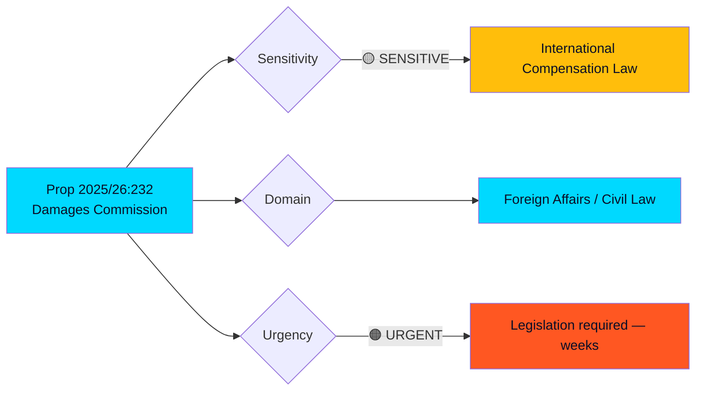

# 🔍 Per-File Political Intelligence Analysis: HD03232

## 📋 Document Identity

| Field | Value |
|-------|-------|
| **Document ID** | HD03232 |
| **Document Type** | proposition |
| **Title** | Sveriges tillträde till konventionen om inrättande av en internationell skadeståndskommission för Ukraina |
| **Date** | 2026-04-16 |
| **Riksmöte** | 2025/26 |
| **Source MCP Tool** | get_propositioner |
| **Analysis Timestamp** | 2026-04-16 14:42 UTC |
| **Analyst** | news-realtime-monitor |
| **Data Depth** | FULL-TEXT |

## 🎯 Executive Summary

Sweden proposes joining the International Commission for Damages for Ukraine, a convention Sweden signed on December 16, 2025. This proposition requires Riksdag approval to accede to the convention and amend the Immunity and Privileges Act (1976:661) to grant the commission and its officials necessary legal protections. Together with HD03231 (tribunal), this creates a comprehensive two-pillar accountability framework — criminal prosecution AND compensation for damages. Foreign Minister Maria Malmer Stenergard (M) champions both propositions as part of Sweden's international law commitment. **[HIGH confidence]**

## 📊 Political Classification

## 🔬 SWOT Analysis

### Strengths
| Evidence | Impact | Confidence |
|----------|--------|------------|
| Convention already signed Dec 16, 2025 — government committed (dok_id: HD03232) | Legal process well advanced | HIGH |
| Requires amendment to 1976 Immunity Act — proper legislative process | Constitutional integrity maintained | HIGH |
| Pairs with HD03231 tribunal to create full accountability chain | Criminal + civil liability coverage | HIGH |

### Weaknesses
| Evidence | Impact | Confidence |
|----------|--------|------------|
| Granting immunity to commission officials — potential sovereignty concerns | May face legal scrutiny in constitutional committee (KU) | MEDIUM |
| Practical damage assessment complexity — Ukraine conflict ongoing | Commission workload may exceed capacity for years | MEDIUM |
| No clear mechanism for collecting damages from Russia | Enforcement gap similar to tribunal | MEDIUM |

### Opportunities
| Evidence | Impact | Confidence |
|----------|--------|------------|
| Swedish legal expertise in international arbitration (Permanent Court of Arbitration history) | Sweden positioned as expert contributor to commission | HIGH |
| Combined with frozen Russian state assets debate | Potential link to asset seizure discussions in EU | MEDIUM |
| Strengthens Sweden-Ukraine bilateral relationship | Strategic partnership beyond military support | HIGH |

### Threats
| Evidence | Impact | Confidence |
|----------|--------|------------|
| Russian countermeasures targeting participating states | Hybrid warfare escalation risk | HIGH |
| Commission costs may grow significantly as conflict damage increases | Open-ended financial commitment | MEDIUM |
| Legal challenges to commission's authority in international courts | Jurisdictional disputes possible | LOW |

## 🎯 Stakeholder Impact

| Stakeholder | Impact | Assessment |
|-------------|--------|------------|
| **Citizens** | Minor direct impact; taxpayer contribution to commission operations | Positive as rule-of-law commitment |
| **Government Coalition** | Demonstrates comprehensive Ukraine policy — tribunal + damages + military aid | Strong governing narrative |
| **Opposition** | S likely supportive (Magdalena Andersson government initiated Ukraine support); V may question immunity provisions | Broad cross-party support expected |
| **Business/Industry** | Swedish arbitration expertise may benefit from commission work | Neutral to positive |
| **International/EU** | Complements EU's own accountability initiatives | Strengthens EU solidarity |

## 🔮 Forward Indicators

1. **KU review**: Constitutional committee may examine immunity provisions
2. **Budget impact**: Commission contribution fees in 2027 budget
3. **Asset debate**: Links to EU frozen Russian assets discussion
4. **Timeline**: Law amendment effective "the day government decides" — flexible implementation
