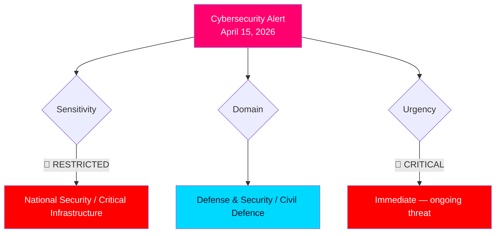

# 🔍 Per-File Political Intelligence Analysis: Government Cybersecurity Alert

## 📋 Document Identity

| Field | Value |
|-------|-------|
| **Document ID** | gov-pressmeddelanden-2026-04-15-cyberhot |
| **Document Type** | government press release |
| **Title** | Regeringen vidtar åtgärder för att skydda operativa system från cyberhot |
| **Date** | 2026-04-15 |
| **Source MCP Tool** | search_regering |
| **Analysis Timestamp** | 2026-04-16 14:42 UTC |
| **Analyst** | news-realtime-monitor |
| **Data Depth** | FULL-TEXT |

## 🎯 Executive Summary

Minister for Civil Defence Carl-Oskar Bohlin (M) and NCSC Director John Billow issued an extraordinary press briefing on April 15, 2026, specifically naming Russia as a cybersecurity threat to Swedish critical infrastructure. The briefing focused on Operational Technology (OT) systems controlling power grids, water treatment, and hospitals — systems where cyberattacks can have physical consequences. The government disclosed that over 1 billion SEK has been allocated to cybersecurity, including funds for municipalities and regions. A new cybersecurity law entered force in January 2026. This explicitly links Russian hybrid operations to domestic Swedish security — a rare public attribution that raises the political stakes. **[VERY HIGH confidence]**

## 📊 Political Classification

## 🔬 SWOT Analysis

### Strengths
| Evidence | Impact | Confidence |
|----------|--------|------------|
| Over 1 billion SEK allocated to cybersecurity (budget proposition) | Substantial funding demonstrates serious commitment | VERY HIGH |
| New cybersecurity law in force since January 2026 | Legal framework for mandatory protections | HIGH |
| National Cybersecurity Center established within FRA (Försvarets radioanstalt) | Central coordination hub operational | HIGH |
| Sweden shares threat intelligence with NATO allies | Alliance intelligence cooperation | HIGH |

### Weaknesses
| Evidence | Impact | Confidence |
|----------|--------|------------|
| OT systems in municipalities often lack dedicated security staff | Local government cyber resilience gap | HIGH |
| Public attribution of Russia may invite escalation | Diplomatic risk in naming threat actor | MEDIUM |
| Historical underinvestment in municipal/regional IT security | Legacy infrastructure vulnerabilities | HIGH |

### Opportunities
| Evidence | Impact | Confidence |
|----------|--------|------------|
| NATO membership enables deeper cyber defense cooperation | Collective defense in cyberspace | HIGH |
| Combined with Ukraine accountability (HD03231/HD03232) sends unified deterrence message | Comprehensive Russia policy narrative | HIGH |
| National cybersecurity strategy provides roadmap for systematic improvement | Long-term resilience building | HIGH |

### Threats
| Evidence | Impact | Confidence |
|----------|--------|------------|
| Russia explicitly named as conducting hybrid operations against European states | Direct threat acknowledgment | VERY HIGH |
| OT attacks on power grids, water, hospitals could cause physical harm | Critical infrastructure vulnerability | HIGH |
| Russian actors becoming "increasingly risk-prone" (Bohlin quote) | Escalation trajectory identified | HIGH |

## 🎯 Stakeholder Impact

| Stakeholder | Impact | Assessment |
|-------------|--------|------------|
| **Citizens** | Direct — critical infrastructure protection affects daily life (power, water, healthcare) | High urgency |
| **Government Coalition** | Demonstrates security competence; aligns with SD's demand for strong defense | Strong political positioning |
| **Opposition** | S supportive of cybersecurity; V/MP may question military-intelligence integration | Broad security consensus |
| **Business/Industry** | New compliance requirements under cybersecurity law | Significant regulatory impact |
| **International/EU** | Aligned with EU NIS2 directive implementation | Strengthens EU cybersecurity framework |
| **Municipalities** | Major impact — expected to "raise their guard" on OT security | Resource and capacity challenge |

## 🔮 Forward Indicators

1. **Municipal compliance**: Watch for reporting on local government cybersecurity readiness
2. **Russian response**: Monitor for escalation in hybrid operations targeting Sweden
3. **NATO integration**: NCSC role in alliance cyber defense architecture
4. **Budget follow-up**: Whether 1B SEK allocation proves sufficient
5. **Thematic link**: Bohlin's briefing + HD03231/HD03232 Ukraine propositions = "confronting Russia" narrative
